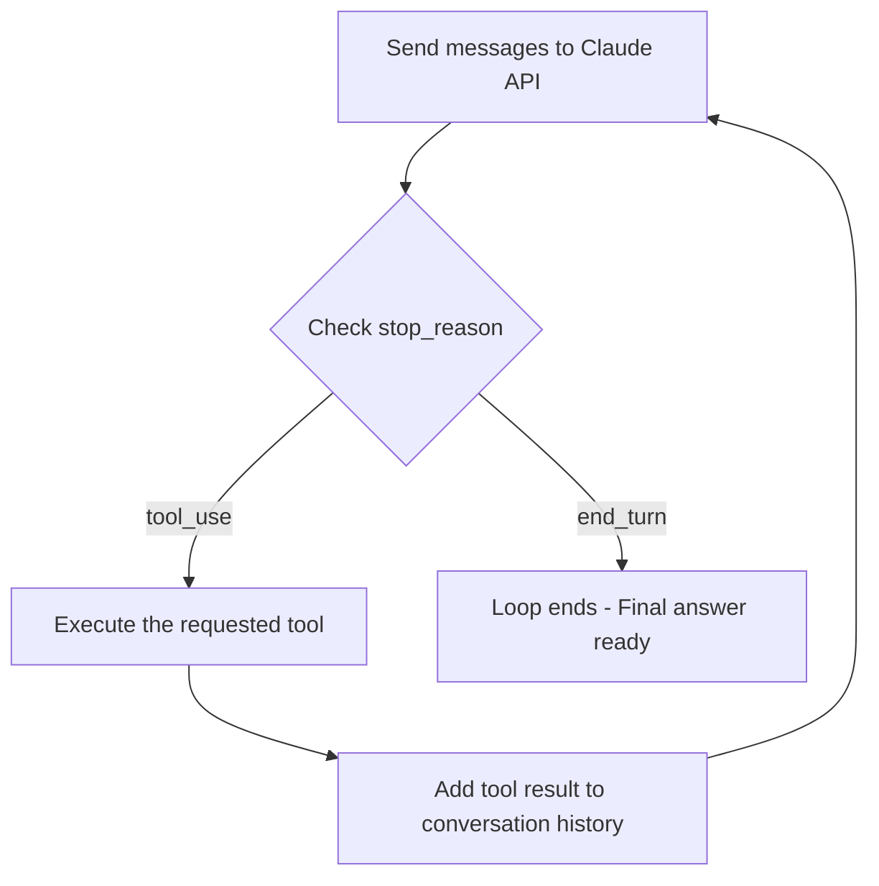

# CCAF Domain 1: Agentic Architecture & Orchestration
## Task Statement 1.1 — Design and Implement Agentic Loops for Autonomous Task Execution

---

## 1. What is an Agentic Loop?

An **agentic loop** is the core pattern that lets Claude act like an "agent" instead of just a chatbot.

In a normal chat, you ask a question, Claude answers, and the conversation is done.

In an agentic loop, Claude can:
1. Think about a task
2. Decide it needs a **tool** (like a calculator, a file reader, or a search function) to move forward
3. Ask your code to run that tool
4. Look at the tool's result
5. Decide the next step — maybe use another tool, or maybe it is done

This keeps repeating until Claude decides the task is finished. That is why it's called a "loop" — the same steps repeat again and again until the goal is reached.

Think of it like a person cooking a recipe:
- Check the fridge (tool call)
- See what's missing (tool result)
- Go to the store (another tool call)
- Come back and cook (another tool call)
- Done eating (task finished)

The person does not follow one fixed script. They react to what they find at each step. This is exactly how Claude behaves in an agentic loop.

---

## 2. The Agentic Loop Lifecycle

The lifecycle has four repeating parts:

1. **Send a request to Claude** — You send the conversation so far (including any previous tool results) to the Claude API.
2. **Inspect `stop_reason`** — Claude's response always includes a field called `stop_reason`. This tells your code *why* Claude stopped generating text.
3. **Execute the requested tool(s)** — If Claude asked for a tool, your code actually runs that tool (e.g., calls a weather API, reads a file, runs a calculation).
4. **Return the result for the next iteration** — The tool's output is added back into the conversation, and the whole cycle repeats.

### Simple diagram of the lifecycle



This loop is the heart of every agentic system built with Claude — including Claude Code, autonomous research agents, and coding assistants.

---

## 3. Understanding `stop_reason`

Every response from Claude's API includes a `stop_reason` field. For agentic loops, two values matter most:

| `stop_reason` value | What it means | What your code should do |
|---|---|---|
| `"tool_use"` | Claude wants to call one or more tools before it can continue | Run the tool(s), then send the results back to Claude |
| `"end_turn"` | Claude has finished its response and has no more tools to call | Stop the loop. The task is complete |

This is the **only reliable signal** for controlling the loop. It's a structured field, not something you need to guess from Claude's wording.

### Example: Checking `stop_reason` in Python

```python
response = client.messages.create(
    model="claude-sonnet-4-6",
    max_tokens=1024,
    tools=[weather_tool],
    messages=messages
)

if response.stop_reason == "tool_use":
    print("Claude wants to use a tool.")
elif response.stop_reason == "end_turn":
    print("Claude is done. Task complete.")
```

---

## 4. How the Loop Actually Works, Step by Step

Let's walk through one full cycle using a simple example: Claude is asked "What's the weather in Hyderabad?" and has access to a `get_weather` tool.

### Step 1: Send the initial request

```python
messages = [
    {"role": "user", "content": "What's the weather in Hyderabad?"}
]

response = client.messages.create(
    model="claude-sonnet-4-6",
    max_tokens=1024,
    tools=[weather_tool],
    messages=messages
)
```

### Step 2: Inspect `stop_reason`

Claude looks at the question, sees it has a `get_weather` tool available, and decides it needs to call it.

```python
print(response.stop_reason)
# Output: "tool_use"
```

### Step 3: Execute the requested tool

Claude's response contains a `tool_use` content block. This tells your code **which** tool to run and **with what input**.

```python
for block in response.content:
    if block.type == "tool_use":
        tool_name = block.name          # e.g. "get_weather"
        tool_input = block.input        # e.g. {"city": "Hyderabad"}
        tool_id = block.id

        # Your code actually runs the real tool here
        result = get_weather(tool_input["city"])
```

Notice: **Claude does not run the tool itself.** Claude only *requests* it. Your code is responsible for actually executing it — calling the API, reading the file, running the calculation, etc.

### Step 4: Add the tool result back to the conversation

This is a critical step. You must append **both**:
- Claude's own message (the one containing the tool request)
- A new message with the tool's result

```python
# Add Claude's tool-use message to history
messages.append({"role": "assistant", "content": response.content})

# Add the tool result as the next message
messages.append({
    "role": "user",
    "content": [
        {
            "type": "tool_result",
            "tool_use_id": tool_id,
            "content": str(result)
        }
    ]
})
```

### Step 5: Send the updated conversation back to Claude

```python
response = client.messages.create(
    model="claude-sonnet-4-6",
    max_tokens=1024,
    tools=[weather_tool],
    messages=messages
)
```

Now Claude can see the weather result and will likely respond with `stop_reason = "end_turn"`, along with a plain text answer like "It's 32°C and sunny in Hyderabad."

---

## 5. Putting It All Together: A Full Loop

```python
def run_agentic_loop(messages, tools):
    while True:
        response = client.messages.create(
            model="claude-sonnet-4-6",
            max_tokens=1024,
            tools=tools,
            messages=messages
        )

        # Always add Claude's response to history first
        messages.append({"role": "assistant", "content": response.content})

        if response.stop_reason == "tool_use":
            tool_results = []
            for block in response.content:
                if block.type == "tool_use":
                    result = execute_tool(block.name, block.input)
                    tool_results.append({
                        "type": "tool_result",
                        "tool_use_id": block.id,
                        "content": str(result)
                    })

            # Feed all tool results back as the next user message
            messages.append({"role": "user", "content": tool_results})
            continue  # go around the loop again

        if response.stop_reason == "end_turn":
            return response  # task finished, exit the loop
```

This small function captures the entire lifecycle: **send → check stop_reason → execute → append → repeat**.

---

## 6. Why Conversation History Matters

Claude has no memory of its own between API calls. Every single call is "fresh" — Claude only knows what is inside the `messages` list you send.

This means:
- If you forget to add the tool result to `messages`, Claude will not know the tool even ran.
- If you forget to add Claude's own `tool_use` message, the API will reject the next request (because a `tool_result` must always follow the matching `tool_use`).

So the conversation history acts like Claude's short-term memory. Each iteration, it grows a little:

```
[user question]
[assistant: tool_use request]
[user: tool_result]
[assistant: tool_use request again, or final answer]
[user: tool_result, if needed]
...
[assistant: end_turn — final answer]
```

This growing history is what allows Claude to **reason about the next action** using everything that has happened so far — not just the original question.

---

## 7. Model-Driven Decisions vs. Pre-Configured Decision Trees

This is a key concept for the exam. There are two very different ways to build a multi-step system:

### A. Model-driven decision-making (the agentic way)
Claude itself looks at the current context and **decides** which tool to call next, if any. There is no fixed script. Claude might:
- Call the same tool twice
- Skip a tool entirely
- Call tools in a different order depending on what it learns

This is flexible and can handle situations the developer didn't originally imagine.

### B. Pre-configured decision trees (the traditional way)
The developer writes fixed logic like:

```python
if step == 1:
    run_tool_A()
elif step == 2:
    run_tool_B()
elif step == 3:
    run_tool_C()
```

This is rigid. It only works for situations the developer already planned for. It is **not** an agentic loop — it's traditional workflow automation with Claude bolted on.

**Exam tip:** True agentic loop design lets the *model* choose the tool sequence based on `stop_reason` and context — not a hardcoded `if/elif` chain of tool calls.

---

## 8. Anti-Patterns to Avoid

The exam specifically tests whether you know what **not** to do. Avoid these common mistakes:

### ❌ Anti-Pattern 1: Parsing natural language to detect "done"

```python
# BAD - do not do this
if "I am finished" in response_text or "done" in response_text.lower():
    stop_loop()
```

Why it's bad: Claude's wording can vary infinitely. This is unreliable and will break easily. Always use the structured `stop_reason` field instead.

### ❌ Anti-Pattern 2: Using an arbitrary iteration cap as the main stopping mechanism

```python
# BAD - do not rely on this as your main control
for i in range(5):  # just guessing 5 is "enough"
    ...
```

Why it's bad: Some tasks legitimately need more steps, others need fewer. A hardcoded limit either cuts off valid work too early or wastes calls when the task was already done. It is fine to have a safety cap as a backup limit (to prevent infinite loops), but it must never be the primary way you decide the task is complete. `stop_reason == "end_turn"` is the primary signal.

### ❌ Anti-Pattern 3: Checking for assistant text content as a completion signal

```python
# BAD - do not do this
if response.content and response.content[0].type == "text":
    stop_loop()
```

Why it's bad: Claude can sometimes include text **and** a tool call in the same response (for example, explaining what it's about to do before calling a tool). The presence of text does not guarantee the task is finished. Only `stop_reason == "end_turn"` guarantees Claude has nothing more to do.

---

## 9. Quick Reference Summary

| Concept | Key Point |
|---|---|
| Agentic loop | Repeats: send → check stop_reason → execute tool → append result → repeat |
| `stop_reason: "tool_use"` | Claude needs a tool run before it can continue |
| `stop_reason: "end_turn"` | Claude is done, safe to exit loop |
| Conversation history | Must include both the `tool_use` message and the matching `tool_result` message |
| Model-driven decisions | Claude chooses the next tool based on context — flexible |
| Decision trees | Developer hardcodes the tool sequence — rigid, not truly agentic |
| Anti-pattern | Parsing text like "done" to detect completion |
| Anti-pattern | Using a loop counter as your *primary* stop signal |
| Anti-pattern | Treating any text content as proof the task is finished |

---

## 10. Practice Questions (Exam Prep)

**Q1.** What is the correct field to check in order to decide whether an agentic loop should continue or stop?
- A) The presence of text in the response
- B) The `stop_reason` field
- C) A fixed iteration counter
- D) Keywords like "done" in the response

**Answer: B** — `stop_reason` is the only reliable, structured signal.

**Q2.** True or False: A hardcoded `if/elif` chain that calls tools in a fixed order is an example of model-driven decision-making.

**Answer: False** — This is a pre-configured decision tree, not model-driven reasoning.

**Q3.** After Claude requests a tool call, what two messages must be added to the conversation history before sending the next request?

**Answer:** 1) Claude's own assistant message containing the `tool_use` block, and 2) a user message containing the matching `tool_result` block.

**Q4.** Why is using an iteration cap as your *only* stopping condition considered an anti-pattern?

**Answer:** Because task complexity varies — a fixed cap may cut off a task before it's genuinely finished, or waste resources after it already ended. It should only be used as a safety backstop, not the primary completion signal.

---

*End of Domain 1 — Task Statement 1.1 tutorial.*
