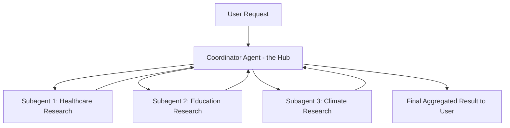
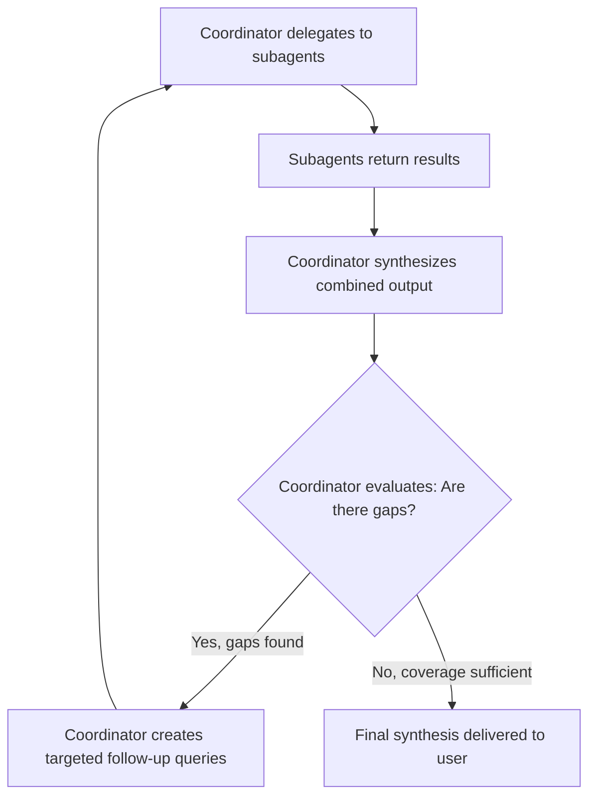

# CCAF Domain 1: Agentic Architecture & Orchestration
## Task Statement 1.2 — Orchestrate Multi-Agent Systems with Coordinator-Subagent Patterns

---

## 1. What is a Multi-Agent System?

So far we looked at a single agent running a loop with tools. But some tasks are too big or too varied for one agent to handle well alone.

Example: "Research the impact of AI on healthcare, education, and climate policy, and write a full report."

This is really three research jobs plus one writing job. Instead of forcing one agent to do everything, we can split the work across multiple smaller agents, each with a focused job.

This is called a **multi-agent system**. The most common and recommended pattern for this is called **coordinator-subagent** (also called **hub-and-spoke**).

---

## 2. Hub-and-Spoke Architecture

Think of a bicycle wheel:
- The **hub** in the center is the **coordinator agent**.
- The **spokes** going outward connect to **subagents**.
- Subagents never talk to each other directly. They only talk to the hub.



**Key rule:** All communication passes through the coordinator. A subagent never sends its result directly to another subagent or directly to the user.

### Why route everything through the coordinator?

1. **Observability** — Since every message passes through one place, it is easy to log, monitor, and debug the whole system.
2. **Consistent error handling** — If a subagent fails, the coordinator (not each individual subagent) decides what to do next: retry, skip, or ask a different subagent.
3. **Controlled information flow** — The coordinator decides exactly what information moves where, avoiding messy, unpredictable communication between subagents.

---

## 3. Subagents Have Isolated Context

This is one of the most important — and most tested — concepts in this task statement.

**A subagent does NOT automatically see the coordinator's full conversation history.**

Each subagent starts with a **fresh, isolated context**. It only knows what the coordinator explicitly tells it.

### Why this matters

If the coordinator has had a long conversation with the user — including irrelevant chit-chat, earlier mistakes, or unrelated topics — none of that is automatically passed to the subagent. The coordinator must **deliberately package** only the relevant instructions and data for each subagent.

### Simple example

```python
# Coordinator's own conversation history (NOT visible to subagents)
coordinator_history = [
    {"role": "user", "content": "Can you research AI in healthcare, education, and climate policy?"},
    {"role": "assistant", "content": "Sure, breaking this into three research tasks..."}
]

# The coordinator must manually build a clean, isolated task for each subagent
healthcare_subagent_task = {
    "role": "user",
    "content": "Research recent developments in AI applied to healthcare diagnostics and treatment."
}

# This subagent has NO idea that education or climate topics exist,
# and no idea about anything said earlier in the coordinator's chat.
subagent_response = client.messages.create(
    model="claude-sonnet-4-6",
    max_tokens=1024,
    messages=[healthcare_subagent_task]
)
```

Notice: `healthcare_subagent_task` is a brand-new, minimal conversation. It does not include `coordinator_history`. This isolation is intentional — it keeps each subagent focused and prevents context from one topic leaking into and confusing another.

---

## 4. The Coordinator's Responsibilities

The coordinator agent has four main jobs:

### A. Task decomposition
Breaking a big, broad request into smaller, well-defined subtasks.

### B. Delegation
Deciding **which** subagent(s) should handle each subtask, and sending each one a clean, isolated instruction.

### C. Result aggregation
Collecting the outputs from all subagents and combining them into one coherent final answer.

### D. Deciding which subagents to invoke, based on query complexity
Not every request needs every subagent. A simple question might only need one subagent (or none at all — the coordinator might answer directly). A complex, broad research question might need several.

### Example: Dynamic subagent selection

```python
def coordinator_decide_subagents(user_query):
    """
    The coordinator analyzes the query and decides which subagents
    are actually needed - it does NOT always run the full pipeline.
    """
    if is_simple_factual_question(user_query):
        return []  # no subagents needed, coordinator answers directly

    needed = []
    if mentions_healthcare(user_query):
        needed.append("healthcare_subagent")
    if mentions_education(user_query):
        needed.append("education_subagent")
    if mentions_climate(user_query):
        needed.append("climate_subagent")

    return needed
```

**Exam tip:** A well-designed coordinator dynamically chooses which subagents to invoke based on what the query actually needs. It should **not** always run every subagent in a fixed pipeline, regardless of whether they're relevant. That would waste time and resources.

---

## 5. Risk: Overly Narrow Task Decomposition

This is a specific risk called out in the syllabus, so let's slow down on it.

**The problem:** If the coordinator breaks a broad topic into subtasks that are too narrow or too specific, the subagents may miss large parts of the topic. The final result looks complete, but it actually has gaps.

### Example of the mistake

Broad request: "Research renewable energy adoption worldwide."

**Bad decomposition (too narrow):**
- Subagent 1: "Research solar panel prices in California"
- Subagent 2: "Research one wind farm project in Germany"

This misses: other renewable sources (hydro, geothermal), other regions (Asia, Africa, South America), policy angles, and adoption trends overall. The coordinator asked overly specific sub-questions, so the "worldwide" scope was never actually covered.

**Better decomposition (broad but distinct):**
- Subagent 1: "Research renewable energy adoption trends in North America and Europe"
- Subagent 2: "Research renewable energy adoption trends in Asia, Africa, and South America"
- Subagent 3: "Research government policy trends supporting renewable energy globally"

This decomposition keeps each subagent focused on a distinct slice, while still covering the full breadth of the original topic.

**Exam tip:** Always check — does the sum of all subtasks fully cover the original broad topic? If not, decomposition was too narrow.

---

## 6. Partitioning Research Scope to Minimize Duplication

Just as important as *coverage* is *avoiding overlap*. If two subagents research the same subtopic, you waste time and get redundant, repetitive results.

### Good partitioning strategy

Assign each subagent a **distinct subtopic or source type**, so their work doesn't overlap.

```python
subagent_assignments = {
    "subagent_1": "Peer-reviewed academic research on AI in diagnostics",
    "subagent_2": "News and industry reports on AI healthcare startups",
    "subagent_3": "Government and regulatory policy on AI in healthcare"
}
```

Here, all three subagents are researching "AI in healthcare" — but each is looking at a **different source type** (academic, industry news, government policy). This avoids duplication while still giving broad coverage.

You could also partition by:
- **Subtopic** (e.g., diagnostics vs. treatment vs. drug discovery)
- **Region** (e.g., North America vs. Asia vs. Europe)
- **Source type** (e.g., academic vs. news vs. government)
- **Time period** (e.g., pre-2020 developments vs. recent developments)

---

## 7. Iterative Refinement Loop

Sometimes, after the coordinator aggregates results from subagents and creates a synthesis (a combined summary), it realizes the synthesis is missing something. This is where **iterative refinement** comes in.

The coordinator does not just run subagents once and stop. It can:

1. Evaluate the synthesis output for gaps
2. Re-delegate to search/analysis subagents with **new, targeted queries** that fill those gaps
3. Re-run the synthesis step
4. Repeat until coverage is good enough

### Diagram of the refinement loop



### Example: Refinement loop in code

```python
def coordinator_research_loop(topic, subagents, max_refinements=3):
    results = run_subagents(topic, subagents)
    synthesis = synthesize(results)

    refinement_count = 0
    while refinement_count < max_refinements:
        gaps = evaluate_synthesis_for_gaps(synthesis, topic)

        if not gaps:
            break  # coverage is sufficient, exit the loop

        # Re-delegate with targeted queries that address the gaps
        follow_up_results = run_subagents(gaps, subagents)
        results.extend(follow_up_results)
        synthesis = synthesize(results)
        refinement_count += 1

    return synthesis
```

Notice this looks similar to the agentic loop from Task Statement 1.1 — send, evaluate, act, repeat — but here it's happening at the **coordinator level**, across multiple subagents, instead of a single agent calling one tool at a time.

**Note:** A `max_refinements` safety cap is used here — similar to Task 1.1, this should be a backup safety limit, not the primary way you decide refinement is done. The primary signal is whether gaps still exist.

---

## 8. Putting It All Together: Full Coordinator Flow

```python
def coordinator_handle_request(user_query):
    # Step 1: Decide which subagents are actually needed
    needed_subagents = coordinator_decide_subagents(user_query)

    if not needed_subagents:
        return answer_directly(user_query)  # simple query, no delegation needed

    # Step 2: Decompose the task and partition scope across subagents
    subtasks = decompose_and_partition(user_query, needed_subagents)

    # Step 3: Delegate - each subagent gets an isolated, clean context
    results = {}
    for subagent_name, task_instruction in subtasks.items():
        isolated_context = [{"role": "user", "content": task_instruction}]
        results[subagent_name] = client.messages.create(
            model="claude-sonnet-4-6",
            max_tokens=1024,
            messages=isolated_context
        )

    # Step 4: Aggregate results
    synthesis = synthesize(results)

    # Step 5: Iteratively refine if there are gaps
    synthesis = refine_until_sufficient(synthesis, user_query, needed_subagents)

    return synthesis
```

---

## 9. Quick Reference Summary

| Concept | Key Point |
|---|---|
| Hub-and-spoke | Coordinator is the hub; subagents are spokes; all communication passes through coordinator |
| Isolated context | Subagents do NOT automatically inherit the coordinator's conversation history |
| Coordinator's job | Task decomposition, delegation, result aggregation, deciding which subagents to invoke |
| Dynamic subagent selection | Coordinator should invoke only the subagents needed — not always the full pipeline |
| Risk: overly narrow decomposition | Can leave gaps in broad topics — always check subtasks fully cover the original scope |
| Partitioning scope | Assign distinct subtopics/source types to each subagent to avoid duplication |
| Iterative refinement | Coordinator evaluates synthesis for gaps, re-delegates targeted queries, re-synthesizes, repeats until sufficient |
| Routing through coordinator | Enables observability, consistent error handling, controlled information flow |

---

## 10. Practice Questions (Exam Prep)

**Q1.** In a hub-and-spoke multi-agent architecture, can two subagents communicate directly with each other?

**Answer:** No. All communication must be routed through the coordinator.

**Q2.** True or False: A subagent automatically has access to the coordinator's full conversation history unless explicitly restricted.

**Answer:** False — subagents have isolated context by default. The coordinator must explicitly pass in whatever information the subagent needs.

**Q3.** What is the main risk of overly narrow task decomposition by a coordinator?

**Answer:** It can leave gaps in coverage for broad topics — the sum of the subtasks may not actually cover the full scope of the original request.

**Q4.** Why should a coordinator dynamically decide which subagents to invoke instead of always running the full pipeline?

**Answer:** Because not every query needs every subagent. Running unnecessary subagents wastes resources and time. The coordinator should analyze query complexity and invoke only what's relevant.

**Q5.** What should trigger the coordinator to re-delegate work to subagents during iterative refinement?

**Answer:** The coordinator evaluating the synthesized output and finding gaps in coverage — not a fixed number of iterations. A max-iteration cap can exist as a safety backstop, but shouldn't be the primary stopping condition.

**Q6.** Give one example of a good way to partition research scope across subagents to avoid duplication.

**Answer:** Assigning each subagent a distinct subtopic, region, source type, or time period (e.g., one subagent handles academic sources, another handles news sources, another handles government policy).

---

*End of Domain 1 — Task Statement 1.2 tutorial.*
