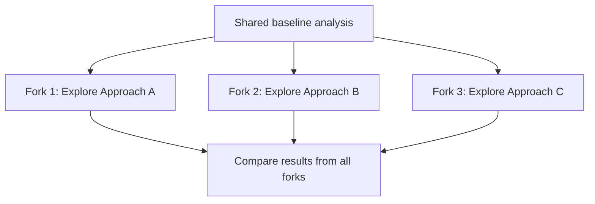

# CCAF Domain 1: Agentic Architecture & Orchestration
## Task Statement 1.3 — Configure Subagent Invocation, Context Passing, and Spawning

---

## 1. Overview

In Task Statement 1.2, we learned that a coordinator manages subagents in a hub-and-spoke pattern. Now we go one level deeper: **how does the coordinator actually spawn a subagent?** What tool does it use? What information must it manually pass along? How can it spawn many subagents at once?

This tutorial covers the practical, technical mechanics of subagent invocation.

---

## 2. The `Task` Tool: How Subagents Are Spawned

The **`Task` tool** is the mechanism Claude uses to spawn a subagent. When the coordinator agent decides it needs a subagent to do some work, it doesn't call the subagent directly in code — it requests a `Task` tool call, just like it would request any other tool.

### The critical requirement: `allowedTools` must include `"Task"`

For a coordinator agent to be able to spawn subagents at all, its configuration must explicitly allow the `Task` tool. If `"Task"` is missing from `allowedTools`, the coordinator has no way to create subagents — no matter how well-designed its prompt is.

```python
coordinator_config = {
    "allowedTools": ["Task", "WebSearch", "Read"],  # "Task" MUST be included
    "systemPrompt": "You are a research coordinator. Break down broad queries and delegate to subagents using the Task tool."
}
```

If you forget to include `"Task"` here, the coordinator will simply be unable to invoke any subagents — this is a common configuration mistake to watch for on the exam.

---

## 3. Subagents Do Not Automatically Inherit Context

We touched on this in Task Statement 1.2, but here we go deeper into the **mechanics**: exactly what must be passed, and how.

**Key rule:** Subagent context must be explicitly written into the prompt passed to the `Task` tool call. There is no automatic sharing of:
- The coordinator's conversation history
- Memory from earlier subagent invocations
- Any "global" data

Every subagent invocation is a fresh start. Whatever the subagent needs to know, the coordinator must type it directly into that subagent's prompt.

### Example: Passing context explicitly

```python
# WRONG assumption - this does NOT happen automatically:
# "The subagent will just know what we discussed earlier."

# CORRECT approach - the coordinator explicitly writes the needed context
# into the Task tool call's prompt:

task_call = {
    "tool": "Task",
    "input": {
        "description": "Synthesize research findings",
        "prompt": (
            "Here are the findings from our research subagents:\n\n"
            "Finding 1 (from web search): AI diagnostic tools reduced "
            "misdiagnosis rates by 15% in 2025 clinical trials.\n"
            "Source: https://example.com/study1\n\n"
            "Finding 2 (from document analysis): Hospital adoption of AI "
            "tools grew from 20% to 45% between 2023 and 2025.\n"
            "Source: internal_report.pdf, page 12\n\n"
            "Please write a synthesis paragraph combining these findings."
        )
    }
}
```

Notice everything the subagent needs — the actual findings, not just a reference to "the earlier conversation" — is spelled out directly in the prompt text.

---

## 4. `AgentDefinition`: Configuring a Subagent Type

Each type of subagent (for example, a "web research subagent" or a "synthesis subagent") is configured using an **`AgentDefinition`**. This defines what the subagent is, how it should behave, and what it's allowed to do.

An `AgentDefinition` typically includes:

| Field | Purpose |
|---|---|
| `description` | A short summary of what this subagent type does (helps the coordinator decide when to use it) |
| `systemPrompt` | Instructions that shape how this subagent behaves — its role, tone, and goals |
| `tools` (tool restrictions) | Which tools this specific subagent type is allowed to use |

### Example: Defining two subagent types

```python
research_subagent = {
    "name": "research_subagent",
    "description": "Searches the web and gathers raw findings on a given subtopic.",
    "systemPrompt": (
        "You are a research subagent. Given a subtopic, search for relevant, "
        "credible information and report your findings with clear source attribution."
    ),
    "tools": ["WebSearch", "WebFetch"]  # restricted - cannot spawn its own subagents
}

synthesis_subagent = {
    "name": "synthesis_subagent",
    "description": "Combines findings from multiple research subagents into a coherent summary.",
    "systemPrompt": (
        "You are a synthesis subagent. Combine the provided findings into a "
        "clear, well-organized summary. Preserve source attribution."
    ),
    "tools": []  # this subagent doesn't need any tools, just reasoning over given text
}
```

**Why tool restrictions matter:** Giving each subagent type only the tools it actually needs limits what it can do, reduces risk, and keeps its behavior predictable and focused on its specific role.

---

## 5. Fork-Based Session Management

Sometimes you want to explore **multiple different approaches** starting from the **same shared analysis baseline** — rather than starting each approach completely from scratch, or having them all share one conversation.

This is called **fork-based session management**. The idea:

1. Do some shared initial analysis (the "baseline")
2. "Fork" that baseline into multiple separate sessions
3. Each forked session explores a different direction, independently, without affecting the others

### Diagram



### Example use case

Imagine the coordinator has already analyzed a codebase and understood its structure (the baseline). Now it wants to explore three different possible refactoring strategies. Instead of re-doing the analysis three times, it forks the baseline session three times — each fork starts with the same understanding of the codebase but then diverges to explore its own strategy independently.

This is efficient (no repeated baseline work) and safe (each fork's exploration doesn't interfere with the others, since they're isolated after the fork point).

---

## 6. Preserving Attribution with Structured Data Formats

When passing findings between agents (for example, from a research subagent to a synthesis subagent), it's important to keep the **content** separate from its **metadata** — things like source URLs, document names, and page numbers.

If you just paste raw text together without structure, you risk losing track of which fact came from which source. This is especially important for research and citation accuracy.

### Bad approach: unstructured, mixed-together text

```
AI reduced misdiagnosis by 15% and hospital adoption grew to 45% and this
was all from some article and a report somewhere probably in 2025.
```

Here, it's impossible to tell which claim came from which source.

### Good approach: structured format with separated metadata

```python
findings = [
    {
        "content": "AI diagnostic tools reduced misdiagnosis rates by 15% in 2025 clinical trials.",
        "source_url": "https://example.com/study1",
        "source_type": "web_article"
    },
    {
        "content": "Hospital adoption of AI tools grew from 20% to 45% between 2023 and 2025.",
        "source_document": "internal_report.pdf",
        "page_number": 12
    }
]
```

When this is passed into a subagent's prompt, it can be formatted clearly so the subagent (and later, the user) always knows exactly which source backs which claim:

```python
prompt_text = "\n\n".join(
    f"Finding: {f['content']}\nSource: {f.get('source_url') or f.get('source_document')}"
    + (f" (page {f['page_number']})" if 'page_number' in f else "")
    for f in findings
)
```

**Exam tip:** Keeping content and metadata separate (rather than blending them into one paragraph) is what allows attribution to survive as findings move from one agent to another.

---

## 7. Spawning Parallel Subagents in a Single Response

If the coordinator needs multiple independent subagents to run — for example, three research subagents each covering a different subtopic — it can spawn them **in parallel** by emitting **multiple `Task` tool calls within a single response**, rather than spawning them one at a time across separate turns.

### Sequential (slower) — one Task call per turn

```
Turn 1: coordinator calls Task -> subagent 1 runs -> result returned
Turn 2: coordinator calls Task -> subagent 2 runs -> result returned
Turn 3: coordinator calls Task -> subagent 3 runs -> result returned
```

This means waiting for each subagent to finish before starting the next one.

### Parallel (faster) — multiple Task calls in one turn

```
Turn 1: coordinator calls Task, Task, Task (three calls at once)
        -> subagent 1, subagent 2, subagent 3 all run at the same time
        -> all three results returned together
```

### Example: Parallel Task calls

```python
# The coordinator's response contains THREE tool_use blocks in ONE turn:
response_content = [
    {
        "type": "tool_use",
        "name": "Task",
        "input": {"description": "Research healthcare subtopic", "prompt": "..."}
    },
    {
        "type": "tool_use",
        "name": "Task",
        "input": {"description": "Research education subtopic", "prompt": "..."}
    },
    {
        "type": "tool_use",
        "name": "Task",
        "input": {"description": "Research climate subtopic", "prompt": "..."}
    }
]
```

All three `Task` calls are part of the **same** coordinator response. This lets independent, unrelated subtasks run in parallel, which is much more efficient than waiting through separate turns.

**When to use parallel spawning:** Only when the subagents' tasks are truly independent of each other — none of them needs the result of another before it can start.

---

## 8. Writing Goal-Oriented Prompts, Not Step-by-Step Instructions

When the coordinator writes a prompt for a subagent, it's tempting to write very detailed, procedural, step-by-step instructions. But this is usually the wrong approach.

**Better practice:** Describe the **research goal** and the **quality criteria** for a good result — and let the subagent figure out the best way to get there. This makes subagents more adaptable to unexpected situations.

### Less effective: rigid step-by-step instructions

```
1. Search for "AI in healthcare 2025"
2. Open the first three results
3. Copy the first paragraph from each
4. Combine them into one paragraph
5. Stop
```

This is brittle. If the first search returns bad results, the subagent has no room to adapt — it's locked into following the exact steps.

### More effective: goal and quality criteria

```
Goal: Find credible, recent information about how AI is being used in
healthcare diagnostics.

Quality criteria:
- Prioritize sources from 2024-2026
- Prefer peer-reviewed or reputable industry sources
- Include specific data points where available (percentages, dates, sample sizes)
- Clearly cite the source for every claim

Use your judgment on search terms and sources - adapt as needed based on
what you find.
```

This gives the subagent a clear target and clear standards, but leaves the *how* flexible — so it can adjust its search strategy if the first attempt doesn't turn up good results.

---

## 9. Putting It All Together: Full Example

```python
coordinator_config = {
    "allowedTools": ["Task"],  # required for the coordinator to spawn subagents
    "systemPrompt": "You are a research coordinator managing subagents."
}

# Step 1: Define subagent types (AgentDefinitions)
agent_definitions = {
    "research_subagent": {
        "description": "Searches for and reports findings on a given subtopic.",
        "systemPrompt": "You are a research subagent...",
        "tools": ["WebSearch"]
    },
    "synthesis_subagent": {
        "description": "Synthesizes findings from multiple subagents.",
        "systemPrompt": "You are a synthesis subagent...",
        "tools": []
    }
}

# Step 2: Coordinator spawns THREE research subagents in parallel (one response)
parallel_task_calls = [
    {"tool": "Task", "input": {"description": "Research healthcare AI trends",
     "prompt": "Goal: find recent, credible data on AI in healthcare. Quality criteria: cite sources, prefer 2024-2026 data."}},
    {"tool": "Task", "input": {"description": "Research education AI trends",
     "prompt": "Goal: find recent, credible data on AI in education. Quality criteria: cite sources, prefer 2024-2026 data."}},
    {"tool": "Task", "input": {"description": "Research climate AI trends",
     "prompt": "Goal: find recent, credible data on AI in climate policy. Quality criteria: cite sources, prefer 2024-2026 data."}}
]

# Step 3: After all three return, coordinator explicitly passes ALL findings
# (with structured attribution) into the synthesis subagent's prompt
synthesis_prompt = build_structured_findings_prompt(all_findings)  # keeps content + metadata separate

synthesis_task_call = {
    "tool": "Task",
    "input": {
        "description": "Synthesize all research findings",
        "prompt": synthesis_prompt
    }
}
```

---

## 10. Quick Reference Summary

| Concept | Key Point |
|---|---|
| `Task` tool | The mechanism used to spawn subagents |
| `allowedTools` requirement | Must include `"Task"` or the coordinator cannot spawn any subagents |
| Context passing | Must be explicitly written into the subagent's prompt — no automatic inheritance or shared memory |
| `AgentDefinition` | Configures a subagent type: `description`, `systemPrompt`, and tool restrictions |
| Fork-based sessions | Branch multiple independent explorations from one shared baseline analysis |
| Structured data | Keep content separate from metadata (URLs, doc names, page numbers) to preserve attribution |
| Parallel spawning | Emit multiple `Task` calls in a single response to run independent subagents at the same time |
| Goal-oriented prompts | Describe goals and quality criteria, not rigid steps, so subagents can adapt |

---

## 11. Practice Questions (Exam Prep)

**Q1.** What must be included in a coordinator's `allowedTools` list for it to be able to spawn subagents?

**Answer:** `"Task"` — without it, the coordinator cannot invoke the Task tool and therefore cannot spawn subagents.

**Q2.** True or False: If a coordinator has already discussed a topic with the user, any subagent it spawns afterward will automatically know that context.

**Answer:** False — subagent context is never automatic. It must be explicitly written into the subagent's prompt.

**Q3.** What three things does an `AgentDefinition` typically configure for a subagent type?

**Answer:** A `description`, a `systemPrompt`, and tool restrictions (which tools that subagent type is allowed to use).

**Q4.** What is fork-based session management used for?

**Answer:** Exploring multiple divergent approaches that all start from the same shared analysis baseline, without repeating the baseline work and without the forks interfering with each other.

**Q5.** Why should content and metadata (like source URLs or page numbers) be kept in separate structured fields when passing findings between agents?

**Answer:** To preserve accurate attribution — so it stays clear which source backs which specific claim as information moves from one agent to another.

**Q6.** How can a coordinator spawn multiple subagents to run in parallel rather than one at a time?

**Answer:** By emitting multiple `Task` tool calls within a single coordinator response, instead of spawning them across separate turns.

**Q7.** Why is it generally better to give a subagent goal-oriented instructions and quality criteria rather than rigid, step-by-step procedures?

**Answer:** Because rigid steps are brittle and can't adapt if something unexpected happens (e.g., a search returns poor results). Goal-oriented instructions let the subagent use judgment to adapt while still working toward a clear, well-defined target.

---

*End of Domain 1 — Task Statement 1.3 tutorial.*
