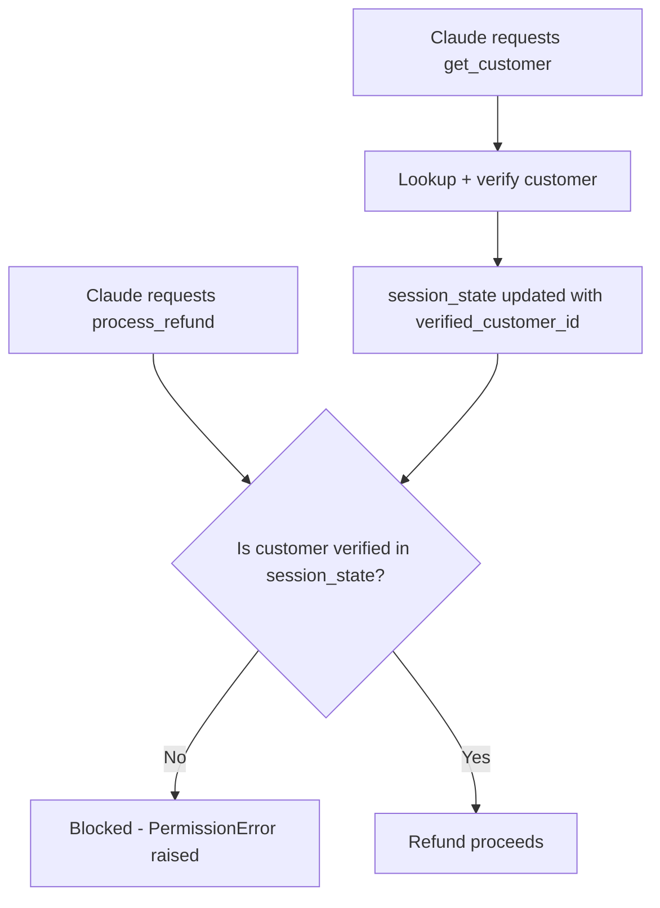
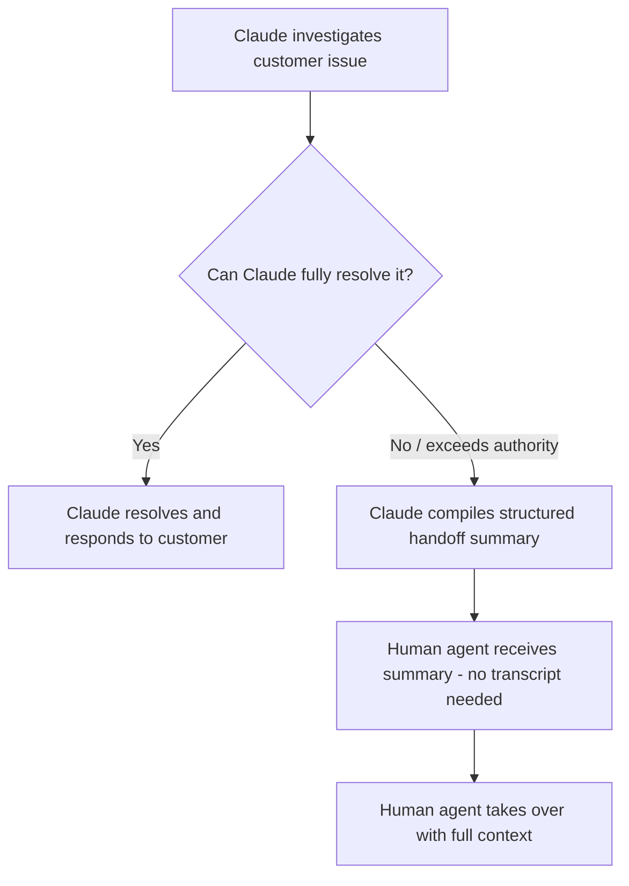

# CCAF Domain 1: Agentic Architecture & Orchestration
## Task Statement 1.4 — Implement Multi-Step Workflows with Enforcement and Handoff Patterns

---

## 1. Overview

Some workflows have steps that **must** happen in a specific order — no exceptions. For example, you should never process a refund before you've verified who the customer is.

This tutorial covers two related ideas:
1. How to make sure Claude actually follows required step order — **enforcement**
2. How to properly hand off a conversation to a human when Claude can't (or shouldn't) finish the job — **handoff**

---

## 2. Programmatic Enforcement vs. Prompt-Based Guidance

There are two very different ways to try to make sure Claude follows the correct order of steps.

### A. Prompt-based guidance

This means simply *telling* Claude, in its instructions, what order to follow.

```
System prompt: "Always call get_customer before calling process_refund."
```

This is easy to write. But it relies on Claude reading, understanding, and correctly following that instruction every single time.

### B. Programmatic enforcement

This means writing actual code — like **hooks** or **prerequisite gates** — that physically **blocks** a tool call from running unless its prerequisites have already been completed. This does not rely on Claude "remembering" the rule. The system itself refuses to let the action happen out of order.

```python
def process_refund(customer_id, amount):
    if not customer_id_is_verified(customer_id):
        raise PermissionError("Cannot process refund: customer not verified yet.")
    # ... proceed with refund
```

Here, even if Claude somehow tried to call `process_refund` too early, the code itself would stop it. This is enforcement, not just guidance.

### Comparison table

| | Prompt-based guidance | Programmatic enforcement |
|---|---|---|
| How it works | Instructions in the system prompt | Code (hooks, gates) that blocks the action |
| Reliability | Has a non-zero failure rate — Claude can occasionally skip or misorder steps | Deterministic — the action is physically blocked if prerequisites aren't met |
| Best used for | Style, tone, general preferences, non-critical ordering | Steps where being wrong has serious consequences (money, identity, security) |

---

## 3. When Deterministic Compliance Is Required

**Deterministic compliance** means: this step *must* happen first, 100% of the time, no exceptions — and we don't rely on the model's judgment to guarantee it.

### Why prompt instructions alone are not enough

Even a very well-written prompt has a **non-zero failure rate**. This means: even if it works correctly 99% of the time, that remaining 1% is still a real risk. For low-stakes tasks, this might be acceptable. But for some tasks, it is not.

### Example: Identity verification before financial operations

Imagine a customer service agent that can issue refunds. If Claude ever calls `process_refund` for the wrong customer — even by a small mistake — real money goes to the wrong place. This is exactly the kind of case where you cannot rely on "the prompt said to check first."

**Rule of thumb for the exam:** Whenever a mistake could cause financial loss, security risk, privacy violation, or irreversible harm, use **programmatic enforcement**, not just prompt instructions.

---

## 4. Implementing Programmatic Prerequisites

Let's build this out step by step, using the classic example: **block `process_refund` until `get_customer` has returned a verified customer ID.**

### Step 1: Track state — has the prerequisite been completed?

```python
# Simple state tracker for this conversation/session
session_state = {
    "verified_customer_id": None
}
```

### Step 2: The prerequisite tool sets the state when it succeeds

```python
def get_customer(customer_lookup_info):
    customer = look_up_customer_in_database(customer_lookup_info)

    if customer and customer["verified"]:
        session_state["verified_customer_id"] = customer["id"]
        return {"status": "verified", "customer_id": customer["id"]}
    else:
        return {"status": "not_verified"}
```

### Step 3: The downstream tool checks the state before running — this is the "gate"

```python
def process_refund(amount, customer_id=None):
    # PROGRAMMATIC GATE - this blocks execution, it does not just warn
    if session_state["verified_customer_id"] is None:
        raise PermissionError(
            "process_refund blocked: get_customer must complete and verify "
            "the customer before a refund can be processed."
        )

    if customer_id != session_state["verified_customer_id"]:
        raise PermissionError(
            "process_refund blocked: customer_id does not match the verified customer."
        )

    # Only reached if verification actually happened successfully
    return issue_refund(session_state["verified_customer_id"], amount)
```

### Diagram: enforced step order



**Key idea:** This gate works no matter what Claude "intends" to do. Even if Claude's reasoning goes wrong, the code itself refuses to let `process_refund` run out of order. This is what makes it deterministic.

---

## 5. Hooks as a Form of Programmatic Enforcement

A **hook** is a piece of code that runs automatically at a certain point in the workflow — for example, right before a tool call is executed — to check conditions and potentially block or modify that action.

```python
def pre_tool_call_hook(tool_name, tool_input, session_state):
    """
    Runs automatically before any tool call is executed.
    Can block the call if prerequisites are not met.
    """
    if tool_name == "process_refund":
        if session_state["verified_customer_id"] is None:
            return {"allow": False, "reason": "Customer must be verified first."}

    return {"allow": True}
```

Hooks give you a centralized place to enforce rules across many tools, rather than repeating prerequisite checks inside every single tool function.

---

## 6. Decomposing Multi-Concern Requests

Sometimes a single customer message actually contains **multiple, separate concerns**. For example:

> "My last order arrived damaged, and also I was charged twice for it, and can you also update my shipping address?"

This is really **three** separate issues:
1. Damaged order (needs investigation / possible replacement)
2. Double charge (needs a refund investigation)
3. Address update (a simple account change)

### Skill: Decompose, investigate in parallel, then synthesize

Instead of processing these one at a time in sequence, a well-designed agent:
1. **Decomposes** the message into distinct items
2. **Investigates each item in parallel**, using **shared context** (e.g., the same customer ID, same order history) so it doesn't have to re-fetch common data for each concern
3. **Synthesizes** all the findings into one unified resolution message back to the customer

### Example

```python
def handle_multi_concern_request(customer_message, customer_id):
    # Step 1: Decompose into distinct concerns
    concerns = decompose_concerns(customer_message)
    # e.g. ["damaged_order", "double_charge", "address_update"]

    # Shared context fetched once, reused across all concerns
    shared_context = {
        "customer_id": customer_id,
        "order_history": get_order_history(customer_id)
    }

    # Step 2: Investigate each concern using the shared context
    findings = {}
    for concern in concerns:
        findings[concern] = investigate_concern(concern, shared_context)

    # Step 3: Synthesize into one unified resolution
    return synthesize_unified_resolution(findings)
```

**Why this matters:** Handling concerns one at a time, from scratch, wastes effort (re-fetching the same customer data repeatedly) and can produce a fragmented, confusing set of separate replies instead of one clear resolution.

---

## 7. Structured Handoff Protocols for Escalation

Sometimes Claude cannot (or should not) resolve an issue on its own — for example, the situation is too complex, sensitive, or outside its authority. In these cases, the conversation must be **escalated to a human agent**.

**The problem:** The human agent usually does **not** have access to the full conversation transcript. If Claude just says "please escalate this," the human has to start from zero, re-asking the customer everything again. That's a bad experience.

**The solution:** Claude should compile a **structured handoff summary** — a clear, organized package of everything the human agent needs to pick up where Claude left off.

### What a good handoff summary includes

| Field | Purpose |
|---|---|
| Customer ID | Identifies exactly who this is about |
| Root cause analysis | What Claude has already figured out is actually wrong |
| Refund amount (if relevant) | Concrete numbers, not vague descriptions |
| Recommended action | What Claude thinks should happen next |

### Example: Structured handoff summary

```python
handoff_summary = {
    "customer_id": "CUST-48213",
    "issue_summary": "Customer was charged twice for order #58291 due to a "
                      "payment gateway retry bug during checkout.",
    "root_cause_analysis": (
        "Order logs show the payment was submitted twice within 2 seconds "
        "due to a known double-submit issue in the checkout retry logic. "
        "Both charges cleared successfully, resulting in a duplicate charge."
    ),
    "refund_amount": "$84.99",
    "recommended_action": (
        "Issue a refund of $84.99 for the duplicate charge. This exceeds "
        "my authorized refund limit, so it requires human approval."
    ),
    "escalation_reason": "Refund amount exceeds automated approval threshold."
}
```

### Why each field matters

- **Customer ID** — the human doesn't have to ask "who are we talking about again?"
- **Root cause analysis** — saves the human from having to re-investigate from scratch
- **Refund amount** — gives a precise number to approve or adjust, not a vague "some money"
- **Recommended action** — gives the human a starting point/decision, rather than a blank page

### Diagram: handoff flow



---

## 8. Putting It All Together: Full Example

```python
def customer_service_agent(customer_message, customer_id):
    # Step 1: Decompose multi-concern request
    concerns = decompose_concerns(customer_message)
    shared_context = {
        "customer_id": customer_id,
        "order_history": get_order_history(customer_id)
    }

    findings = {}
    for concern in concerns:
        findings[concern] = investigate_concern(concern, shared_context)

    # Step 2: For anything involving a refund, enforcement applies
    for concern, finding in findings.items():
        if finding["requires_refund"]:
            # Programmatic gate - refund cannot run without verification
            if session_state["verified_customer_id"] is None:
                get_customer(customer_id)  # must run first, sets verified state

    # Step 3: Decide - resolve directly, or escalate?
    if all(finding["within_agent_authority"] for finding in findings.values()):
        return synthesize_unified_resolution(findings)
    else:
        return compile_handoff_summary(customer_id, findings)


def compile_handoff_summary(customer_id, findings):
    return {
        "customer_id": customer_id,
        "root_cause_analysis": summarize_root_causes(findings),
        "refund_amount": sum_refund_amounts(findings),
        "recommended_action": recommend_action(findings),
        "escalation_reason": explain_why_escalating(findings)
    }
```

---

## 9. Quick Reference Summary

| Concept | Key Point |
|---|---|
| Prompt-based guidance | Instructions telling Claude the order to follow — has a non-zero failure rate |
| Programmatic enforcement | Code (hooks, gates) that physically blocks out-of-order actions — deterministic |
| When to use enforcement | Any time being wrong has serious consequences: money, identity, security |
| Prerequisite gate example | Block `process_refund` until `get_customer` has verified the customer |
| Hooks | Code that runs automatically before/around a tool call to check and potentially block it |
| Multi-concern decomposition | Split a message into distinct concerns, investigate in parallel using shared context, then synthesize one unified reply |
| Handoff summary fields | Customer ID, root cause analysis, refund amount, recommended action |
| Why handoffs need structure | The human agent usually cannot see the conversation transcript |

---

## 10. Practice Questions (Exam Prep)

**Q1.** Why is prompt-based guidance alone not sufficient for steps like identity verification before a financial transaction?

**Answer:** Prompt instructions have a non-zero failure rate — even a well-written prompt can occasionally be skipped or misordered by the model. Financial and identity-sensitive actions need deterministic (guaranteed) compliance, which requires programmatic enforcement.

**Q2.** What is the difference between a hook and a prerequisite gate, conceptually?

**Answer:** They're closely related — a hook is code that runs automatically at a certain point (e.g., before a tool call) to check conditions; a prerequisite gate is the specific check/block logic (often implemented via a hook or inside the tool itself) that stops a downstream action until a required prior step has completed.

**Q3.** In the refund example, what specifically should block `process_refund` from executing?

**Answer:** A programmatic check confirming that `get_customer` has already run and returned a verified customer ID — if that hasn't happened, `process_refund` should be blocked (e.g., by raising an error), regardless of what Claude "intended."

**Q4.** When a customer message contains multiple unrelated concerns, what is the recommended approach?

**Answer:** Decompose the message into distinct concerns, investigate each one in parallel using shared context (like customer ID and order history fetched once), then synthesize the findings into one unified resolution.

**Q5.** Why is a structured handoff summary important when escalating to a human agent?

**Answer:** Because the human agent typically does not have access to the conversation transcript. A structured summary (customer ID, root cause analysis, refund amount, recommended action) lets them pick up immediately without re-investigating from scratch.

**Q6.** Name the four key fields that should typically appear in a handoff summary.

**Answer:** Customer ID, root cause analysis, refund amount (or relevant financial detail), and recommended action.

---

*End of Domain 1 — Task Statement 1.4 tutorial.*
