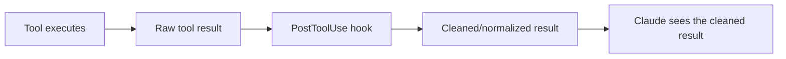
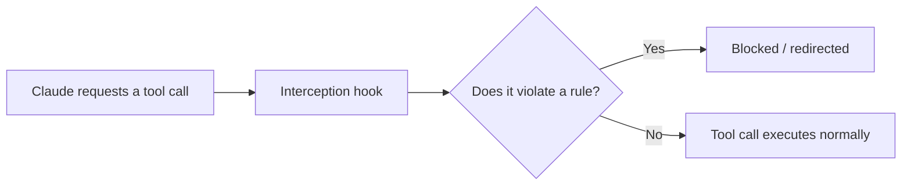
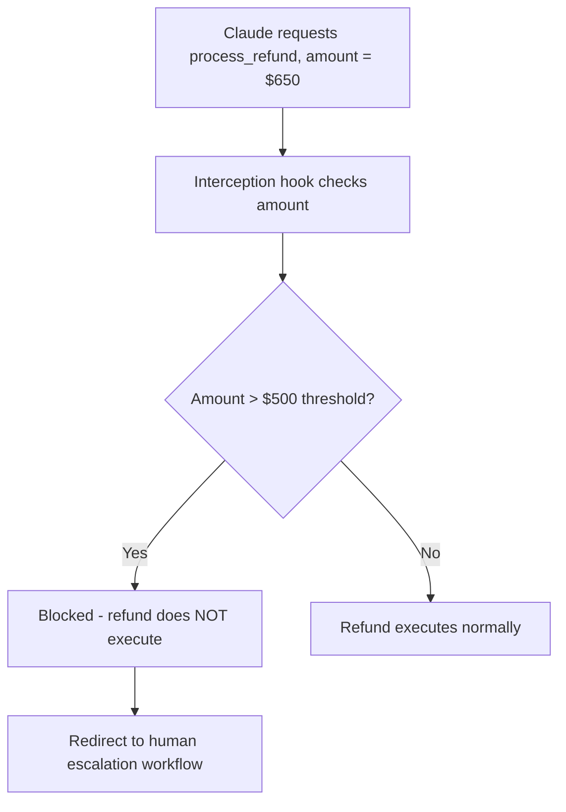

# CCAF Domain 1: Agentic Architecture & Orchestration
## Task Statement 1.5 — Apply Agent SDK Hooks for Tool Call Interception and Data Normalization

---

## 1. Overview

In Task Statement 1.4, we saw hooks used briefly as a way to block a tool call (like `process_refund`) until a prerequisite was met. Now we go deeper into **hooks** as a general Agent SDK feature — what they are, the different points where they can run, and the two big things they're used for:

1. **Cleaning up messy tool results** before Claude sees them (normalization)
2. **Blocking bad actions** before they happen (compliance enforcement)

---

## 2. What is a Hook?

A **hook** is a small piece of code that the Agent SDK runs automatically at a specific point in the tool-calling process. Hooks let you "step in" — either to change data, or to stop something from happening — without needing Claude to do that work itself.

Think of a hook like airport security. Every passenger (tool call or tool result) has to pass through a checkpoint. The checkpoint can:
- **Inspect** what's passing through
- **Modify** it (e.g., ask you to repack something)
- **Block** it entirely (e.g., stop a prohibited item)

---

## 3. Two Key Hook Patterns

### A. `PostToolUse` — intercepting tool *results*

This hook runs **after** a tool has already executed, but **before** Claude sees the result. It's used to transform, clean, or normalize the data coming back from a tool.



### B. Tool call interception — intercepting outgoing tool *calls*

This hook runs **before** a tool call is actually executed. It's used to enforce compliance rules — checking whether this action is even allowed to happen at all.



**Simple way to remember the difference:**
- `PostToolUse` = cleans up the answer coming **back**
- Interception hook = checks permission **before** the action goes **out**

---

## 4. Why This Matters: Deterministic Guarantees vs. Prompt Instructions

This connects directly to what we learned in Task Statement 1.4.

You *could* try to solve both of these problems (messy data, policy violations) just by writing prompt instructions:

```
System prompt: "If you see a timestamp, please convert it to a readable date."
System prompt: "Please don't approve refunds over $500 without escalating."
```

But prompt instructions are **probabilistic** — Claude usually follows them, but there's always a small chance it doesn't (misreads the data, forgets the rule under a long conversation, etc.).

**Hooks are deterministic.** The code runs every single time, guaranteed, no matter what Claude "decides." This is why hooks are the right tool when business rules must be followed 100% of the time.

| | Prompt instructions | Hooks |
|---|---|---|
| Reliability | Probabilistic — usually works, but not guaranteed | Deterministic — guaranteed to run every time |
| Best for | Style, tone, soft preferences | Business rules, compliance, data consistency |
| Example | "Please format dates nicely" | Automatically converting every timestamp format before Claude ever sees it |

**Exam tip:** Whenever you see the word "guaranteed," "must always," or "compliance rule" in a scenario — hooks are the answer, not just a system prompt instruction.

---

## 5. Skill: Normalizing Heterogeneous Data with `PostToolUse`

In real systems, different tools (especially different MCP servers) often return data in **different formats** for the same type of information. This is confusing for Claude and can lead to mistakes.

### Common inconsistency examples

| Data type | Tool A's format | Tool B's format | Tool C's format |
|---|---|---|---|
| Timestamp | Unix timestamp: `1731024000` | ISO 8601: `"2024-11-08T00:00:00Z"` | `"Nov 8, 2024"` |
| Status | `200` (numeric code) | `"success"` (string) | `true` (boolean) |

If Claude has to interpret all these different formats itself, every single time, that's extra work and extra room for mistakes. A **`PostToolUse` hook** can normalize all of them into one **consistent format** before Claude ever sees the data.

### Example: Normalizing timestamps

```python
from datetime import datetime, timezone

def normalize_timestamp(raw_value):
    """
    Converts different timestamp formats into one consistent ISO 8601 string.
    """
    # Case 1: Unix timestamp (integer or numeric string)
    if isinstance(raw_value, (int, float)):
        return datetime.fromtimestamp(raw_value, tz=timezone.utc).isoformat()

    # Case 2: Already ISO 8601 - just return as-is
    if isinstance(raw_value, str) and "T" in raw_value and raw_value.endswith("Z"):
        return raw_value

    # Case 3: Human-readable date string like "Nov 8, 2024"
    if isinstance(raw_value, str):
        parsed = datetime.strptime(raw_value, "%b %d, %Y")
        return parsed.replace(tzinfo=timezone.utc).isoformat()

    raise ValueError(f"Unrecognized timestamp format: {raw_value}")
```

### Example: Normalizing status codes

```python
def normalize_status(raw_status):
    """
    Converts different status representations into one consistent string.
    """
    if raw_status in (200, "success", True):
        return "success"
    if raw_status in (500, "error", False):
        return "error"
    return "unknown"
```

### Wiring it into a `PostToolUse` hook

```python
def post_tool_use_hook(tool_name, raw_result):
    """
    Runs automatically after any tool call finishes, before Claude sees the result.
    """
    normalized_result = dict(raw_result)  # copy so we don't mutate the original

    if "timestamp" in normalized_result:
        normalized_result["timestamp"] = normalize_timestamp(normalized_result["timestamp"])

    if "status" in normalized_result:
        normalized_result["status"] = normalize_status(normalized_result["status"])

    return normalized_result
```

Now, no matter which MCP tool the data came from, Claude always receives clean, predictable, consistent data — `"timestamp"` always in ISO 8601, `"status"` always `"success"` or `"error"`. Claude doesn't have to guess or interpret different formats itself.

---

## 6. Skill: Blocking Policy-Violating Actions with Interception Hooks

The second major use of hooks is enforcing **compliance rules** — stopping Claude from taking an action that violates a business policy, before that action ever actually runs.

### Example: Blocking refunds above $500

```python
REFUND_THRESHOLD = 500

def pre_tool_call_hook(tool_name, tool_input):
    """
    Runs automatically before a tool call executes.
    Can block the call and redirect to an alternative workflow.
    """
    if tool_name == "process_refund":
        amount = tool_input.get("amount", 0)

        if amount > REFUND_THRESHOLD:
            return {
                "allow": False,
                "reason": f"Refund of ${amount} exceeds the ${REFUND_THRESHOLD} auto-approval limit.",
                "redirect_to": "human_escalation_workflow"
            }

    return {"allow": True}
```

### What happens when the hook blocks the call

```python
def execute_tool_call(tool_name, tool_input):
    hook_result = pre_tool_call_hook(tool_name, tool_input)

    if not hook_result["allow"]:
        # Redirect to an alternative workflow instead of running the tool
        return trigger_human_escalation(
            reason=hook_result["reason"],
            tool_name=tool_name,
            tool_input=tool_input
        )

    # Only reached if the hook allowed it
    return run_actual_tool(tool_name, tool_input)
```

### Diagram: interception + redirect flow



**Important:** This block happens **no matter what Claude's reasoning was**. Even if Claude was totally convinced the refund was justified, the hook still stops it — because this is a hard business rule, not a judgment call left to the model.

---

## 7. Choosing Hooks Over Prompt-Based Enforcement

Here's a simple decision guide for the exam:

### Ask: "What happens if this rule is followed 99% of the time but fails 1% of the time?"

- If the answer is "that's mostly fine" → prompt-based guidance may be acceptable
- If the answer is "that 1% could cause real financial, legal, security, or safety harm" → you need a **hook**, not just a prompt instruction

### Examples of when hooks are required

| Scenario | Why hooks are needed |
|---|---|
| Refund amount limits | A missed rule = real money lost incorrectly |
| Identity verification before financial action | A missed check = wrong person gets access/money |
| Data format consistency across tools | Small formatting mistakes can cascade into wrong reasoning by Claude |
| Regulatory or legal compliance rules | Non-compliance can have serious legal consequences |

### Examples of when prompts are usually fine

| Scenario | Why prompts are usually enough |
|---|---|
| Preferred tone or writing style | No serious harm if occasionally inconsistent |
| General helpfulness reminders | Soft guidance, not a hard rule |
| Formatting preferences for the final chat reply | Cosmetic, not a compliance issue |

---

## 8. Putting It All Together: Full Example

```python
REFUND_THRESHOLD = 500

def pre_tool_call_hook(tool_name, tool_input):
    if tool_name == "process_refund" and tool_input.get("amount", 0) > REFUND_THRESHOLD:
        return {
            "allow": False,
            "reason": "Refund exceeds auto-approval threshold.",
            "redirect_to": "human_escalation_workflow"
        }
    return {"allow": True}


def post_tool_use_hook(tool_name, raw_result):
    normalized_result = dict(raw_result)
    if "timestamp" in normalized_result:
        normalized_result["timestamp"] = normalize_timestamp(normalized_result["timestamp"])
    if "status" in normalized_result:
        normalized_result["status"] = normalize_status(normalized_result["status"])
    return normalized_result


def agent_tool_execution_pipeline(tool_name, tool_input):
    # Step 1: Interception hook runs BEFORE the tool call executes
    hook_decision = pre_tool_call_hook(tool_name, tool_input)
    if not hook_decision["allow"]:
        return trigger_human_escalation(hook_decision["reason"], tool_name, tool_input)

    # Step 2: Tool actually executes
    raw_result = run_actual_tool(tool_name, tool_input)

    # Step 3: PostToolUse hook runs AFTER execution, before Claude sees the result
    clean_result = post_tool_use_hook(tool_name, raw_result)

    return clean_result
```

---

## 9. Quick Reference Summary

| Concept | Key Point |
|---|---|
| Hook | Code that runs automatically at a specific point in the tool-calling process |
| `PostToolUse` hook | Runs after a tool executes, before Claude sees the result — used for normalization/transformation |
| Interception hook | Runs before a tool call executes — used to enforce compliance rules, can block/redirect |
| Deterministic vs. probabilistic | Hooks are guaranteed to run every time; prompt instructions are not guaranteed |
| Data normalization | Convert inconsistent formats (timestamps, status codes) from different MCP tools into one consistent format |
| Compliance blocking | Stop policy-violating actions (e.g., refunds over $500) and redirect to an alternative workflow (e.g., human escalation) |
| When to use hooks | Whenever a business rule needs guaranteed compliance, not just "usually followed" |

---

## 10. Practice Questions (Exam Prep)

**Q1.** What is the key difference between a `PostToolUse` hook and a tool call interception hook?

**Answer:** `PostToolUse` runs after a tool has executed, to transform/clean its result before Claude sees it. An interception hook runs before a tool call executes, to check and potentially block/redirect the action itself.

**Q2.** Why might three different MCP tools return timestamps in three different formats, and why is this a problem?

**Answer:** Different tools/services are built by different teams or systems with different conventions (Unix timestamp, ISO 8601, human-readable string). This is a problem because Claude has to interpret each format correctly every time, which increases the chance of misreading or misusing the data.

**Q3.** A business rule states refunds over $500 must always go to human review. Why is a hook a better choice than a prompt instruction for enforcing this?

**Answer:** Because prompt instructions are probabilistic — Claude could occasionally miss or misapply the rule. A hook guarantees the rule is enforced every single time, regardless of Claude's reasoning, which is required for a hard business rule involving money.

**Q4.** In the refund-blocking example, what happens after the interception hook blocks the tool call?

**Answer:** Instead of executing the refund, the system redirects to an alternative workflow — in this case, human escalation.

**Q5.** True or False: Hooks should be used for every instruction you want Claude to follow, including style and tone preferences.

**Answer:** False — hooks are best reserved for cases needing guaranteed, deterministic compliance (like business rules or data consistency). Soft preferences like tone or style are usually fine with prompt-based guidance.

**Q6.** What does it mean to "normalize" tool result data, and at which hook point does this typically happen?

**Answer:** Normalizing means converting inconsistent data formats (e.g., different timestamp or status formats) into one consistent format. This typically happens in a `PostToolUse` hook, after the tool executes but before Claude processes the result.

---

*End of Domain 1 — Task Statement 1.5 tutorial.*

---

# Domain 1 Complete

This completes all five task statements in **Domain 1: Agentic Architecture & Orchestration**:
- 1.1 Agentic loop lifecycle
- 1.2 Coordinator-subagent patterns
- 1.3 Subagent invocation, context passing, and spawning
- 1.4 Multi-step workflow enforcement and handoff patterns
- 1.5 Agent SDK hooks for interception and normalization

Ready to continue with Domain 2 whenever you are.
