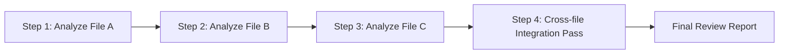
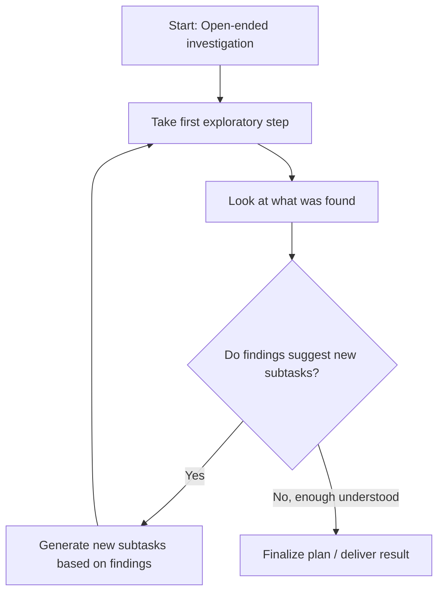
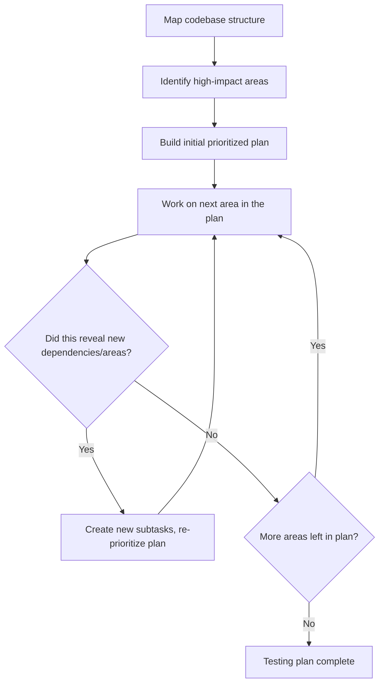

# CCAF Domain 1: Agentic Architecture & Orchestration
## Task Statement 1.6 — Design Task Decomposition Strategies for Complex Workflows

---

## 1. Overview

When Claude faces a big, complex task, it usually cannot (and shouldn't) try to do everything in one giant step. The task needs to be broken down — **decomposed** — into smaller pieces.

But there isn't just one way to decompose a task. This tutorial covers **two major strategies**:

1. **Prompt chaining** — a fixed, predictable sequence of steps
2. **Dynamic adaptive decomposition** — a flexible plan that changes based on what is discovered along the way

Knowing *which* one to use for a given situation is a key exam skill.

---

## 2. Prompt Chaining (Fixed Sequential Pipelines)

**Prompt chaining** means breaking a task into a **fixed sequence of steps**, where each step's output feeds into the next step. The order is decided **in advance** by the developer — it does not change based on what is found along the way.



### When to use prompt chaining

Prompt chaining works best when:
- The task is **predictable** — you already know what steps are needed
- The task has **multiple distinct aspects** that each deserve focused attention
- The order of steps doesn't need to change based on results

### Example: Code review using prompt chaining

Imagine reviewing a pull request with 3 changed files. A fixed pipeline could look like:

```python
def prompt_chain_code_review(files):
    file_analyses = []

    # Step 1-3: Analyze each file individually, one after another
    for file in files:
        analysis = analyze_single_file(file)
        file_analyses.append(analysis)

    # Step 4: A separate, final step - cross-file integration pass
    integration_report = analyze_cross_file_integration(file_analyses)

    return combine_into_final_report(file_analyses, integration_report)
```

Each step here is planned ahead of time. We always analyze files first, then always run the integration pass. This predictability is exactly what makes prompt chaining a good fit for reviews.

---

## 3. Dynamic Adaptive Decomposition

**Dynamic decomposition** means the plan is **not fixed in advance**. Instead, the agent decides what to do next **based on what it discovers** at each step. New subtasks can be created on the fly.



### When to use dynamic decomposition

Dynamic decomposition works best when:
- The task is **open-ended** — you don't know in advance exactly what needs to be done
- What you find in early steps should **change** what you do next
- A fixed pipeline would either miss important things or waste time on irrelevant ones

### Example: Why fixed pipelines fail for open-ended tasks

Imagine the task: "Add comprehensive tests to this legacy codebase." You don't know in advance:
- Which parts of the codebase are most important
- Which parts already have tests and which don't
- Which parts are risky or complicated

A fixed, pre-planned sequence like "test file 1, then file 2, then file 3" doesn't make sense here — you don't even know yet what "file 1, 2, 3" should be until you've explored the codebase.

---

## 4. Choosing the Right Strategy: Decision Guide

| Situation | Best strategy |
|---|---|
| Reviewing a pull request with a known set of files | Prompt chaining |
| Running the same multi-step quality checklist on every submission | Prompt chaining |
| Investigating an unfamiliar/legacy codebase | Dynamic decomposition |
| Open-ended research on a broad topic | Dynamic decomposition |
| The next step depends heavily on what was just found | Dynamic decomposition |
| The steps needed are known and predictable ahead of time | Prompt chaining |

**Exam tip:** The core question to ask is: *"Do I already know all the steps in advance, or will I only discover them as I go?"* Known steps → prompt chaining. Unknown, discovery-driven steps → dynamic decomposition.

---

## 5. Skill: Splitting Code Reviews into Per-File + Cross-File Passes

This is a specific, important pattern worth its own section: **avoiding attention dilution** in code reviews.

### The problem: attention dilution

If you ask Claude to review 10 changed files **all at once**, in one giant pass, its attention gets spread thin across all the files simultaneously. Details in individual files can get missed because the model is trying to juggle everything at once.

### The solution: two separate types of passes

**1. Per-file local analysis pass** — review each file **on its own**, deeply, without distraction from the other files.

```python
def analyze_single_file(file):
    """
    Focused, local analysis - looking only at this one file's own code
    quality, bugs, style issues, etc.
    """
    return {
        "file": file.name,
        "issues": find_issues_in_file(file),
        "suggestions": generate_suggestions_for_file(file)
    }
```

**2. Cross-file integration pass** — a **separate**, dedicated step that looks at how the files work **together**: Do they call each other correctly? Are there consistency issues across files? Did a change in one file break an assumption in another?

```python
def analyze_cross_file_integration(file_analyses):
    """
    A separate, focused pass - only concerned with how files interact,
    not re-checking each file's individual code quality again.
    """
    return {
        "integration_issues": find_integration_issues(file_analyses),
        "consistency_issues": find_cross_file_consistency_issues(file_analyses)
    }
```

### Why splitting these two concerns helps

- Each pass has a **narrow, focused job** — this reduces attention dilution
- Per-file issues (like a typo or a bug in one function) don't get lost among 9 other files
- Cross-file issues (like "File A assumes File B returns a list, but File B now returns a dictionary") get their own dedicated attention, instead of being an afterthought

### Full pattern

```python
def reviewed_split_pipeline(files):
    # Pass 1: local, per-file analysis (can even be done in parallel)
    file_analyses = [analyze_single_file(f) for f in files]

    # Pass 2: separate, cross-file integration analysis
    integration_report = analyze_cross_file_integration(file_analyses)

    return {
        "per_file_results": file_analyses,
        "integration_results": integration_report
    }
```

---

## 6. Skill: Adaptive Investigation Plans for Open-Ended Tasks

Let's walk through the exact example from the syllabus: **"Add comprehensive tests to a legacy codebase."**

This is a great example of a task that *cannot* be fully planned out in advance. Here's the adaptive approach:

### Step 1: Map the structure first

Before deciding what to test, first understand what exists.

```python
def map_codebase_structure(codebase_path):
    return {
        "modules": list_all_modules(codebase_path),
        "existing_test_coverage": get_current_test_coverage(codebase_path),
        "dependency_graph": build_dependency_graph(codebase_path)
    }
```

### Step 2: Identify high-impact areas

Not all code is equally important to test. Some parts are core, heavily-used, or risky; others are minor or rarely touched.

```python
def identify_high_impact_areas(structure_map):
    return [
        module for module in structure_map["modules"]
        if is_frequently_used(module, structure_map["dependency_graph"])
        or has_low_test_coverage(module, structure_map["existing_test_coverage"])
        or is_business_critical(module)
    ]
```

### Step 3: Create a prioritized plan — and let it adapt

Now build an initial plan, but **don't lock it in permanently**. As testing work uncovers new information (e.g., a hidden dependency, an undocumented edge case, a module that's more complex than expected), the plan should update.

```python
def adaptive_testing_plan(codebase_path):
    structure_map = map_codebase_structure(codebase_path)
    high_impact_areas = identify_high_impact_areas(structure_map)

    plan = prioritize_areas(high_impact_areas)
    completed = []

    while plan:
        current_area = plan.pop(0)
        result = write_tests_for_area(current_area)
        completed.append(result)

        # ADAPTIVE STEP: check if this work revealed new things to test
        newly_discovered_dependencies = result.get("discovered_dependencies", [])
        if newly_discovered_dependencies:
            new_subtasks = create_subtasks_for(newly_discovered_dependencies)
            plan = prioritize_areas(plan + new_subtasks)  # re-prioritize with new info

    return completed
```

### Why this matters

Notice the key line: *if testing area A reveals a hidden dependency on module B, new subtasks for B get added to the plan* — even though B wasn't part of the original plan at all. This is the essence of dynamic decomposition: **the plan grows and changes based on what is discovered**, instead of being fixed from the very beginning.

### Diagram: adaptive testing plan flow



---

## 7. Side-by-Side Comparison

| | Prompt Chaining | Dynamic Adaptive Decomposition |
|---|---|---|
| Plan decided | In advance, by the developer | On the fly, as the agent learns more |
| Best for | Predictable, multi-aspect reviews | Open-ended, exploratory tasks |
| Example | Reviewing known files in a PR, then a cross-file pass | Adding tests to an unfamiliar legacy codebase |
| Flexibility | Low — steps don't change | High — steps can be added/reprioritized |
| Risk if misused | Using this for open-ended tasks can miss important, unexpected areas | Using this for simple predictable tasks adds unnecessary complexity/overhead |

---

## 8. Quick Reference Summary

| Concept | Key Point |
|---|---|
| Prompt chaining | Fixed sequence of steps decided in advance; good for predictable, multi-aspect tasks |
| Dynamic decomposition | Plan adapts based on discoveries; good for open-ended, exploratory tasks |
| Attention dilution | Reviewing too much at once causes details to get missed |
| Per-file + cross-file split | Separate passes: local per-file analysis, then a dedicated cross-file integration pass |
| Adaptive investigation plan | Map structure → identify high-impact areas → build prioritized plan → adapt as new dependencies are discovered |

---

## 9. Practice Questions (Exam Prep)

**Q1.** What is the main difference between prompt chaining and dynamic adaptive decomposition?

**Answer:** Prompt chaining uses a fixed sequence of steps decided in advance. Dynamic decomposition generates and adjusts subtasks based on what is discovered while doing the work.

**Q2.** For reviewing a pull request with a known, fixed list of files, which decomposition strategy is more appropriate, and why?

**Answer:** Prompt chaining — the files and review steps are known ahead of time and don't need to change based on findings, making a fixed sequential pipeline a good fit.

**Q3.** What problem does splitting a code review into per-file and cross-file passes solve?

**Answer:** It solves attention dilution — reviewing many files all at once can cause details in individual files to be missed. Separating local per-file analysis from a dedicated cross-file integration pass keeps each pass focused.

**Q4.** In the "add comprehensive tests to a legacy codebase" example, what are the three main steps of the adaptive approach?

**Answer:** First map the codebase structure, then identify high-impact areas, then create a prioritized plan that adapts as new dependencies or areas are discovered during the work.

**Q5.** True or False: In dynamic adaptive decomposition, the original plan is treated as final and should not change once work begins.

**Answer:** False — the plan is meant to adapt. New subtasks can be added and priorities can shift as new information is discovered.

**Q6.** Give an example of when using dynamic decomposition for a task would be unnecessary overhead.

**Answer:** When the task is predictable and the full set of steps is already known in advance — e.g., a routine multi-aspect review with a known file list — using dynamic decomposition there just adds unneeded complexity compared to a simple prompt chain.

---

*End of Domain 1 — Task Statement 1.6 tutorial.*

---

# Domain 1 Fully Complete

All six task statements in **Domain 1: Agentic Architecture & Orchestration** are now covered:
- 1.1 Agentic loop lifecycle
- 1.2 Coordinator-subagent patterns
- 1.3 Subagent invocation, context passing, and spawning
- 1.4 Multi-step workflow enforcement and handoff patterns
- 1.5 Agent SDK hooks for interception and normalization
- 1.6 Task decomposition strategies for complex workflows

Ready for Domain 2 whenever you'd like to continue.
