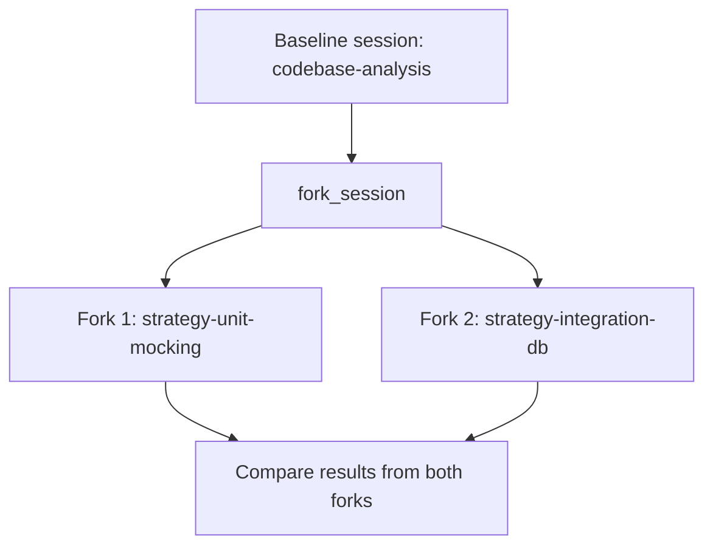
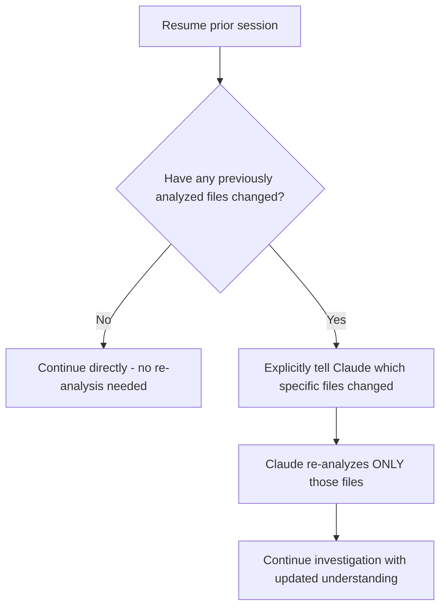
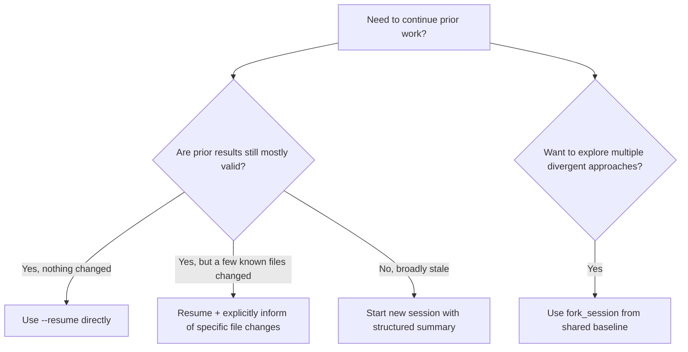

# CCAF Domain 1: Agentic Architecture & Orchestration
## Task Statement 1.7 — Manage Session State, Resumption, and Forking

---

## 1. Overview

Agentic work often doesn't finish in one sitting. You might investigate a codebase today, then come back tomorrow to continue. Or you might want to try two different approaches from the same starting point, without redoing your analysis twice.

This tutorial covers three related tools for managing this:
1. **`--resume`** — continuing a specific, named prior session
2. **`fork_session`** — branching off into independent parallel explorations
3. **Structured summaries** — starting fresh, but with the important context carried over cleanly

---

## 2. Named Session Resumption with `--resume`

When you work with Claude across multiple work sessions (e.g., different days, or different terminal sessions), you don't want to lose all your prior progress and context. **`--resume`** lets you continue a specific, **named** conversation exactly where it left off.

### Basic idea

```bash
# Start a named investigation session
claude --session-name "auth-bug-investigation"

# ... work happens, investigation progresses ...
# (you close your terminal, go do something else)

# Later, come back and resume the SAME session by name
claude --resume "auth-bug-investigation"
```

By naming the session, you can have several different ongoing investigations at once (e.g., `"auth-bug-investigation"`, `"performance-refactor"`, `"api-migration"`) and resume the exact right one whenever you come back to it.

### Why this matters

Without named resumption, you'd have to either:
- Keep one huge, unfocused session running for everything (confusing, and other unrelated work pollutes the context), or
- Start completely fresh every time you come back (losing all prior investigation work)

`--resume` solves both problems: focused, separate sessions that you can pick back up exactly where you left off.

---

## 3. `fork_session`: Branching from a Shared Baseline

We touched on fork-based session management briefly in Task Statement 1.3. Now let's look at the actual mechanism: **`fork_session`**.

`fork_session` creates an **independent branch** of a session, starting from the current point. This lets you explore multiple different, divergent approaches — all starting from the same shared analysis — without the branches interfering with each other.

### Example use case

Imagine you've already had Claude deeply analyze a codebase's testing setup (the baseline). Now you want to compare **two different testing strategies**: one using unit tests with heavy mocking, another using integration tests with a test database. You don't want to redo the codebase analysis twice — and you don't want the exploration of strategy 1 to mix with or influence strategy 2.

```bash
# Baseline: Claude has already deeply analyzed the codebase's structure

# Fork 1: explore the mocking-based unit test strategy
claude fork_session --from "codebase-analysis" --new-session "strategy-unit-mocking"

# Fork 2: explore the integration test / test database strategy
claude fork_session --from "codebase-analysis" --new-session "strategy-integration-db"
```



### Why forking, instead of just resuming twice?

If you just used `--resume "codebase-analysis"` twice and worked on both strategies in the same session, they would mix together — Claude's reasoning about strategy 1 could bleed into strategy 2, and vice versa. Forking keeps them **cleanly separated** after the fork point, while still sharing everything that happened **before** the fork (the baseline analysis).

---

## 4. Informing the Agent About File Changes When Resuming

This is a subtle but important issue. Suppose you resumed a session using `--resume`, but since the last time you worked with Claude, **you (or someone else) changed some of the files** that Claude had already analyzed.

**The problem:** Claude's understanding of those files, stored in its resumed context, is now **out of date**. If you don't tell it anything changed, Claude may keep reasoning based on the old (now incorrect) version of the file.

### The fix: explicitly inform the agent about specific changes

Instead of just resuming and hoping Claude notices, you should explicitly tell it what changed — and let it do a **targeted re-analysis** of just those files, rather than re-exploring the entire codebase from scratch.

```python
resume_message = (
    "Resuming our investigation. Since we last spoke, the following files "
    "have changed:\n"
    "- src/auth/login.py (login validation logic was refactored)\n"
    "- src/auth/session.py (session expiry time was changed from 30 to 60 minutes)\n\n"
    "Please re-analyze only these two files before continuing with the "
    "investigation. All other prior findings still apply."
)
```

### Why targeted re-analysis, not full re-exploration?

- **Full re-exploration** of the whole codebase wastes time and tokens re-checking things that haven't changed at all.
- **Targeted re-analysis** only redoes the work that's actually necessary — much more efficient, and Claude gets back up to speed quickly.



**Exam tip:** The key skill being tested here is knowing to proactively inform the agent of specific file changes — not assuming Claude will magically know, and not forcing a full re-exploration when a targeted one will do.

---

## 5. Why Starting Fresh with a Structured Summary Can Be Better Than Resuming

Sometimes resuming isn't the best option at all. If **a lot** has changed, or the prior session's tool results are now **stale** (out of date) in many places, trying to patch things up by informing Claude of a handful of changes may not be enough.

### The problem with resuming stale sessions

If most of the tool results in a resumed session are now outdated, Claude is working from a conversation history full of **incorrect assumptions**. Even if you point out a few changes, there could be many more subtle inconsistencies you didn't think to mention. This creates a real risk of Claude reasoning from wrong information.

### The better alternative: start a new session with a structured summary

Instead of resuming a stale session, you can:
1. Extract the **important, still-valid conclusions** from the prior session (not the raw, possibly-stale tool outputs)
2. Write these into a clean, **structured summary**
3. Start a **brand new session**, giving Claude this summary as its starting context

```python
structured_summary = {
    "prior_findings": [
        "Authentication uses JWT tokens with a 30-minute expiry (as of last analysis).",
        "Login validation logic is in src/auth/login.py.",
        "No rate limiting was found on the login endpoint."
    ],
    "known_stale_areas": [
        "Session expiry logic in src/auth/session.py may have changed - verify before relying on it."
    ],
    "next_steps": [
        "Confirm current session expiry behavior.",
        "Check whether rate limiting has since been added to the login endpoint."
    ]
}

new_session_prompt = (
    "Here is a structured summary of a prior investigation into this codebase's "
    "authentication system:\n\n"
    f"{format_summary(structured_summary)}\n\n"
    "Please continue the investigation from here, verifying the flagged stale "
    "areas before relying on them."
)
```

### Why this is more reliable than resuming with stale tool results

| | Resuming stale session | Starting fresh with structured summary |
|---|---|---|
| What Claude sees | The full old conversation, including outdated tool results mixed in with valid ones | Only the clean, verified conclusions that are worth keeping |
| Risk | Claude may accidentally trust outdated information | Lower risk — stale info has been filtered out, or explicitly flagged as needing re-verification |
| Efficiency | May carry a lot of unnecessary old context/tokens | Compact, focused, only the essentials |

**Exam tip:** The core principle is: raw stale tool results are risky to resume with, but a **curated, structured summary of validated conclusions** is a reliable and efficient way to carry knowledge forward into a new session.

---

## 6. Choosing the Right Approach: Decision Guide

| Situation | Best approach |
|---|---|
| Continuing an investigation, nothing important has changed | `--resume` the named session |
| A few specific known files changed since last session | `--resume`, then explicitly inform Claude of those specific changes for targeted re-analysis |
| Want to explore two+ divergent approaches from the same baseline | `fork_session` to branch independently |
| Prior session's tool results are broadly stale/unreliable | Start a new session with a structured summary of validated findings |



---

## 7. Putting It All Together: Full Example

```python
def manage_session_continuation(session_name, files_changed, staleness_level):
    """
    Decide the right session strategy based on how much has changed.
    """
    if staleness_level == "none":
        # Nothing changed - simple resume
        return resume_session(session_name)

    elif staleness_level == "minor":
        # A few specific files changed - resume + targeted re-analysis
        resumed = resume_session(session_name)
        inform_agent_of_file_changes(resumed, files_changed)
        return resumed

    elif staleness_level == "major":
        # Too much has changed / stale - start fresh with a structured summary
        validated_summary = extract_structured_summary(session_name)
        return start_new_session_with_summary(validated_summary)


def explore_divergent_approaches(baseline_session_name, approaches):
    """
    Use fork_session to explore multiple approaches from a shared baseline.
    """
    forked_sessions = {}
    for approach_name in approaches:
        forked_sessions[approach_name] = fork_session(
            from_session=baseline_session_name,
            new_session_name=f"{baseline_session_name}-{approach_name}"
        )
    return forked_sessions
```

---

## 8. Quick Reference Summary

| Concept | Key Point |
|---|---|
| `--resume` | Continue a specific, named prior conversation exactly where it left off |
| `fork_session` | Create independent branches from a shared baseline to explore divergent approaches in parallel |
| Informing about file changes | When resuming after code changes, explicitly tell Claude which files changed for targeted re-analysis |
| Targeted vs. full re-analysis | Prefer targeted re-analysis of only the changed files, not a full re-exploration |
| Structured summary vs. stale resume | If prior tool results are broadly stale, start a new session with a curated structured summary instead of resuming |
| Why summaries are more reliable | Raw stale tool results risk Claude trusting outdated info; a validated summary avoids that risk |

---

## 9. Practice Questions (Exam Prep)

**Q1.** What does `--resume` let you do, and why is naming sessions useful?

**Answer:** `--resume` continues a specific prior conversation exactly where it left off. Naming sessions lets you maintain several separate, focused investigations at once and resume the correct one later.

**Q2.** When would you use `fork_session` instead of just resuming a session multiple times?

**Answer:** When you want to explore multiple divergent approaches from the same shared baseline without them interfering with each other — forking keeps each branch's exploration independent after the fork point, while resuming the same session repeatedly would mix all the approaches together.

**Q3.** If a few files that Claude previously analyzed have changed since the last session, what's the recommended approach?

**Answer:** Resume the session, but explicitly inform Claude which specific files changed so it can perform a targeted re-analysis of just those files, rather than requiring a full re-exploration of everything.

**Q4.** Why can resuming a session with broadly stale tool results be risky?

**Answer:** Because Claude's conversation history would contain a mix of valid and outdated information, and Claude might reason using the outdated (incorrect) tool results without realizing they're no longer accurate.

**Q5.** What is the recommended alternative when prior tool results are too stale to safely resume?

**Answer:** Start a new session and provide Claude with a structured summary containing only the validated, still-relevant conclusions from the prior investigation, rather than the raw stale tool outputs.

**Q6.** True or False: When resuming after file changes, it's best to always trigger a full re-exploration of the whole codebase to be safe.

**Answer:** False — targeted re-analysis of just the specific changed files is preferred. It's more efficient and avoids wasting time/resources re-checking things that haven't changed.

---

*End of Domain 1 — Task Statement 1.7 tutorial.*

---

# Domain 1 Fully Complete

All seven task statements in **Domain 1: Agentic Architecture & Orchestration** are now covered:
- 1.1 Agentic loop lifecycle
- 1.2 Coordinator-subagent patterns
- 1.3 Subagent invocation, context passing, and spawning
- 1.4 Multi-step workflow enforcement and handoff patterns
- 1.5 Agent SDK hooks for interception and normalization
- 1.6 Task decomposition strategies for complex workflows
- 1.7 Session state, resumption, and forking

Ready for Domain 2 whenever you'd like to continue.
