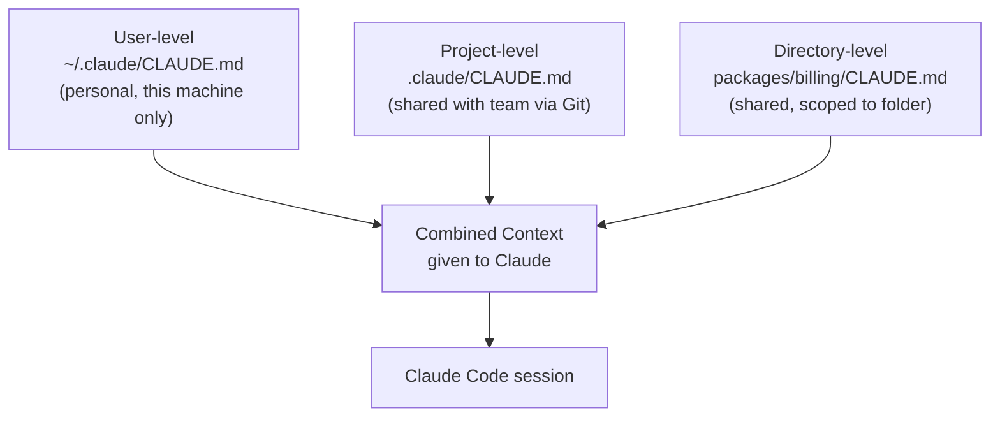
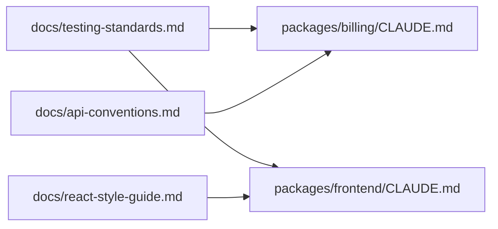
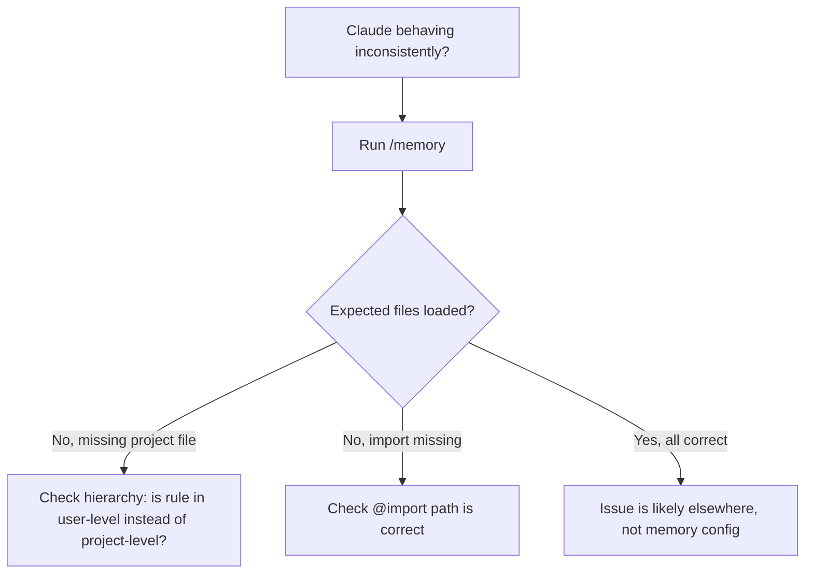

# Task Statement 3.1: Configure CLAUDE.md Files with Appropriate Hierarchy, Scoping, and Modular Organization

**Domain 3: Configuration & Customization**

---

## 1. Introduction

`CLAUDE.md` is a special file. Claude Code reads it automatically at the start of a session. It contains instructions, rules, and context that you want Claude to always know about — things like coding style, project structure, testing rules, or how to handle deployments.

Think of `CLAUDE.md` as a "briefing note" you leave for Claude before it starts working. Instead of typing the same instructions every time, you write them once in `CLAUDE.md`, and Claude reads them automatically.

The tricky part is: **where** you put this file matters a lot. Claude Code supports multiple `CLAUDE.md` files at different levels, and understanding this hierarchy is a core exam skill.

---

## 2. The CLAUDE.md Configuration Hierarchy

Claude Code looks for `CLAUDE.md` files at **three levels**. Each level has a different purpose and different scope (who it applies to).

| Level | File Location | Applies To | Shared with Team? |
|---|---|---|---|
| User-level | `~/.claude/CLAUDE.md` | Only the current user, across ALL their projects | ❌ No — lives on your machine only |
| Project-level | `.claude/CLAUDE.md` or root `CLAUDE.md` | Everyone working on this project | ✅ Yes — checked into version control (e.g. Git) |
| Directory-level | `CLAUDE.md` inside a subdirectory | Only that subdirectory (and folders inside it) | ✅ Yes — checked into version control, but scoped to that folder |

### 2.1 User-level: `~/.claude/CLAUDE.md`

- Lives in your **home directory**, not inside any project.
- Applies to **every project you open** on your machine.
- Good for personal preferences. Example: "Always explain your reasoning before writing code" or "I prefer tabs over spaces."
- **Important exam point:** This file is personal. It is **not** stored inside the project's Git repository, so it is **never shared with teammates**. If you put an instruction here, only you will benefit from it.

```
~/.claude/CLAUDE.md
```

Example content:
```markdown
# My Personal Preferences
- Always ask before installing new npm packages.
- Keep answers short unless I ask for details.
```

### 2.2 Project-level: `.claude/CLAUDE.md` or root `CLAUDE.md`

- Lives at the **root of the project**, usually inside a `.claude/` folder, or directly as `CLAUDE.md` in the project root.
- Applies to **anyone who opens this project** with Claude Code.
- This file **is** checked into Git, so the whole team shares the same instructions.
- Good for: project architecture, coding conventions, build commands, testing rules.

```
my-project/
├── .claude/
│   └── CLAUDE.md      <-- project-level
├── src/
└── package.json
```

Example content:
```markdown
# Project: Payment Service
- This project uses TypeScript and Express.
- Run tests with: npm run test
- Never commit directly to main branch.
```

### 2.3 Directory-level: subdirectory `CLAUDE.md` files

- You can place a `CLAUDE.md` file **inside any subdirectory**.
- It applies only to that folder (and its subfolders), **on top of** the project-level rules.
- Useful in large repositories with multiple packages, where each package has its own conventions.

```
my-project/
├── CLAUDE.md              <-- project-level (applies to everything)
├── packages/
│   ├── billing/
│   │   └── CLAUDE.md      <-- directory-level (applies only inside billing/)
│   └── auth/
│       └── CLAUDE.md      <-- directory-level (applies only inside auth/)
```

Example: `packages/billing/CLAUDE.md`
```markdown
# Billing Package Rules
- All money values must be stored as integers (cents), never floats.
- Every function that touches payments needs a unit test.
```

### 2.4 How the hierarchy works together

Claude Code does **not** pick just one file. It **combines** all the relevant `CLAUDE.md` files for your current working context — user-level + project-level + any directory-level files above where you're working. More specific files add extra context on top of general ones.



**Rule of thumb:** General rules go higher up (project root). Specific rules go closer to the code they affect (subdirectory).

---

## 3. Common Diagnosis Skill: "Why isn't my teammate getting these instructions?"

This is a classic exam scenario. A team member says: *"Claude isn't following our team rules, even though I set them up."*

**Most likely cause:** The instructions were added to `~/.claude/CLAUDE.md` (user-level) instead of `.claude/CLAUDE.md` (project-level).

Since user-level files are **not part of the Git repository**, they never leave the original person's machine. A new team member cloning the project will not see those instructions at all.

### How to diagnose this

1. Ask: "Where did you add the instruction — home folder or project folder?"
2. Check if the file is tracked by Git:
   ```bash
   git status .claude/CLAUDE.md
   ```
   If Git says "not tracked" or the file doesn't exist in the repo, it was never shared.
3. Confirm the correct fix: move the shared instructions into the **project-level** file so it travels with the repository.

| Symptom | Likely Cause | Fix |
|---|---|---|
| Only one person's Claude follows the rule | Rule is in user-level `~/.claude/CLAUDE.md` | Move rule to project-level `.claude/CLAUDE.md` |
| Whole team is missing a rule that should apply to one package only | Rule was put in root `CLAUDE.md` instead of subdirectory | Move rule into that subdirectory's `CLAUDE.md` |
| Rule applies everywhere but should only apply to one package | Rule was put in project-level file, not directory-level | Move rule down into the specific subdirectory's `CLAUDE.md` |

> ⚠️ **Anti-pattern:** Putting team-wide standards (like "always use 2-space indentation for this repo") in your personal `~/.claude/CLAUDE.md`. This creates inconsistent behavior across the team since everyone else's Claude won't know the rule.

---

## 4. The `@import` Syntax — Keeping CLAUDE.md Modular

As projects grow, `CLAUDE.md` can become long and hard to manage. The `@import` syntax lets you **pull in content from other files**, instead of writing everything in one giant file.

### 4.1 Basic syntax

```markdown
# CLAUDE.md
@import ./docs/testing-standards.md
@import ./docs/api-conventions.md
```

When Claude Code loads this `CLAUDE.md`, it also loads the content of `testing-standards.md` and `api-conventions.md` as if they were pasted in.

### 4.2 Why use @import instead of one big file?

- **Modularity:** Each topic lives in its own file (testing, API rules, deployment steps).
- **Reusability:** The same standards file can be imported by multiple packages.
- **Selective inclusion:** Each package can import only the standards relevant to it — based on what the maintainer of that package actually needs to know.

### 4.3 Example: selective imports per package

Imagine a monorepo with a `billing` package and a `frontend` package. They don't need the same standards.

```
my-project/
├── docs/
│   ├── testing-standards.md
│   ├── api-conventions.md
│   └── react-style-guide.md
├── packages/
│   ├── billing/
│   │   └── CLAUDE.md
│   └── frontend/
│       └── CLAUDE.md
```

`packages/billing/CLAUDE.md`:
```markdown
# Billing Package
@import ../../docs/testing-standards.md
@import ../../docs/api-conventions.md
```

`packages/frontend/CLAUDE.md`:
```markdown
# Frontend Package
@import ../../docs/testing-standards.md
@import ../../docs/react-style-guide.md
```

Notice: both import `testing-standards.md` (shared rule), but only `frontend` imports the React style guide, and only `billing` imports API conventions. This is what the exam means by **"selectively including relevant standards files based on maintainer domain knowledge."** The person maintaining `billing` knows their package needs API rules, not React rules.



---

## 5. The `.claude/rules/` Directory — An Alternative to a Monolithic CLAUDE.md

Instead of (or alongside) using `@import`, Claude Code supports a `.claude/rules/` directory. This lets you split rules into **separate topic-specific files**, without needing to manually write `@import` lines for each one — Claude Code automatically picks up files placed here.

### 5.1 Structure

```
my-project/
├── .claude/
│   ├── CLAUDE.md
│   └── rules/
│       ├── testing.md
│       ├── api-conventions.md
│       └── deployment.md
```

Each file focuses on one topic only:

`testing.md`
```markdown
# Testing Rules
- Every new function needs a unit test.
- Use Jest as the test runner.
- Do not merge code with failing tests.
```

`api-conventions.md`
```markdown
# API Conventions
- All endpoints must use plural nouns (e.g. /users not /user).
- Responses must use camelCase JSON keys.
```

`deployment.md`
```markdown
# Deployment Rules
- Never deploy on Fridays.
- Deployment requires two approvals.
```

### 5.2 Why split a large CLAUDE.md into `.claude/rules/`

| Problem with one huge CLAUDE.md | How `.claude/rules/` helps |
|---|---|
| Hard to find a specific rule | Each topic has its own small file |
| Hard to review changes in Git (big diffs) | Changes to "testing" rules only touch `testing.md` |
| Different reviewers own different topics | QA team owns `testing.md`, DevOps owns `deployment.md`, etc. |
| Risk of merge conflicts when many people edit CLAUDE.md | Fewer conflicts since edits are spread across smaller files |

> ⚠️ **Anti-pattern:** Cramming testing rules, API rules, and deployment rules all into one root `CLAUDE.md` that keeps growing every sprint. This becomes hard to maintain and hard to review. Prefer splitting into `.claude/rules/*.md` once the file gets large or covers multiple unrelated topics.

### 5.3 @import vs .claude/rules/ — when to use which

| Approach | Best for |
|---|---|
| `@import` in CLAUDE.md | When different packages/subfolders need **different combinations** of standards files (selective inclusion) |
| `.claude/rules/` directory | When you want to organize **one project's** rules by topic, and want all of them loaded together automatically |

---

## 6. The `/memory` Command — Verifying What's Loaded

Since Claude Code can load instructions from several files (user-level, project-level, directory-level, imports, and rules files), it's easy to lose track of **what Claude actually knows** in a session.

The `/memory` command solves this. Run it inside a Claude Code session:

```
/memory
```

This shows you:
- Which `CLAUDE.md` files were loaded (user, project, directory-level)
- Which files were pulled in through `@import`
- Which files from `.claude/rules/` were included

### 6.1 Why this matters for diagnosis

If Claude is behaving inconsistently across sessions or across team members, `/memory` is your **first diagnostic step**. It tells you exactly what memory files are active, so you can confirm:

- Is the project-level file actually being picked up?
- Did an `@import` fail silently (e.g. wrong file path)?
- Is an unexpected user-level file adding instructions that conflict with team rules?



---

## 7. Quick Reference Summary

| Concept | Key Fact |
|---|---|
| `~/.claude/CLAUDE.md` | User-level. Personal. Not shared with team via Git. |
| `.claude/CLAUDE.md` or root `CLAUDE.md` | Project-level. Shared with team via Git. |
| Subdirectory `CLAUDE.md` | Directory-level. Scoped to that folder and below. |
| `@import ./path/to/file.md` | Pulls content of another file into CLAUDE.md. Enables modular, selective inclusion. |
| `.claude/rules/*.md` | Alternative way to split rules by topic (e.g. testing.md, api-conventions.md, deployment.md). |
| `/memory` | Command to check which memory files are currently loaded — key diagnostic tool. |
| Common bug | New teammate missing instructions → rule was in user-level, not project-level. |

---

## 8. Practice Questions

**Q1.** A developer adds a rule "always use snake_case for Python variables" to `~/.claude/CLAUDE.md`. Their teammate clones the same repository but does not see this rule applied. What is the most likely reason?

A) The rule was written incorrectly
B) `~/.claude/CLAUDE.md` is user-level and is not shared through version control
C) `/memory` was not run
D) The teammate needs to restart their computer

**Answer: B** — User-level CLAUDE.md files live outside the project repository and only apply to the user who created them.

---

**Q2.** Which command should you run to check exactly which CLAUDE.md files and imports are currently active in a Claude Code session?

A) `/status`
B) `/config`
C) `/memory`
D) `/context`

**Answer: C** — `/memory` shows the loaded memory files, including user-level, project-level, directory-level, and any imports.

---

**Q3.** A monorepo has a `billing` package and a `frontend` package. The billing team wants API convention rules but not React style rules, while the frontend team wants React style rules but not API rules. What is the best way to achieve this?

A) Put all rules in the root CLAUDE.md so both packages get everything
B) Use `@import` in each package's CLAUDE.md to selectively include only the relevant standards files
C) Ask each developer to memorize the rules manually
D) Duplicate all standards files into each package folder

**Answer: B** — `@import` allows each package's CLAUDE.md to pull in only the standards files relevant to that package's maintainers.

---

**Q4.** A project's root CLAUDE.md has grown to over 500 lines, covering testing, API design, and deployment steps together. Reviewers find it hard to track changes in pull requests. What is the recommended fix?

A) Delete the CLAUDE.md file entirely
B) Split the content into topic-specific files inside `.claude/rules/` (e.g. testing.md, api-conventions.md, deployment.md)
C) Move all content to user-level CLAUDE.md
D) Convert CLAUDE.md into a binary file

**Answer: B** — Splitting into `.claude/rules/` keeps each topic in its own file, making changes easier to review and reducing merge conflicts.

---

**Q5.** True or False: A subdirectory-level CLAUDE.md file completely replaces the project-level CLAUDE.md when Claude Code works inside that subdirectory.

**Answer: False** — Claude Code combines the relevant CLAUDE.md files (user-level + project-level + directory-level); the directory-level file adds more specific context, it does not replace the higher-level files.

---

**Q6.** Where should a rule that applies to the entire team, for the entire project, be placed?

A) `~/.claude/CLAUDE.md`
B) `.claude/CLAUDE.md` (project-level, root of the repo)
C) A random subdirectory's CLAUDE.md
D) It cannot be shared with a team

**Answer: B** — Project-level CLAUDE.md is checked into version control and shared with everyone working on the project.

---

**Q7.** What is the main risk of putting team-wide coding standards into your personal `~/.claude/CLAUDE.md` instead of the project-level file?

A) Claude Code will crash
B) The rule only applies to you; teammates will not see it since it's not version-controlled
C) It will slow down Claude Code
D) There is no risk, both are identical

**Answer: B** — User-level files are local to the machine and are never shared with teammates through Git, leading to inconsistent behavior across the team.