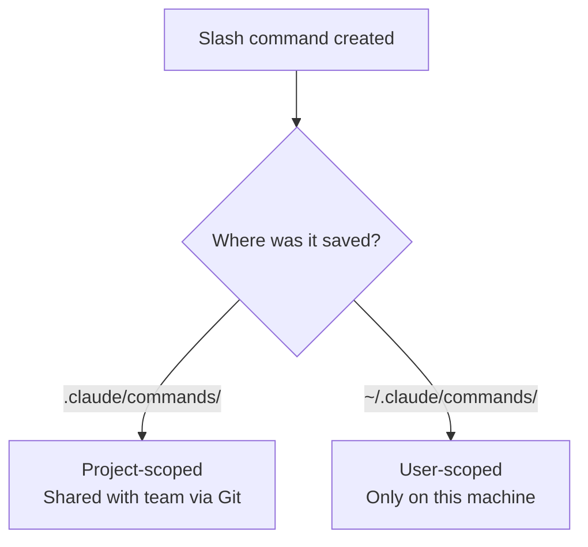
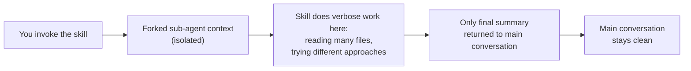
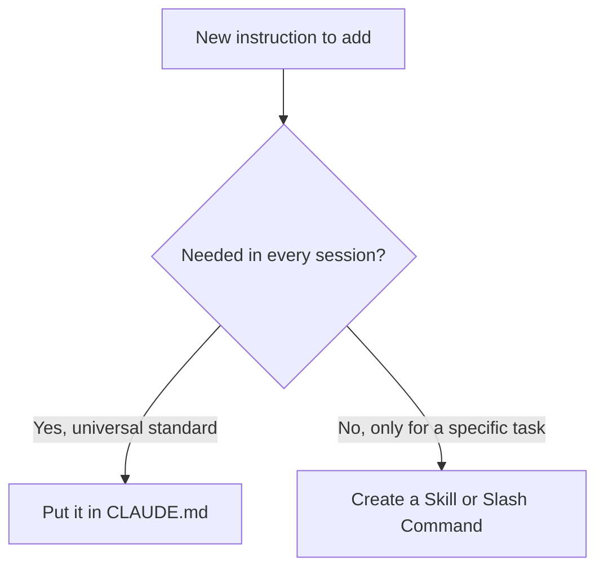

# Task Statement 3.2: Create and Configure Custom Slash Commands and Skills

**Domain 3: Configuration & Customization**

---

## 1. Introduction

In the last tutorial, we learned that `CLAUDE.md` gives Claude **always-loaded** instructions — things Claude should know in every session.

But sometimes you don't want something loaded *all the time*. You want a specific action available **on demand** — something you trigger only when you need it. This is what **slash commands** and **skills** are for.

- A **slash command** is a shortcut you type (like `/deploy`) that runs a predefined prompt or workflow.
- A **skill** is a more structured, reusable capability, defined in a `SKILL.md` file, that Claude can invoke for a specific task (like "analyze this codebase" or "write release notes").

Both can be scoped to just you, or shared with your whole team.

---

## 2. Slash Commands: Project-Scoped vs User-Scoped

Just like `CLAUDE.md`, slash commands have a **hierarchy** based on where the file lives.

| Location | Scope | Shared with Team via Git? |
|---|---|---|
| `.claude/commands/` | Project-scoped | ✅ Yes |
| `~/.claude/commands/` | User-scoped (personal) | ❌ No |

### 2.1 Project-scoped commands: `.claude/commands/`

- Lives inside the project repository.
- Checked into version control, so **everyone on the team gets the same command**.
- Best for workflows the whole team should be able to run the same way — e.g. `/deploy`, `/run-tests`, `/generate-changelog`.

Example: `.claude/commands/run-tests.md`
```markdown
---
description: Run the full test suite and summarize failures
---
Run the project's test suite using `npm run test`.
Summarize any failing tests in a short bullet list, and suggest likely causes.
```

Once this file exists, any team member can type:
```
/run-tests
```
and Claude will follow those instructions.

### 2.2 User-scoped commands: `~/.claude/commands/`

- Lives in your home directory, outside any project.
- Applies only to you, on your machine.
- Not shared with teammates through version control.
- Good for personal shortcuts you like, but that aren't official team workflows.

Example: `~/.claude/commands/explain-simply.md`
```markdown
---
description: Explain the selected code in very simple terms
---
Explain the code above as if teaching a beginner. Avoid jargon. Use short sentences.
```

> ⚠️ **Same exam trap as CLAUDE.md:** If a teammate says "I created a `/deploy` command but no one else can use it," check whether it was placed in `~/.claude/commands/` (personal) instead of `.claude/commands/` (project, shared).



---

## 3. Skills: `.claude/skills/` and `SKILL.md`

A **skill** is a bigger, more structured unit than a simple slash command. Skills live in `.claude/skills/`, and each skill has its own folder containing a `SKILL.md` file.

```
.claude/
└── skills/
    └── codebase-analysis/
        └── SKILL.md
```

`SKILL.md` has two parts:
1. **Frontmatter** — configuration settings at the top, written between `---` lines.
2. **Body** — the actual instructions for what the skill should do.

Example skeleton:
```markdown
---
description: Analyze the codebase and report structure, dependencies, and risks
context: fork
allowed-tools: [Read, Grep, Glob]
argument-hint: "<directory-to-analyze>"
---

# Codebase Analysis Skill
Analyze the given directory. Report:
- Folder structure
- Key dependencies
- Any obvious code smells
```

Let's go through each frontmatter option one at a time, since these are exam-critical.

---

## 4. Frontmatter Option: `context: fork`

By default, when Claude runs a skill, its output becomes part of your **main conversation**. If the skill produces a lot of output (like a long codebase analysis), that output fills up your main conversation's context — even if you only wanted a short summary.

`context: fork` fixes this. It tells Claude Code to run the skill in an **isolated sub-agent context** — a separate mini-session. The sub-agent does the work, and only the **final result** is passed back to your main conversation. All the messy intermediate steps stay inside the fork and don't pollute your main chat.

```markdown
---
description: Analyze the codebase and summarize architecture
context: fork
---
```



### 4.1 When to use `context: fork`

Use it for skills that:
- Produce **verbose output** — e.g. scanning a large codebase file by file.
- Involve **exploratory work** — e.g. brainstorming five different solutions before picking the best one.

In both cases, you care about the final answer, not the noisy process of getting there. Forking keeps your main conversation focused and readable.

> ⚠️ **Anti-pattern:** Running a long, exploratory "brainstorm 10 architecture options" skill directly in the main conversation. This fills up context with ideas you'll discard, making it harder for Claude to stay focused later. Use `context: fork` instead.

---

## 5. Frontmatter Option: `allowed-tools`

Skills can use Claude Code's tools (like reading files, writing files, running bash commands, etc.). By default, a skill might have access to many tools. The `allowed-tools` frontmatter option **restricts** which tools a skill is allowed to use while it runs.

This is a safety mechanism — it limits what a skill *can* do, even if its instructions accidentally (or maliciously) try to do more.

Example: a skill that should only be allowed to write files, never delete or run shell commands:

```markdown
---
description: Generate a changelog file from recent commits
allowed-tools: [Read, Write]
---
```

Here, the skill can `Read` files and `Write` new files, but it **cannot** run Bash commands, and it cannot use any tool not listed. This prevents destructive actions — for example, stopping a skill from accidentally running `rm -rf` or modifying files it shouldn't touch.

| Without `allowed-tools` | With `allowed-tools: [Read, Write]` |
|---|---|
| Skill can use any available tool | Skill can only Read and Write files |
| Higher risk of unintended destructive actions | Restricted, safer, predictable behavior |

> ⚠️ **Anti-pattern:** Giving a skill full tool access (including Bash) when it only needs to read and write text files. Always restrict `allowed-tools` to the minimum needed — this is a least-privilege principle.

---

## 6. Frontmatter Option: `argument-hint`

Some skills need specific input to work — for example, a directory path, a filename, or a ticket number. If a developer invokes the skill without giving that input, `argument-hint` prompts them for it.

```markdown
---
description: Analyze a specific package for test coverage gaps
argument-hint: "<package-name>"
---
```

If someone runs the skill without supplying `<package-name>`, Claude Code uses the `argument-hint` text to prompt them — for example, asking "Which package should I analyze?" — instead of guessing or failing silently.

### 6.1 Full example combining all three options

```markdown
---
description: Explore a large codebase and produce an architecture summary
context: fork
allowed-tools: [Read, Grep, Glob]
argument-hint: "<root-directory-to-explore>"
---

# Codebase Exploration Skill
Explore the given root directory.
Summarize:
- Main modules and their responsibilities
- Key external dependencies
- Any circular dependencies found

Return only the final summary — do not include your full file-by-file notes.
```

This skill:
- Runs isolated (`context: fork`) so its exploration noise doesn't clutter the main chat.
- Can only read/search files (`allowed-tools`) — it cannot write or delete anything.
- Will ask for a directory if the developer forgets to provide one (`argument-hint`).

---

## 7. Personal Skill Customization: `~/.claude/skills/`

Sometimes you want your **own version** of a skill, tweaked to your liking, without changing the shared team version in `.claude/skills/`.

You can create a personal variant in `~/.claude/skills/`, using a **different name** than the team's skill. This avoids conflicts and avoids affecting teammates.

Example:
- Team skill: `.claude/skills/codebase-analysis/SKILL.md` (shared, used by everyone)
- Your personal variant: `~/.claude/skills/codebase-analysis-verbose/SKILL.md` (only you, more detailed output)

```
Project repo (shared):
.claude/skills/codebase-analysis/SKILL.md

Your home folder (personal):
~/.claude/skills/codebase-analysis-verbose/SKILL.md
```

> **Key exam point:** Give your personal variant a **different name**. If you reused the exact same skill name at the user level, it could shadow or conflict with the team's project-level skill, causing confusing behavior for you or others. A distinct name keeps things clear and avoids impacting teammates.

---

## 8. Skills vs CLAUDE.md — When to Use Which

This is a common exam decision point: should something go into a **skill** or into **CLAUDE.md**?

| | CLAUDE.md | Skills |
|---|---|---|
| When it loads | Always, every session | Only when invoked, on demand |
| Best for | Universal standards that apply to all work (e.g. "always write tests", "use TypeScript strict mode") | Task-specific workflows used sometimes (e.g. "analyze this codebase", "generate a changelog") |
| Size/verbosity | Should stay lean since it's always loaded | Can be detailed, since it only loads when needed |
| Example | "This project uses camelCase for JSON keys" | "/generate-release-notes" skill that only runs when preparing a release |



**Rule of thumb:** If Claude should know it *all the time*, it belongs in `CLAUDE.md`. If Claude should use it *only when asked*, it belongs in a skill (or slash command).

---

## 9. Quick Reference Summary

| Concept | Key Fact |
|---|---|
| `.claude/commands/` | Project-scoped slash commands, shared via Git |
| `~/.claude/commands/` | User-scoped slash commands, personal only |
| `.claude/skills/<name>/SKILL.md` | Skill definition file, frontmatter + instructions |
| `context: fork` | Runs skill in isolated sub-agent; only final result returns to main conversation |
| `allowed-tools` | Restricts which tools a skill can use (least privilege) |
| `argument-hint` | Prompts developer for required input if not provided |
| `~/.claude/skills/<different-name>/SKILL.md` | Personal skill variant; use a different name to avoid affecting teammates |
| Skills vs CLAUDE.md | CLAUDE.md = always loaded, universal. Skills = on-demand, task-specific |

---

## 10. Practice Questions

**Q1.** A developer creates a `/deploy` slash command inside `~/.claude/commands/`. Why can't their teammates use it?

A) Slash commands cannot be named `/deploy`
B) `~/.claude/commands/` is user-scoped and not shared through version control
C) The command needs `context: fork`
D) Slash commands only work for admins

**Answer: B** — User-scoped commands live outside the project repo and apply only to that individual user.

---

**Q2.** Which frontmatter option should be used for a skill that explores a large codebase and produces a lot of intermediate output, to keep the main conversation clean?

A) `allowed-tools`
B) `argument-hint`
C) `context: fork`
D) `description`

**Answer: C** — `context: fork` runs the skill in an isolated sub-agent context, returning only the final result to the main conversation.

---

**Q3.** A team wants a skill that generates changelog files but should never be able to delete files or run shell commands. What should they configure?

A) `context: fork`
B) `argument-hint: "<none>"`
C) `allowed-tools: [Read, Write]`
D) Remove the SKILL.md frontmatter entirely

**Answer: C** — `allowed-tools` restricts the skill to only the listed tools, preventing destructive actions like deletion or shell execution.

---

**Q4.** A developer invokes a skill without providing a required package name, and Claude Code prompts them to supply it. Which frontmatter option makes this possible?

A) `context: fork`
B) `argument-hint`
C) `allowed-tools`
D) `description`

**Answer: B** — `argument-hint` tells Claude Code what input is expected, so it can prompt the developer when the argument is missing.

---

**Q5.** A developer wants a personal, more detailed version of the team's shared `codebase-analysis` skill, without affecting teammates. What is the correct approach?

A) Edit `.claude/skills/codebase-analysis/SKILL.md` directly
B) Create `~/.claude/skills/codebase-analysis/SKILL.md` using the exact same name
C) Create `~/.claude/skills/codebase-analysis-verbose/SKILL.md` using a different name
D) Delete the project skill and replace it

**Answer: C** — Personal variants should live in `~/.claude/skills/` with a different name to avoid conflicting with or affecting the shared team skill.

---

**Q6.** A team wants all developers to always follow the rule "use 2-space indentation" in every session, with no need to invoke anything manually. Where should this rule go?

A) A skill in `.claude/skills/`
B) A slash command in `.claude/commands/`
C) `CLAUDE.md`
D) `~/.claude/skills/`

**Answer: C** — Universal, always-applicable standards belong in `CLAUDE.md`, since it loads automatically every session. Skills and commands are for on-demand, task-specific use.

---

**Q7.** True or False: `context: fork` prevents a skill from returning any result to the main conversation.

**Answer: False** — `context: fork` isolates the skill's working process (like verbose exploration) in a sub-agent, but the final result is still returned to the main conversation. Only the noisy intermediate steps are hidden.

---

**Q8.** Which of the following is the best candidate to become a project-scoped slash command (`.claude/commands/`) rather than something in personal `~/.claude/commands/`?

A) A personal shortcut to explain code in very simple terms, for one developer's own learning
B) A `/run-tests` command that the whole team should use consistently
C) A one-off experiment a single developer wants to try privately
D) A preference for shorter answers, for one user only

**Answer: B** — Team-wide, standardized workflows like `/run-tests` belong in the project-scoped `.claude/commands/` so everyone shares the same command via version control.