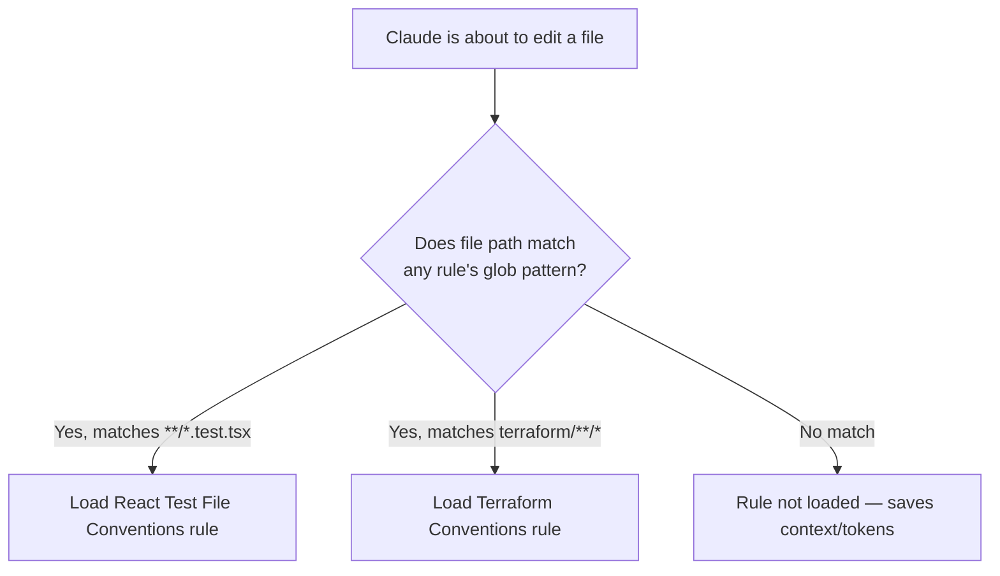
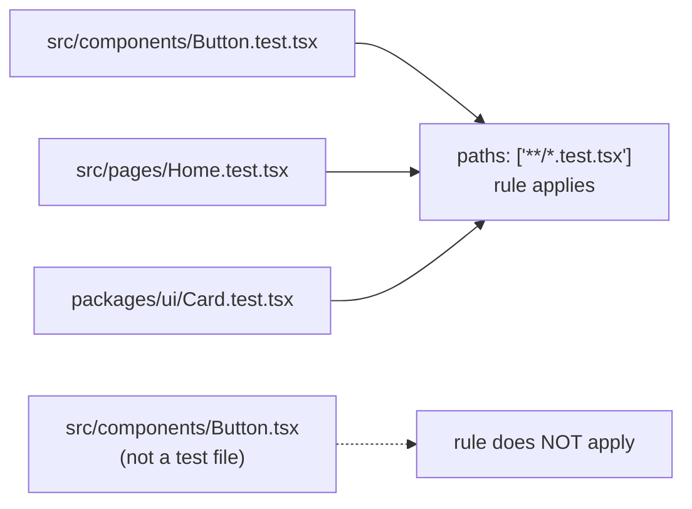
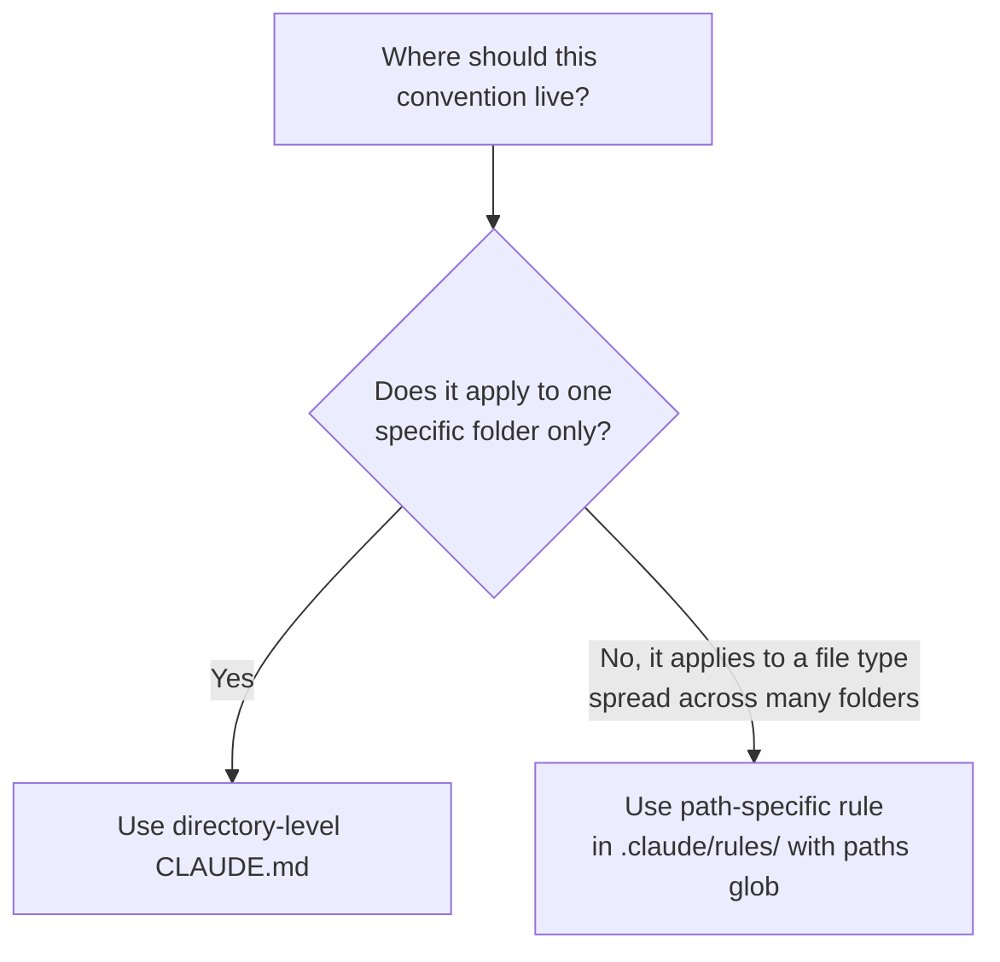

# Task Statement 3.3: Apply Path-Specific Rules for Conditional Convention Loading

**Domain 3: Configuration & Customization**

---

## 1. Introduction

In Task Statement 3.1, we learned that `.claude/rules/` can hold topic-specific files like `testing.md` or `deployment.md`, as an alternative to one giant `CLAUDE.md`.

But there's a problem those topic files don't solve on their own: **not every rule applies to every file.** A rule about Terraform formatting shouldn't load when you're editing a React component. A rule about test file conventions shouldn't load when you're editing a config file.

Loading rules that don't apply wastes **context** and **tokens**, and can even confuse Claude with irrelevant instructions.

This is where **path-specific rules** come in. They use **glob patterns** in YAML frontmatter to say: "only load this rule when the file being edited matches this pattern."

---

## 2. What Is a Path-Specific Rule?

A path-specific rule is a file inside `.claude/rules/` that has **YAML frontmatter** with a `paths` field. The `paths` field contains one or more **glob patterns**. Claude Code only loads that rule's content when the file currently being edited matches one of those patterns.

### 2.1 Basic structure

```markdown
---
paths: ["terraform/**/*"]
---

# Terraform Conventions
- Always pin provider versions.
- Use snake_case for resource names.
- Run `terraform fmt` before committing.
```

If you are editing a file inside the `terraform/` folder (at any depth), this rule loads. If you're editing a file in `src/frontend/`, this rule does **not** load — Claude never sees it, and it doesn't use up any context.

### 2.2 How this differs from a normal `.claude/rules/` file

Recall from 3.1: a normal `.claude/rules/` file like `testing.md` is loaded **as part of the general rules set** whenever Claude Code reads rules for the project. A **path-specific** rule only activates conditionally, based on what file is being touched.

| Rule Type | When It Loads |
|---|---|
| Plain `.claude/rules/testing.md` (no `paths` field) | Loaded generally, as part of the project's rule set |
| `.claude/rules/terraform.md` with `paths: ["terraform/**/*"]` | Loaded only when working on a file matching that glob pattern |

---

## 3. Glob Patterns — Matching Files by Pattern, Not Just Folder

A **glob pattern** is a way of describing a group of file paths using wildcard symbols.

| Symbol | Meaning | Example | Matches |
|---|---|---|---|
| `*` | Any characters, within one folder level | `*.md` | `readme.md`, `notes.md` (not files in subfolders) |
| `**` | Any characters, across any number of folder levels | `terraform/**/*` | `terraform/network/main.tf`, `terraform/vpc/prod/main.tf` |
| `?` | A single character | `file?.ts` | `file1.ts`, `fileA.ts` |

### 3.1 Example: rule scoped to a folder

```markdown
---
paths: ["terraform/**/*"]
---

# Terraform Conventions
- Always pin provider versions.
- Use snake_case for resource names.
```

This applies to any file, at any depth, inside the `terraform/` directory.

### 3.2 Example: rule scoped to a file type, anywhere in the codebase

This is the more powerful use case. Instead of matching a folder, you can match a **file pattern**, no matter where that file lives.

```markdown
---
paths: ["**/*.test.tsx"]
---

# React Test File Conventions
- Use React Testing Library, not Enzyme.
- Every test file must have at least one accessibility check.
- Mock all network calls using MSW.
```

This rule loads **any time** Claude edits a file ending in `.test.tsx` — whether that file is in `src/components/`, `src/pages/`, or `packages/ui/tests/`. It doesn't matter where the file is. What matters is the file's **name pattern**.



---

## 4. Why Path-Scoped Rules Reduce Irrelevant Context and Token Usage

Every rule that gets loaded into a session takes up **context space** (tokens). If Claude loads rules that don't apply to the current task, that's wasted space — and it can even distract Claude with instructions that aren't relevant.

Path-specific rules solve this by loading **conditionally**:

- Editing a Terraform file → only Terraform-related rules load.
- Editing a test file → only testing-related rules load.
- Editing an unrelated file (e.g. a README) → neither rule loads.

| Without path scoping | With path scoping |
|---|---|
| All rules load every time, regardless of relevance | Only matching rules load |
| Context fills up with unrelated instructions (e.g. Terraform rules while editing CSS) | Context stays focused on what's actually relevant |
| More tokens used per session | Fewer tokens used, more efficient |

> ⚠️ **Anti-pattern:** Writing one huge `.claude/rules/general.md` file that mixes Terraform rules, React test rules, and API rules together with no `paths` scoping. Claude loads all of it, all the time, even when 90% of it is irrelevant to the current file.

---

## 5. Path-Specific Rules vs Subdirectory CLAUDE.md — Choosing the Right Tool

In Task Statement 3.1, we learned that directory-level `CLAUDE.md` files apply to a **subdirectory and everything below it**. This works well when conventions map cleanly to a folder structure — like `packages/billing/CLAUDE.md` for billing-specific rules.

But some conventions don't map to a single folder at all. **Test files are the classic example.** In most codebases, test files (`*.test.tsx`, `*.spec.ts`, etc.) are scattered **throughout** the project — inside `src/components/`, `src/pages/`, `packages/ui/`, and more. There is no single folder you could put a `CLAUDE.md` in that would only apply to test files and nothing else.

### 5.1 Why directory-level CLAUDE.md fails here

```
src/
├── components/
│   ├── Button.tsx
│   └── Button.test.tsx     <-- test file
├── pages/
│   ├── Home.tsx
│   └── Home.test.tsx       <-- test file
packages/
└── ui/
    └── Card.test.tsx        <-- test file
```

You cannot place one directory-level `CLAUDE.md` that covers only these `.test.tsx` files, because they are spread across `components/`, `pages/`, and `packages/ui/`. A directory-level `CLAUDE.md` in `src/components/` would apply to **all** files in that folder — `Button.tsx` too, not just the test file — which is not what you want.

### 5.2 Why glob-pattern rules solve this

A path-specific rule using `paths: ["**/*.test.tsx"]` ignores folder boundaries entirely and matches purely by **file name pattern**. It doesn't matter if the test file is in `components/`, `pages/`, or `packages/ui/` — the rule applies consistently everywhere.

```markdown
---
paths: ["**/*.test.tsx"]
---

# React Test File Conventions
- Use React Testing Library, not Enzyme.
- Mock all network calls using MSW.
```



### 5.3 Decision guide: which tool to use

| Scenario | Best Tool |
|---|---|
| Conventions apply to everything inside one specific folder (e.g. the `billing` package) | Directory-level `CLAUDE.md` |
| Conventions apply to a file *type*, scattered across many folders (e.g. all test files, all Terraform files) | Path-specific rule with `paths` glob pattern in `.claude/rules/` |
| Conventions apply to the whole project, always | Project-level `CLAUDE.md` |
| Personal preference, only for you | User-level `~/.claude/CLAUDE.md` |



---

## 6. Full Worked Example

Suppose a team wants two conditional rules: one for Terraform files, one for React test files.

`.claude/rules/terraform.md`:
```markdown
---
paths: ["terraform/**/*"]
---

# Terraform Conventions
- Always pin provider versions.
- Use snake_case for resource names.
- Run `terraform fmt` before committing.
```

`.claude/rules/react-tests.md`:
```markdown
---
paths: ["**/*.test.tsx"]
---

# React Test File Conventions
- Use React Testing Library, not Enzyme.
- Every test file must have at least one accessibility check.
- Mock all network calls using MSW.
```

Result:
- Editing `terraform/vpc/main.tf` → only `terraform.md` loads.
- Editing `src/components/Button.test.tsx` → only `react-tests.md` loads.
- Editing `src/components/Button.tsx` (not a test file) → neither rule loads.
- Editing `README.md` → neither rule loads.

---

## 7. Quick Reference Summary

| Concept | Key Fact |
|---|---|
| Path-specific rule | A file in `.claude/rules/` with a `paths` field in YAML frontmatter |
| `paths` field | Contains one or more glob patterns, e.g. `["terraform/**/*"]` |
| `**` | Matches any number of folder levels |
| `*` | Matches any characters within one folder level |
| Conditional loading | The rule only loads when the file being edited matches a glob pattern |
| Main benefit | Reduces irrelevant context and token usage — only relevant rules load |
| `paths: ["**/*.test.tsx"]` | Matches test files by name/type, regardless of which folder they're in |
| Directory-level CLAUDE.md | Best when a convention applies to one whole folder |
| Path-specific rule | Best when a convention applies to a file type spread across many folders (e.g. tests) |

---

## 8. Practice Questions

**Q1.** What YAML frontmatter field is used inside a `.claude/rules/` file to conditionally load a rule based on which file is being edited?

A) `scope`
B) `paths`
C) `context`
D) `allowed-tools`

**Answer: B** — The `paths` field takes glob patterns that determine when the rule should load.

---

**Q2.** Which glob pattern would correctly match all `.test.tsx` files anywhere in the codebase, regardless of folder?

A) `*.test.tsx`
B) `test/*.tsx`
C) `**/*.test.tsx`
D) `/test.tsx`

**Answer: C** — `**` matches across any number of folder levels, so `**/*.test.tsx` matches test files no matter where they are located.

---

**Q3.** Why do path-specific rules reduce token usage compared to loading all rules all the time?

A) They compress the text of the rules
B) They only load into context when the currently edited file matches the glob pattern, so irrelevant rules are skipped
C) They delete unused rules automatically
D) They convert Markdown to a smaller file format

**Answer: B** — Conditional loading means only relevant rules consume context space; unrelated rules are never loaded.

---

**Q4.** A team has test files scattered across `src/components/`, `src/pages/`, and `packages/ui/`. They want one consistent set of testing conventions to apply to all of them. What is the best approach?

A) Create a directory-level `CLAUDE.md` in each of the three folders, duplicating the same content
B) Create one path-specific rule using `paths: ["**/*.test.tsx"]`
C) Put the testing rules in the user-level `~/.claude/CLAUDE.md`
D) It is not possible to apply rules across multiple folders

**Answer: B** — A single glob-pattern rule matches files by type regardless of directory, avoiding duplication and folder-boundary limits.

---

**Q5.** Why can't a directory-level `CLAUDE.md` easily solve the "test files scattered across the codebase" problem?

A) Directory-level CLAUDE.md files don't support Markdown
B) A directory-level CLAUDE.md applies to an entire folder, but test files are spread across many unrelated folders, so no single folder-level file could target only them
C) CLAUDE.md files cannot contain testing rules
D) Directory-level CLAUDE.md files are deprecated

**Answer: B** — Directory-level CLAUDE.md is scoped by folder, not file type, so it cannot selectively target only test files spread throughout the project.

---

**Q6.** A rule file has this frontmatter: `paths: ["terraform/**/*"]`. A developer edits `src/frontend/App.tsx`. What happens?

A) The rule loads because all rules load by default
B) The rule does not load, since the file path does not match the glob pattern
C) The rule partially loads
D) Claude Code throws an error

**Answer: B** — Since `src/frontend/App.tsx` does not match `terraform/**/*`, the rule is skipped and not loaded into context.

---

**Q7.** When should you prefer a directory-level `CLAUDE.md` over a path-specific rule with glob patterns?

A) When the convention applies only to one specific folder and everything inside it
B) When the convention applies to a file type spread across many different folders
C) Always — directory-level CLAUDE.md is always preferred
D) Never — path-specific rules always replace directory-level CLAUDE.md

**Answer: A** — Directory-level CLAUDE.md is the right tool when a convention naturally maps to a single folder, such as package-specific rules.