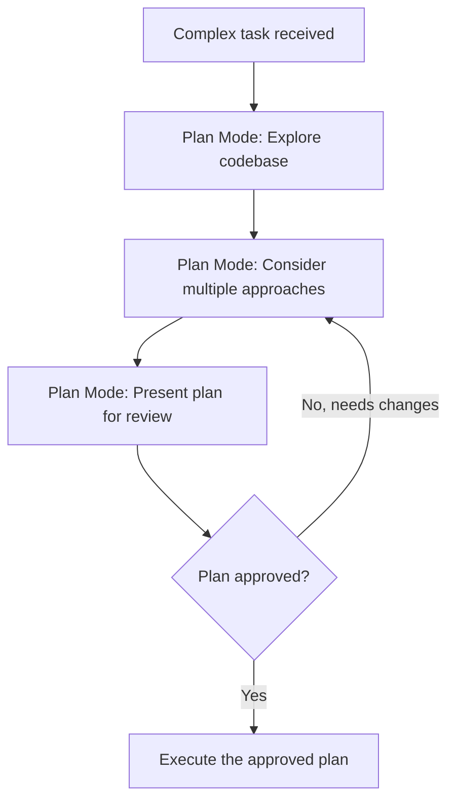
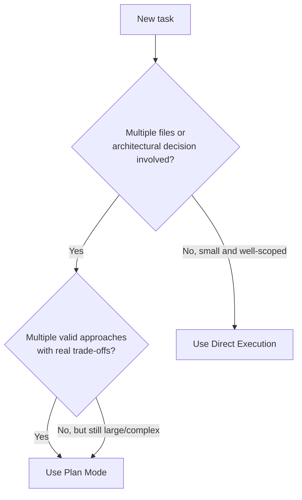
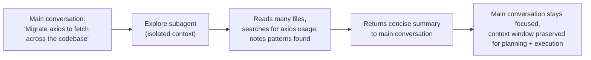
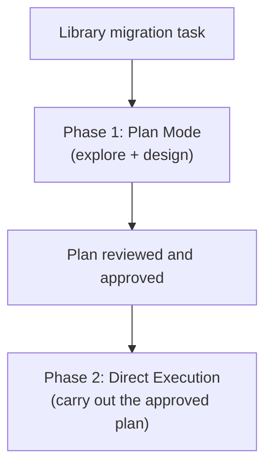

# Task Statement 3.4: Determine When to Use Plan Mode vs Direct Execution

**Domain 3: Configuration & Customization**

---

## 1. Introduction

When you give Claude Code a task, there are two broad ways it can approach the work:

1. **Direct execution** — Claude jumps straight in and makes the change.
2. **Plan mode** — Claude first explores the codebase and designs an approach, shows you a plan, and only makes changes after the plan is agreed on.

Choosing the right mode is a judgment skill the exam tests directly. Use the wrong one, and you either waste time planning something trivial, or you risk messy, costly rework by diving straight into something complex.

---

## 2. What Is Plan Mode?

Plan mode is a way of working where Claude **first investigates and designs**, before touching any code. Claude explores the relevant files, thinks through different approaches, and presents a plan for you to review — like an architect's blueprint before construction starts.

### 2.1 When plan mode is designed for

Plan mode fits tasks that involve:

- **Large-scale changes** — touching many files or many parts of the system.
- **Multiple valid approaches** — more than one reasonable way to solve the problem, each with trade-offs.
- **Architectural decisions** — choices that affect the overall structure of the system, not just one function.
- **Multi-file modifications** — changes that ripple across several files or modules.

### 2.2 Why plan mode matters: preventing costly rework

If Claude jumps straight into a large, ambiguous task without a plan, it might:
- Pick an approach that turns out to be wrong halfway through.
- Touch files in an order that causes conflicts.
- Miss an important architectural constraint that only becomes clear later.

By exploring and designing first, plan mode lets you **catch problems before any code changes happen** — which is much cheaper than discovering the wrong approach after 30 files have already been edited.

---

## 3. What Is Direct Execution?

Direct execution means Claude makes the change immediately, without a separate planning/review phase first.

### 3.1 When direct execution is appropriate

Direct execution fits tasks that are:

- **Simple** — a small, self-contained change.
- **Well-scoped** — the boundaries of the change are clear; there's no ambiguity about what needs to happen.

Examples:
- Adding a single validation check to one function.
- Fixing a bug in one file where the stack trace clearly points to the problem.
- Adding a date validation `if` conditional to an existing function.

In these cases, there's no real design decision to make — the fix is obvious, and planning first would just slow things down without adding value.

---

## 4. Plan Mode vs Direct Execution — Comparison Table

| Factor | Plan Mode | Direct Execution |
|---|---|---|
| Task size | Large-scale, multi-file | Small, single-file or single-function |
| Number of valid approaches | Multiple, with trade-offs | One clear, obvious fix |
| Architectural impact | Yes — affects system structure | No — localized change only |
| Risk of costly rework if done wrong | High | Low |
| Example | Migrating a library across 45+ files | Adding a date validation check to one function |
| Example | Restructuring a monolith into microservices | Fixing a bug with a clear stack trace pointing to one line |
| Speed | Slower upfront (investigation first), but avoids wasted work later | Fast — no planning overhead |

---

## 5. Selecting the Right Mode: Worked Examples

### 5.1 Example needing Plan Mode: Library migration affecting 45+ files

**Task:** "Migrate our HTTP client library from `axios` to `fetch` across the codebase."

This affects 45+ files. There may be multiple valid approaches (e.g., migrate all at once vs. migrate incrementally behind a wrapper). It has architectural implications (how error handling and retries are structured). This is a clear case for **plan mode** — explore first, decide on an approach, get it reviewed, then execute.

### 5.2 Example needing Plan Mode: Choosing between integration approaches

**Task:** "We need to integrate with a payment provider. Should we use their webhook-based approach or their polling-based approach?"

This involves **different infrastructure requirements** depending on which approach is chosen (webhooks need a public endpoint; polling needs a scheduled job). This is an architectural decision with trade-offs — another clear case for **plan mode**.

### 5.3 Example needing Direct Execution: Single-file bug fix

**Task:** "This function throws a `NullPointerException` on line 42 — the stack trace shows `user.email` is null when the email field is optional."

The stack trace tells you exactly what's wrong and where. There is one obvious fix (add a null check). No architectural decision, no multiple approaches to weigh. This is a clear case for **direct execution**.

### 5.4 Example needing Direct Execution: Adding a validation conditional

**Task:** "Add a check so that `startDate` must be before `endDate` in this one function."

Small, well-scoped, single function, one obvious way to implement it. **Direct execution** is appropriate — planning this would be overkill.

---

## 6. The Explore Subagent

When plan mode involves investigating a large codebase, Claude may need to read through many files to understand the current structure. This discovery process can generate a **lot of output** — file contents, search results, notes on what was found.

If all of that verbose output stayed in the main conversation, it would **use up a large portion of the context window**, leaving less room for the actual planning and execution work later.

The **Explore subagent** solves this. It runs the discovery phase in an **isolated sub-agent context** (similar in spirit to `context: fork` from skills, covered in Task Statement 3.2). The Explore subagent does the verbose reading and searching, then returns only a **summary** of what it found back to the main conversation.

### 6.1 Why this matters for multi-phase tasks

Large tasks like a library migration often have multiple phases: discovery, planning, and execution. If discovery alone consumes most of the context window, there may not be enough room left to actually plan and execute the change well.

Using the Explore subagent during the discovery phase **prevents context window exhaustion**, keeping the main conversation focused on decisions and actions, not raw file dumps.

> ⚠️ **Anti-pattern:** Manually reading dozens of files one by one directly in the main conversation during a large investigation. This fills the context window with raw content, leaving less room for the actual plan and the execution steps that follow. Use the Explore subagent to isolate this discovery work instead.

---

## 7. Combining Plan Mode and Direct Execution

Plan mode and direct execution aren't mutually exclusive across an entire task — they can be **combined in sequence**. A common, effective pattern is:

1. Use **plan mode** to investigate the codebase and design the approach.
2. Once the plan is reviewed and approved, switch to **direct execution** to carry out the already-decided plan.

### 7.1 Example: Library migration

**Phase 1 (Plan Mode):**
- Explore the codebase (using the Explore subagent for the heavy discovery work).
- Identify all places `axios` is used.
- Compare migration strategies (all-at-once vs. incremental wrapper).
- Present the chosen plan for review.

**Phase 2 (Direct Execution):**
- Once the plan is approved, execute the planned changes file by file.
- Since the *decisions* were already made in the planning phase, this execution step doesn't need to re-litigate approach — it just carries out the agreed steps.

This combination gets the best of both: careful upfront thinking where it matters (avoiding costly rework), and fast, efficient execution once the direction is clear.

---

## 8. Quick Reference Summary

| Concept | Key Fact |
|---|---|
| Plan mode | Best for large-scale, multi-file, architectural, or multi-approach tasks |
| Direct execution | Best for small, well-scoped, single-file/function changes |
| Why plan mode matters | Prevents costly rework by exploring and designing before making changes |
| Explore subagent | Isolates verbose discovery output; returns only a summary to main conversation |
| Why use Explore subagent | Prevents context window exhaustion during multi-phase tasks |
| Combining modes | Use plan mode to investigate/design, then direct execution to implement the approved plan |
| Plan mode example | Migrating a library across 45+ files; microservice restructuring; choosing an integration approach |
| Direct execution example | Adding a date validation check; fixing a bug with a clear stack trace |

---

## 9. Practice Questions

**Q1.** Which of the following is the best candidate for plan mode rather than direct execution?

A) Adding a single null check to one function based on a clear stack trace
B) Migrating a library used across 45+ files, with multiple possible migration strategies
C) Fixing a typo in a log message
D) Adding one date validation conditional to an existing function

**Answer: B** — Large-scale, multi-file changes with multiple valid approaches are exactly what plan mode is designed for.

---

**Q2.** Why does plan mode help prevent "costly rework"?

A) It makes code changes faster
B) It explores and designs an approach before any code is changed, catching problems before they become expensive to fix
C) It automatically writes unit tests
D) It skips the need for code review

**Answer: B** — By investigating and designing first, plan mode surfaces issues and trade-offs before committing to changes, avoiding wasted work from a wrong approach.

---

**Q3.** A developer needs to fix a bug where a stack trace clearly shows `user.email` is null on line 42 of one file. What is the most appropriate approach?

A) Plan mode, since any code change needs a plan
B) Direct execution, since the fix is clear, well-scoped, and localized to one file
C) The Explore subagent, since discovery is needed
D) None of the above — this cannot be fixed by Claude Code

**Answer: B** — A clear, well-scoped, single-file fix does not need a planning phase; direct execution is appropriate.

---

**Q4.** What is the primary purpose of the Explore subagent?

A) To execute the final code changes
B) To isolate verbose discovery/investigation output in a separate context, returning only a summary to the main conversation
C) To replace plan mode entirely
D) To write documentation for the project

**Answer: B** — The Explore subagent handles verbose file-reading and searching in an isolated context, preserving the main conversation's context window.

---

**Q5.** Why is the Explore subagent especially useful during multi-phase tasks like a large library migration?

A) It makes the migration happen instantly
B) It prevents the discovery phase from consuming so much context that little room is left for planning and execution
C) It automatically chooses the best migration strategy
D) It disables plan mode

**Answer: B** — Without isolating discovery output, a large investigation phase could exhaust the context window, leaving insufficient room for the rest of the task.

---

**Q6.** A team needs to decide between a webhook-based and a polling-based integration with a payment provider, each requiring different infrastructure. What is the appropriate mode?

A) Direct execution, since it's just an integration
B) Plan mode, since this is an architectural decision with multiple valid approaches and different infrastructure trade-offs
C) Neither — this decision should not involve Claude Code
D) The Explore subagent alone, without any planning

**Answer: B** — Choosing between architecturally different integration approaches, each with different infrastructure implications, is a textbook plan mode scenario.

---

**Q7.** What is the recommended pattern for a task like "migrate this library across the codebase," combining both plan mode and direct execution?

A) Use direct execution only, skipping planning entirely
B) Use plan mode only, and never actually execute any changes
C) Use plan mode to investigate and design the approach first, then use direct execution to carry out the approved plan
D) Alternate randomly between plan mode and direct execution during the same file edit

**Answer: C** — A common effective pattern is planning first to decide the approach, then executing directly once the plan is approved — combining careful upfront design with efficient implementation.

---

**Q8.** True or False: Direct execution is always faster and therefore always preferable, even for large architectural changes.

**Answer: False** — While direct execution is faster for simple, well-scoped tasks, using it for large or architecturally significant changes risks costly rework since there is no upfront investigation or design step to catch problems early.