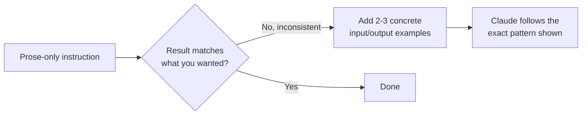
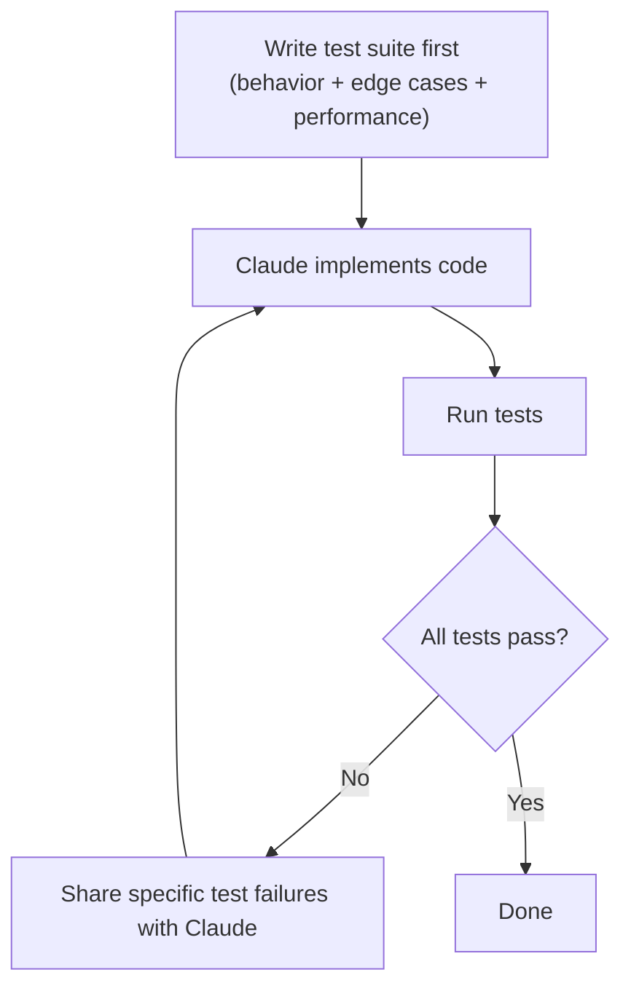
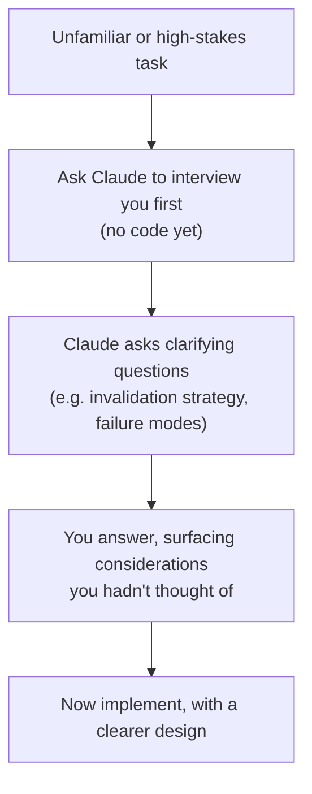
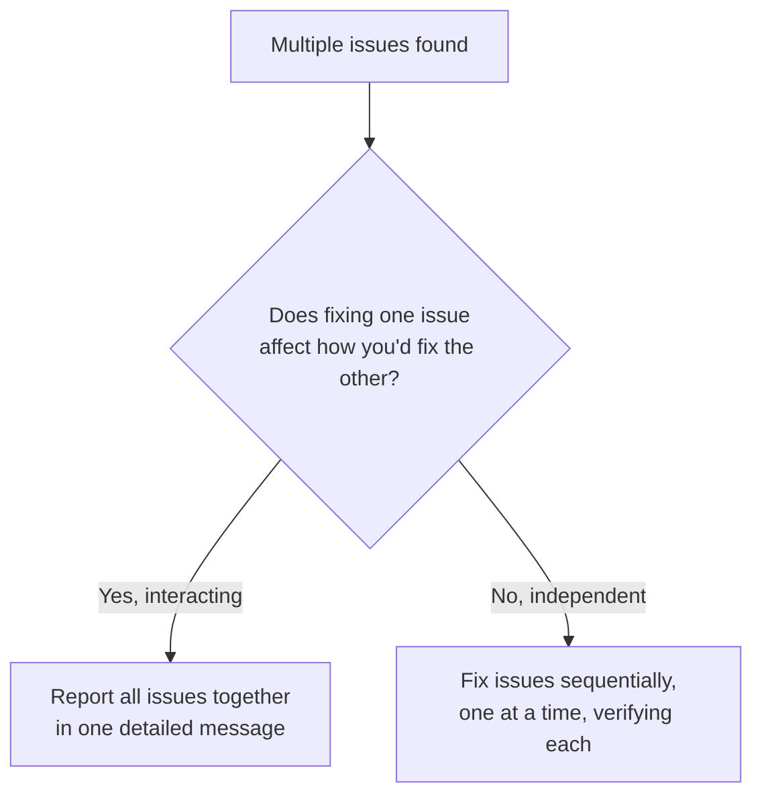

# Task Statement 3.5: Apply Iterative Refinement Techniques for Progressive Improvement

**Domain 3: Configuration & Customization**

---

## 1. Introduction

Working with Claude Code is rarely a single "ask once, get perfect result" interaction. Real progress often comes from **iteration** — giving Claude an initial instruction, seeing the result, and refining it step by step.

This tutorial covers four practical techniques for iterative refinement:

1. Using **concrete input/output examples** instead of vague prose descriptions.
2. **Test-driven iteration** — writing tests first, then iterating using test failures.
3. The **interview pattern** — letting Claude ask questions before implementing.
4. Knowing **when to bundle issues together** in one message versus fixing them **one at a time**.

---

## 2. Concrete Input/Output Examples

### 2.1 The problem with prose-only descriptions

Sometimes a plain English description of a transformation is **interpreted inconsistently**. Different readers (including Claude) may read the same sentence and imagine slightly different behavior, especially around edge cases.

**Example of a vague prose instruction:**
```
"Convert all phone numbers to a standard format."
```

This sounds clear, but it raises unanswered questions:
- What counts as "standard"? `(123) 456-7890`? `123-456-7890`? `+1-123-456-7890`?
- What happens to numbers that are missing an area code?
- What happens to numbers with extensions like `x204`?

Different implementations could reasonably satisfy this sentence in very different ways.

### 2.2 The fix: 2-3 concrete input/output examples

Instead of relying only on prose, show Claude **exactly** what you mean using a small number of real examples. Two or three examples are usually enough to remove ambiguity.

```
Convert phone numbers to this format: (XXX) XXX-XXXX

Examples:
Input: "123.456.7890"        -> Output: "(123) 456-7890"
Input: "1234567890"          -> Output: "(123) 456-7890"
Input: "123-456-7890 x204"   -> Output: "(123) 456-7890 x204"
```

Now there's no ambiguity. Claude can see precisely how separators are handled, how missing formatting is filled in, and how extensions are preserved.

> **Key exam point:** When natural language descriptions produce inconsistent results, the most effective fix is **not** to write a longer, more detailed paragraph. It's to provide **2-3 concrete input/output examples**. Examples remove the ambiguity that prose often leaves behind.



---

## 3. Test-Driven Iteration

### 3.1 The core idea

Instead of describing what you want and hoping Claude gets it right on the first try, you can flip the order:

1. **Write the test suite first** — describing the expected behavior, edge cases, and any performance requirements.
2. Ask Claude to implement code that should pass those tests.
3. Run the tests.
4. **Share the test failures** with Claude.
5. Claude fixes the code based on the specific failures.
6. Repeat until all tests pass.

This gives Claude precise, objective feedback at every step, instead of vague human judgment about "does this look right?"

### 3.2 Example walkthrough

**Step 1 — Write the test suite first:**
```python
def test_divide_normal():
    assert divide(10, 2) == 5

def test_divide_by_zero():
    with pytest.raises(ValueError):
        divide(10, 0)

def test_divide_negative():
    assert divide(-10, 2) == -5

def test_divide_performance():
    # Should complete 100,000 calls in under 1 second
    import time
    start = time.time()
    for _ in range(100_000):
        divide(10, 2)
    assert time.time() - start < 1.0
```

**Step 2 — Ask Claude to implement `divide()` to pass these tests.**

**Step 3 — Run the tests.** Suppose this fails:
```
FAILED test_divide_by_zero - ValueError not raised
```

**Step 4 — Share this exact failure with Claude:**
```
This test is failing:
test_divide_by_zero - ValueError not raised

Please fix divide() so dividing by zero raises a ValueError.
```

**Step 5 — Claude fixes just that issue.** Re-run tests, repeat until everything passes.

### 3.3 Why this works well

- Tests written **before** implementation force you to think through edge cases and performance requirements upfront.
- Test failures are **objective and specific** — much more precise than saying "this doesn't work."
- Each iteration is focused: Claude knows exactly what's broken and why.



---

## 4. The Interview Pattern

### 4.1 The core idea

Sometimes you're working in an **unfamiliar domain**, or the task has hidden considerations you haven't thought through yet. If you ask Claude to just "implement it," Claude might pick a reasonable-looking default that doesn't actually fit your real needs.

The **interview pattern** flips this: instead of jumping straight to implementation, you ask Claude to **first ask you questions** — like an interviewer gathering requirements — before writing any code.

### 4.2 Example

```
Before implementing a caching layer for our API, ask me questions
about the design considerations I should think through. Don't write
any code yet.
```

Claude might respond with questions like:
- "What should happen when cached data becomes stale — do you want a time-based expiry, or should the cache be invalidated when the underlying data changes?"
- "If the cache fails or is unavailable, should the request fail, or should it fall back to querying the database directly?"
- "Should different types of data have different cache lifetimes?"

These questions surface real design decisions — **cache invalidation strategy** and **failure modes** — that you might not have thought about if you'd asked Claude to "just build a cache" right away.

### 4.3 When to use the interview pattern

- When you're working in an **unfamiliar domain** and aren't sure what considerations matter.
- Before implementing something with **non-obvious failure modes** (caching, retries, concurrency, data migrations).
- When getting the design wrong would be expensive to undo later.



> ⚠️ **Anti-pattern:** Asking Claude to implement a caching layer, retry mechanism, or data migration immediately, without discussing invalidation strategy or failure handling first. This often leads to a "default" implementation that works for the happy path but breaks down in edge cases you never discussed.

---

## 5. Providing Specific Test Cases to Fix Edge Cases

A very practical application of "concrete examples" (Section 2) is fixing **edge case bugs** — for example, a data migration script mishandling `null` values.

### 5.1 Example: null values in a migration script

Suppose a migration script fails on a certain kind of record. Instead of describing the bug in prose ("it doesn't handle nulls properly"), give Claude a **specific test case** with example input and expected output:

```
This migration is failing on records like this:

Input:
{ "user_id": 42, "email": null, "signup_date": "2024-01-15" }

Expected output:
{ "user_id": 42, "email": "unknown@placeholder.com", "signup_date": "2024-01-15" }

Currently it crashes with: TypeError: cannot read property 'toLowerCase' of null
```

This gives Claude:
- The exact input that triggers the bug.
- The exact expected output.
- The actual error message.

This is far more effective than a vague description, because Claude can directly verify its fix against the example you gave.

---

## 6. Single Message (Interacting Issues) vs Sequential Iteration (Independent Issues)

When you find multiple problems with a piece of code, should you report them **all at once**, or **one at a time**? The answer depends on whether the issues **interact** with each other.

### 6.1 Interacting problems → report together, in one detailed message

Some issues are **connected** — fixing one affects how you'd fix another. If you report them separately and fix them one by one, you risk Claude fixing issue #1 in a way that makes issue #2 harder to fix, or that has to be undone once issue #2 is addressed.

**Example of interacting issues:**
```
Two problems in this API endpoint:
1. It doesn't validate that 'quantity' is a positive number.
2. When quantity is invalid, the error response doesn't include
   a machine-readable error code, only a human-readable message —
   and the validation fix needs to produce both.
```

These two issues are linked: the fix for #1 (adding validation) directly determines what the error response in #2 needs to contain. Reporting them together, in a single detailed message, lets Claude design one coherent fix instead of two fixes that might conflict.

### 6.2 Independent problems → fix sequentially, one at a time

Other issues have **no relationship** to each other. Fixing one doesn't change how you'd fix the other. In this case, it's better to iterate **sequentially** — fix one, verify it, then move to the next. This keeps each fix focused and easy to verify.

**Example of independent issues:**
```
1. The date formatting on the invoice page shows "2024-1-5" instead of "2024-01-05".
2. The footer logo is missing alt text for accessibility.
```

These two issues have nothing to do with each other — one is about date formatting, the other is about an unrelated accessibility attribute. Fixing them one at a time (and verifying each) is simpler and less risky than bundling them.

### 6.3 Decision guide

| Situation | Approach |
|---|---|
| Fixing issue A changes how issue B should be fixed | Report both in a single, detailed message (interacting problems) |
| Issue A and issue B are unrelated, in different parts of the code | Fix sequentially, one at a time (independent problems) |
| Not sure if they interact | Briefly check: "Does solving one affect the other?" If yes, combine. If no, go sequential. |



> ⚠️ **Anti-pattern:** Reporting two tightly interacting issues separately, in two different messages. Claude may fix the first issue in a way that has to be reworked once the second, related issue is addressed — creating extra churn.

---

## 7. Quick Reference Summary

| Technique | When to Use | Key Benefit |
|---|---|---|
| Concrete input/output examples (2-3) | Prose descriptions are interpreted inconsistently | Removes ambiguity, shows exact expected transformation |
| Test-driven iteration | Before implementation, especially with edge cases/performance requirements | Objective, specific feedback loop via test failures |
| Interview pattern | Unfamiliar domain, high-stakes design decisions (e.g. caching, migrations) | Surfaces hidden considerations before code is written |
| Specific test cases for edge cases | Fixing a specific bug (e.g. null handling in a migration) | Precise input/output/error lets Claude verify the fix directly |
| Single detailed message | Issues interact — fixing one affects the other | One coherent fix instead of conflicting sequential patches |
| Sequential iteration | Issues are independent | Simpler, focused fixes, each easy to verify |

---

## 8. Practice Questions

**Q1.** A developer describes a data transformation in a paragraph, but Claude keeps producing inconsistent results across attempts. What is the most effective fix?

A) Write an even longer, more detailed paragraph
B) Provide 2-3 concrete input/output examples showing the exact expected transformation
C) Ask Claude to guess better
D) Switch to a different AI model

**Answer: B** — Concrete input/output examples remove the ambiguity that prose descriptions often leave behind.

---

**Q2.** In test-driven iteration, what should happen first?

A) Claude implements the feature, then tests are written afterward
B) The test suite is written first, covering expected behavior, edge cases, and performance requirements
C) The feature is deployed, then tested in production
D) Tests are skipped entirely

**Answer: B** — Writing the test suite first defines expected behavior clearly, before any implementation happens.

---

**Q3.** After running tests, some fail. What is the recommended next step?

A) Rewrite the entire test suite from scratch
B) Share the specific test failures with Claude so it can make a targeted fix
C) Ignore the failures and move on
D) Ask Claude to disable the failing tests

**Answer: B** — Sharing specific test failures gives Claude precise, objective feedback to guide the next iteration.

---

**Q4.** When is the interview pattern most useful?

A) When implementing a well-understood, simple change with one obvious approach
B) When working in an unfamiliar domain or before implementing something with non-obvious failure modes, like a caching layer
C) When you already know exactly how you want the code implemented
D) Only when fixing typos

**Answer: B** — The interview pattern helps surface hidden design considerations (e.g. cache invalidation, failure modes) before implementation, especially useful in unfamiliar or high-stakes situations.

---

**Q5.** What kind of questions might Claude ask when using the interview pattern for a caching layer?

A) "What color should the cache indicator icon be?"
B) "What should happen when cached data becomes stale, and how should cache failures be handled?"
C) "What is your favorite programming language?"
D) Claude does not ask questions in the interview pattern

**Answer: B** — The interview pattern surfaces real design considerations like cache invalidation strategy and failure modes.

---

**Q6.** A migration script crashes on records where `email` is `null`. What is the best way to report this to Claude?

A) "The migration script has a bug with null values, please fix it"
B) A specific test case showing the exact input record, the expected output, and the actual error message
C) Just re-run the script and hope it works
D) Delete all records with null emails

**Answer: B** — A concrete input/output example paired with the actual error message gives Claude precise information to fix the specific edge case.

---

**Q7.** Two bugs are found: (1) an endpoint doesn't validate a negative quantity, and (2) the error response for invalid quantity is missing a machine-readable error code — and fixing #1 determines what #2's response needs to contain. How should these be reported?

A) In two separate messages, fixed one at a time
B) In a single, detailed message, since the two issues interact
C) Not reported at all
D) Only the first issue should be mentioned

**Answer: B** — Since fixing one issue affects how the other should be fixed, they are interacting problems and should be reported together for one coherent fix.

---

**Q8.** A developer finds two unrelated issues: a date formatting bug on one page, and missing alt text on an unrelated footer image. What is the best approach?

A) Report both together in one message, since all bugs should be batched
B) Fix them sequentially, one at a time, since they are independent and unrelated
C) Ignore one of the issues
D) Only report bugs found in test suites

**Answer: B** — Independent, unrelated issues are best handled sequentially, keeping each fix focused and easy to verify.