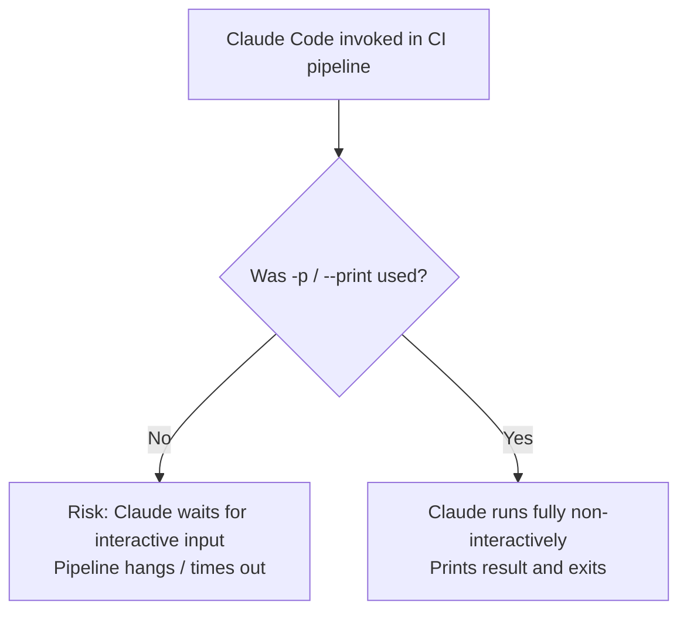
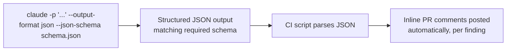
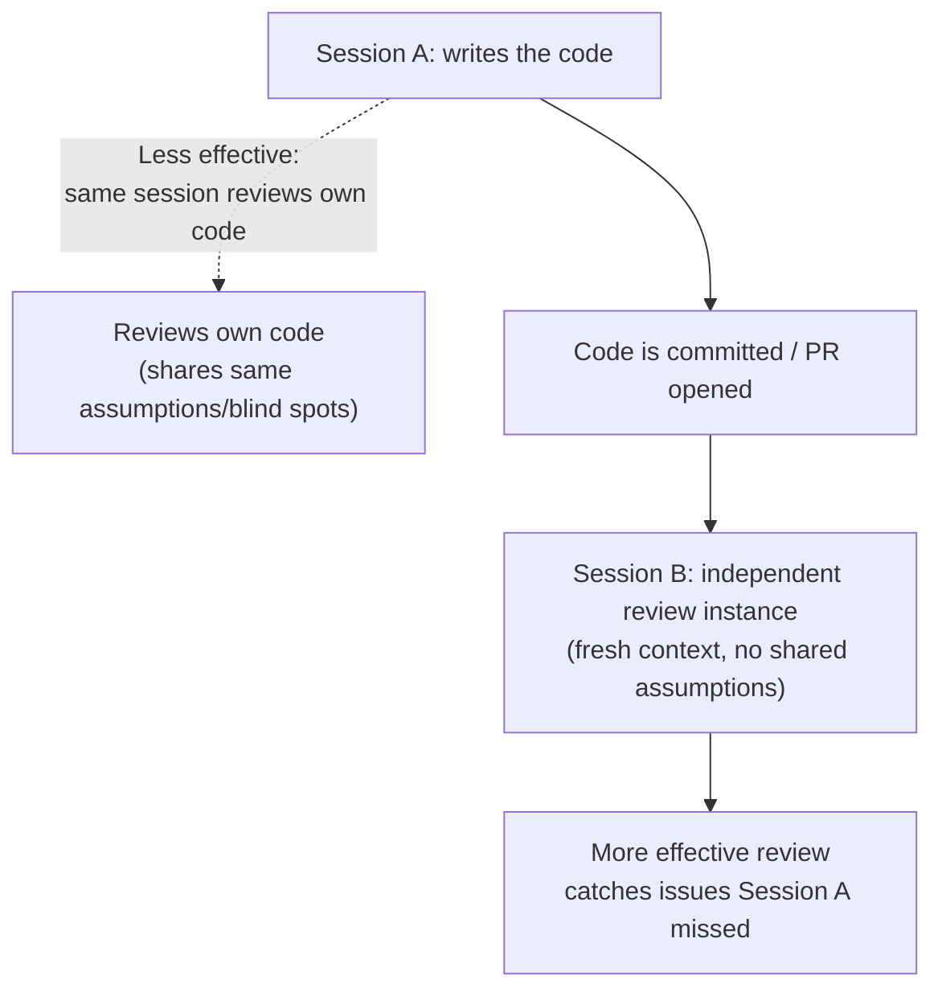
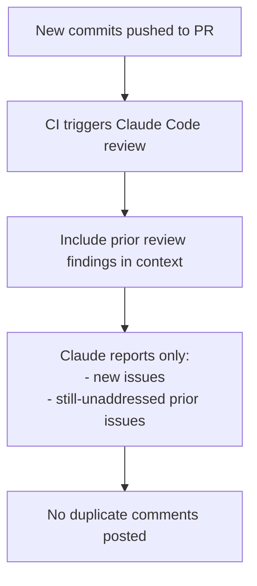

# Task Statement 3.6: Integrate Claude Code into CI/CD Pipelines

**Domain 3: Configuration & Customization**

---

## 1. Introduction

So far, we've mostly talked about Claude Code as something a developer runs **interactively** — typing commands, reading responses, having a back-and-forth conversation.

But Claude Code can also run **automatically**, inside a CI/CD pipeline — for example, reviewing every pull request, or generating tests whenever new code is pushed. This requires a different mode of operation: **non-interactive mode**, with **structured, machine-readable output**.

This tutorial covers the CLI flags, context strategies, and design considerations needed to run Claude Code reliably inside automated pipelines.

---

## 2. Non-Interactive Mode: The `-p` (or `--print`) Flag

### 2.1 The problem

Normally, Claude Code runs interactively — it might pause and wait for you to type a response, confirm an action, or answer a clarifying question. This works fine when a human is sitting at the keyboard.

But in a CI/CD pipeline, **there is no human**. If Claude Code pauses waiting for input that will never come, the pipeline **hangs** — the job never finishes, and eventually times out or wastes compute resources.

### 2.2 The fix: `-p` / `--print`

The `-p` (or `--print`) flag runs Claude Code in **non-interactive mode**. Instead of waiting for back-and-forth conversation, Claude Code:
- Takes a prompt.
- Processes it fully.
- Prints the final result.
- Exits.

No pausing, no waiting for input.

```bash
claude -p "Review this pull request diff for security issues"
```

or using the long form:
```bash
claude --print "Review this pull request diff for security issues"
```

> **Key exam point:** Always use `-p` / `--print` when running Claude Code inside a CI/CD pipeline. Without it, Claude Code may try to behave interactively and **hang the pipeline** waiting for input that will never arrive.



---

## 3. Structured Output: `--output-format json` and `--json-schema`

### 3.1 Why plain text output isn't enough for CI

When a human reads Claude's output, plain English is fine. But in a CI pipeline, something else usually needs to **parse** that output automatically — for example, a script that posts inline comments on a pull request, or a dashboard that tracks review findings over time.

Parsing free-form English text reliably is hard and fragile. If Claude phrases something slightly differently one time, a text-parsing script might break.

### 3.2 `--output-format json`

This flag tells Claude Code to return its response as **JSON** instead of plain text, making it far easier for other programs to read.

```bash
claude -p "Review this diff for bugs" --output-format json
```

Example output:
```json
{
  "findings": [
    {
      "file": "src/auth.py",
      "line": 42,
      "severity": "high",
      "message": "Password comparison is not constant-time, vulnerable to timing attacks."
    }
  ]
}
```

### 3.3 `--json-schema`

Sometimes you need the JSON output to follow a **specific structure** — for example, matching the exact fields your PR-comment-posting script expects. The `--json-schema` flag lets you **enforce a schema**, so Claude's output always matches the shape you require.

```bash
claude -p "Review this diff for bugs" \
  --output-format json \
  --json-schema ./schemas/review-findings.schema.json
```

Example schema file (`review-findings.schema.json`):
```json
{
  "type": "object",
  "properties": {
    "findings": {
      "type": "array",
      "items": {
        "type": "object",
        "properties": {
          "file": { "type": "string" },
          "line": { "type": "integer" },
          "severity": { "type": "string", "enum": ["low", "medium", "high"] },
          "message": { "type": "string" }
        },
        "required": ["file", "line", "severity", "message"]
      }
    }
  },
  "required": ["findings"]
}
```

### 3.4 Why this matters: automated PR comments

With structured, schema-enforced JSON output, a CI script can reliably loop through `findings` and post each one as an **inline comment** on the exact file and line in the pull request — no fragile text parsing required.



| Without structured output | With `--output-format json` + `--json-schema` |
|---|---|
| CI script must parse free-form text | CI script parses reliable, predictable JSON |
| Fragile — breaks if wording changes | Robust — structure is enforced |
| Hard to map findings to specific PR lines | Each finding has clear `file` and `line` fields, easy to map to inline comments |

---

## 4. CLAUDE.md as Context for CI-Invoked Claude Code

### 4.1 Why CLAUDE.md still matters in CI

Even though CI-invoked Claude Code runs non-interactively, it still reads the project's `CLAUDE.md` file (and `.claude/rules/`, as covered in earlier task statements). This is how it learns:

- **Testing standards** — how tests should be structured, what frameworks to use.
- **Fixture conventions** — what shared test fixtures already exist and should be reused.
- **Review criteria** — what the team actually cares about when reviewing code (e.g. security, performance, style).

Without this context, an automated Claude Code review or test generation run would just guess at conventions — often producing output that doesn't match how the team actually works.

### 4.2 Example: CLAUDE.md content for CI-invoked reviews

```markdown
# CI Review Standards

## Testing Standards
- All new functions must have unit tests using pytest.
- Test file names must match `test_<module_name>.py`.

## Fixture Conventions
- Use fixtures from `tests/fixtures/common.py` for database setup.
- Do not create new mock users; use the existing `mock_user` fixture.

## Review Criteria
- Flag any SQL queries built with string concatenation (SQL injection risk).
- Flag any function longer than 50 lines without a comment explaining why.
- Do not flag purely stylistic issues already covered by the linter.
```

By documenting this in `CLAUDE.md`, every CI-invoked Claude Code run — whether reviewing a PR or generating tests — follows the same standards a human reviewer on the team would expect, instead of applying generic, one-size-fits-all judgment.

> **Key exam point:** `CLAUDE.md` is the mechanism for giving CI-invoked Claude Code the same project context a human developer would have — testing standards, fixture conventions, and review criteria — improving the quality and relevance of automated output.

---

## 5. Session Context Isolation: Why Claude Shouldn't Review Its Own Code

### 5.1 The problem

Imagine the same Claude Code session that just **wrote** a piece of code is then asked to **review** that same code for bugs and issues. This tends to be **less effective** than having an independent session review it.

Why? Because the session that wrote the code already has its own reasoning, assumptions, and blind spots baked into the conversation. It's more likely to see its own code as "correct" because it's reviewing against the same assumptions it just used to write it — similar to how a human developer often misses their own bugs, but a fresh reviewer catches them.

### 5.2 The fix: independent review instance

For CI/CD pipelines, it's better to run **a separate, independent Claude Code session** specifically for review — one that did not generate the original code and doesn't share that context. This session approaches the code fresh, without the same assumptions, and is more likely to catch real issues.



| Approach | Effectiveness |
|---|---|
| Same session writes and reviews its own code | Lower — shares blind spots and assumptions with the code it wrote |
| Independent session reviews the code fresh | Higher — no shared assumptions, more likely to catch real issues |

---

## 6. Avoiding Duplicate PR Comments Across Re-Reviews

### 6.1 The problem

In a typical CI/CD pipeline, a review might run **every time new commits are pushed** to a pull request. If Claude Code doesn't know what was already flagged in a previous review, it might report the **same issues again**, producing duplicate comments every time new commits are added.

### 6.2 The fix: include prior review findings in context

When re-running a review after new commits, include the **prior review findings** in the context given to Claude, and instruct it to only report **new or still-unaddressed issues**.

```bash
claude -p "Review this diff for bugs. \
Here are the findings from the previous review: \
$(cat previous-review-findings.json) \
Only report NEW issues, or issues from the previous review that are \
still unresolved. Do not repeat issues that have already been fixed." \
--output-format json \
--json-schema ./schemas/review-findings.schema.json
```

This way, the CI pipeline avoids spamming the pull request with the same comment every single time a small new commit is pushed.



---

## 7. Avoiding Duplicate Test Scenarios in Test Generation

### 7.1 The problem

Similarly, when using Claude Code to **generate new tests**, if it doesn't know what tests already exist, it might generate tests that **duplicate scenarios already covered** by the existing test suite — wasting effort and cluttering the codebase with redundant tests.

### 7.2 The fix: provide existing test files in context

Include the existing test file(s) as context when asking Claude to generate new tests, so it can see what's already covered and focus only on genuinely missing scenarios.

```bash
claude -p "Here is the existing test file: \
$(cat tests/test_payment.py) \
Generate additional tests for edge cases NOT already covered above, \
such as invalid currency codes and negative refund amounts." \
--output-format json
```

### 7.3 Combining with CLAUDE.md testing standards

This works even better when combined with the testing standards and fixture conventions documented in `CLAUDE.md` (Section 4). Together, they mean Claude Code:
- Knows the team's testing conventions (from `CLAUDE.md`).
- Knows what's already tested (from the existing test file provided in context).
- Generates only new, valuable tests — not duplicates, and not tests that ignore team conventions.

> ⚠️ **Anti-pattern:** Asking Claude Code to "generate more tests for this module" without providing the existing test file or the project's testing standards. This often produces redundant tests covering scenarios already handled, along with low-value tests that don't follow team conventions.

---

## 8. Full Example: A CI Review Step

Putting it all together, here's what a realistic CI review invocation might look like in a pipeline script:

```bash
claude -p "Review this pull request diff. \
Follow the review criteria in CLAUDE.md. \
Here are findings from the previous review: $(cat prev-findings.json) \
Only report new or unresolved issues." \
--output-format json \
--json-schema ./schemas/review-findings.schema.json \
> review-output.json

# CI script then parses review-output.json and posts inline PR comments
```

This single command combines:
- `-p` for non-interactive execution (no hanging pipeline).
- `--output-format json` + `--json-schema` for structured, parseable output.
- `CLAUDE.md` for project-specific review criteria.
- Prior findings in context, to avoid duplicate comments.

---

## 9. Quick Reference Summary

| Concept | Key Fact |
|---|---|
| `-p` / `--print` | Runs Claude Code in non-interactive mode; prevents pipeline hangs waiting for input |
| `--output-format json` | Produces JSON output instead of plain text, for machine parsing |
| `--json-schema` | Enforces a specific JSON structure, ensuring output matches what CI scripts expect |
| CLAUDE.md in CI | Provides testing standards, fixture conventions, and review criteria to CI-invoked Claude Code |
| Session context isolation | The same session that wrote code is less effective at reviewing it; use an independent review session |
| Prior review findings in context | Prevents duplicate PR comments across repeated review runs on new commits |
| Existing test files in context | Prevents duplicate/redundant test generation |

---

## 10. Practice Questions

**Q1.** Why must the `-p` (or `--print`) flag be used when running Claude Code in a CI/CD pipeline?

A) It makes Claude Code run faster
B) It prevents Claude Code from waiting for interactive input, which would hang the pipeline
C) It enables colored terminal output
D) It is required to use JSON output

**Answer: B** — Without `-p`/`--print`, Claude Code may behave interactively and wait for input that will never arrive in an automated pipeline, causing it to hang.

---

**Q2.** What is the purpose of combining `--output-format json` with `--json-schema`?

A) To make the output prettier for humans to read
B) To produce machine-parseable output that matches a specific, enforced structure, suitable for automated processing like posting PR comments
C) To speed up Claude Code's response time
D) To disable structured output

**Answer: B** — `--output-format json` produces JSON, and `--json-schema` enforces a specific structure so CI scripts can reliably parse and act on the output, such as posting inline PR comments.

---

**Q3.** What role does `CLAUDE.md` play when Claude Code is invoked from a CI pipeline?

A) It has no effect in CI, only in interactive sessions
B) It provides project context — testing standards, fixture conventions, and review criteria — so automated runs match team expectations
C) It only controls formatting of the terminal output
D) It is used only to store API keys

**Answer: B** — CLAUDE.md gives CI-invoked Claude Code the same contextual knowledge a human developer would have, improving the relevance and quality of automated reviews and test generation.

---

**Q4.** Why is it generally less effective for the same Claude Code session that wrote a piece of code to also review that code?

A) Claude Code cannot review code at all
B) The same session shares the assumptions and blind spots it used while writing the code, making it less likely to catch its own issues
C) Reviewing code uses too many tokens
D) It is technically impossible to review code in the same session

**Answer: B** — A session that wrote the code shares the same reasoning and assumptions, making it less likely to spot its own mistakes compared to an independent review session with fresh context.

---

**Q5.** A CI pipeline re-runs a Claude Code review every time new commits are pushed to a PR. What should be done to avoid duplicate comments on issues already reported in a previous review?

A) Nothing — duplicates are unavoidable
B) Include the prior review findings in context, and instruct Claude to only report new or still-unaddressed issues
C) Disable review comments entirely
D) Only run the review once per week

**Answer: B** — Including prior findings and instructing Claude to report only new or unresolved issues prevents the same issues from being flagged repeatedly.

---

**Q6.** When asking Claude Code to generate new tests for a module, what should be included in context to avoid generating duplicate test scenarios?

A) Nothing extra is needed
B) The existing test file(s) for that module, so Claude can see what's already covered
C) Only the CLAUDE.md file, with no test files
D) A list of all developers on the team

**Answer: B** — Providing the existing test file(s) lets Claude Code see what's already tested and focus on genuinely missing scenarios instead of duplicating existing coverage.

---

**Q7.** What information, when documented in `CLAUDE.md`, improves the quality of Claude Code's automated test generation in CI?

A) The company's holiday schedule
B) Testing standards, valuable test criteria, and available fixtures
C) The list of all employees' email addresses
D) The pipeline's build number history

**Answer: B** — Documenting testing standards, what makes a test valuable, and available fixtures helps Claude Code generate tests that follow team conventions and avoid low-value output.

---

**Q8.** A CI review script expects JSON output containing a `findings` array, where each finding has `file`, `line`, `severity`, and `message` fields, so it can post inline PR comments. Which combination of flags best guarantees this?

A) `-p` alone
B) `--output-format json` alone, with no schema enforcement
C) `--output-format json` combined with `--json-schema` pointing to a schema defining the required fields
D) No flags are needed; Claude will guess the correct format

**Answer: C** — `--output-format json` produces JSON, and `--json-schema` enforces that the JSON matches the exact structure the CI script expects, ensuring reliable automated parsing.