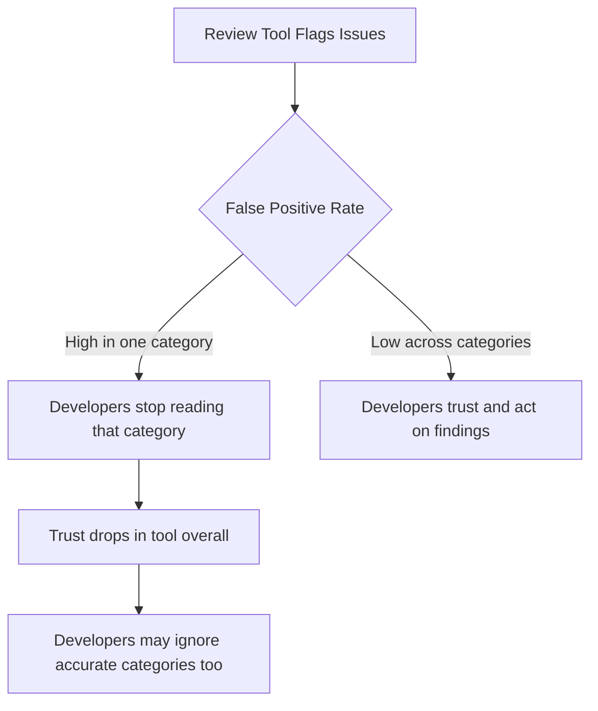
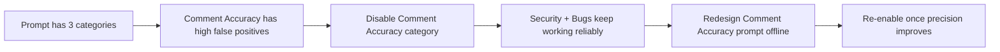

# Domain 4: Prompt Engineering & Structured Output
## Task Statement 4.1: Design Prompts With Explicit Criteria to Improve Precision and Reduce False Positives

---

## 1. Introduction

When you ask Claude to review code, check comments, or find bugs, the quality of the result depends heavily on **how you write the prompt**.

Many beginners write prompts like this:

> "Check that comments are accurate."

This sounds fine, but it is **vague**. Claude does not know exactly what "accurate" means. So it may flag too many things (false positives), too few things (false negatives), or inconsistent things (different results each time).

This tutorial teaches you how to write prompts with **explicit criteria** — clear, specific rules that tell Claude exactly what to look for and what to skip. This is one of the most important skills for building reliable agentic review systems.

---

## 2. Why Vague Instructions Fail

### 2.1 The Core Problem

A vague instruction describes a **goal**, not a **rule**. Claude has to guess what counts as a violation. Different guesses lead to inconsistent output.

Compare these two instructions:

| Vague Instruction | Explicit Instruction |
|---|---|
| "Check that comments are accurate." | "Flag a comment only when the claimed behavior in the comment contradicts the actual behavior in the code below it." |
| "Review this code for problems." | "Report only bugs that cause incorrect output or crashes. Do not report style issues." |
| "Be conservative." | "Only report an issue if you can point to the exact line where the code output differs from the documented behavior." |

The vague version leaves room for interpretation. The explicit version gives Claude a **test it can apply consistently** to every piece of code.

### 2.2 Why "Be Conservative" Does Not Work

A common mistake is to think that adding words like:

- "Be conservative"
- "Only report high-confidence findings"
- "Only flag things you are very sure about"

...will fix a false-positive problem. **It usually does not.**

This is because these instructions do not change **what** Claude is looking for. They only ask Claude to filter results by confidence — but Claude's confidence is not the same thing as correctness. Claude can be very confident about a wrong flag, or unsure about a right one.

**Key idea:** Confidence-based filtering does not fix a bad rule. Only a better rule fixes a bad rule.

```
Vague rule + "be conservative"  → still inconsistent results
Vague rule + explicit criteria  → consistent, precise results
```

### 2.3 Simple Example

Imagine this code:

```python
# Returns the average of the list
def get_average(numbers):
    return sum(numbers) / len(numbers)
```

**Vague prompt:** "Check that comments are accurate."
Claude might flag this because the function doesn't handle an empty list — but that's a *bug*, not a *comment accuracy* issue. The reviewer gets confused about why this was flagged under "comment accuracy."

**Explicit prompt:** "Flag a comment only when the claimed behavior in the comment contradicts the actual code behavior below it."
Now Claude checks: does the comment say "returns average" and does the code actually return an average? Yes — for non-empty lists, this is true. So Claude correctly does **not** flag this as a comment-accuracy issue (the empty-list crash is a separate bug category).

This shows how explicit criteria keep each category of finding **focused and predictable**.

---

## 3. How False Positives Damage Developer Trust

### 3.1 The Trust Problem

Imagine an automated code review tool that checks 5 categories:

1. Security issues
2. Bugs
3. Comment accuracy
4. Style issues
5. Naming conventions

If category 3 (comment accuracy) produces many wrong flags (false positives), developers stop trusting **that category**. Over time, they may start ignoring **all** categories, even the accurate ones like security and bugs.



### 3.2 Why This Matters for Prompt Design

This means precision is not just a "nice to have" — it directly affects whether your agentic system is **useful in practice**. A tool that is right 60% of the time in one category can poison trust for categories that are right 95% of the time.

**Rule of thumb:** It is often better to say nothing about a low-confidence category than to say something wrong.

---

## 4. Skill: Writing Specific Review Criteria (Report vs Skip)

Instead of relying on confidence levels, define **exact categories** of what to report and what to skip.

### 4.1 Bad Approach (Confidence-Based Filtering)

```
Review this code. Only report issues you are highly confident about.
```

Problem: "Confidence" is subjective and not tied to any concrete rule.

### 4.2 Good Approach (Category-Based Filtering)

```
Review this code with these rules:

REPORT:
- Security vulnerabilities (e.g., SQL injection, hard-coded secrets, unsafe deserialization)
- Bugs that cause incorrect output, crashes, or data loss

DO NOT REPORT:
- Minor style issues (e.g., spacing, line length)
- Local team formatting patterns (e.g., variable naming preferences)
- Personal preference suggestions (e.g., "I would use a different loop")

If unsure whether something is a security issue or bug, do not report it.
```

This tells Claude **exactly** which categories are in scope. Now Claude has a rule to apply, not a feeling to guess at.

### 4.3 Example Prompt Template

```
You are reviewing a pull request. Apply these criteria strictly.

REPORT ONLY:
1. Security bugs — code that could allow unauthorized access, data leaks,
   or injection attacks.
2. Logic bugs — code that produces incorrect results for valid input.

SKIP:
1. Style and formatting issues.
2. Naming convention differences that don't affect behavior.
3. Any change that is a stylistic preference, not a functional problem.

For each finding, state:
- File and line number
- Category (Security or Logic Bug)
- One-sentence explanation of the contradiction between intended and actual behavior
```

---

## 5. Skill: Temporarily Disabling High False-Positive Categories

Sometimes, even after tuning a prompt, one category keeps producing too many wrong flags. In real projects, the fix is not to keep tweaking forever — it is to **turn that category off** while you improve it separately.

### 5.1 Why Disable Instead of Keep Trying?

- Keeps the trustworthy categories (like security bugs) still delivering value.
- Stops damaging developer trust while you redesign the prompt for the bad category.
- Buys time to collect more examples of what "good" and "bad" flags look like.

### 5.2 Example: Disabling a Category

```
Review this code. Categories currently active:
- Security issues: ACTIVE
- Logic bugs: ACTIVE
- Comment accuracy: DISABLED (temporarily turned off due to high false
  positive rate — do not report anything in this category)
```



### 5.3 Simple Code Illustration (Config-Style Toggle)

In an agentic pipeline, you might represent this as a config object passed into the prompt builder:

```python
review_categories = {
    "security": True,
    "logic_bugs": True,
    "comment_accuracy": False  # disabled: high false-positive rate
}

def build_prompt(categories):
    active = [name for name, enabled in categories.items() if enabled]
    return f"Review this code. Only check these categories: {', '.join(active)}."

print(build_prompt(review_categories))
# Output: Review this code. Only check these categories: security, logic_bugs.
```

This is a simple but powerful pattern: **let the system control which criteria are active**, so you can turn off a noisy category without rewriting your whole prompt.

---

## 6. Skill: Defining Explicit Severity Criteria With Examples

Another common need is **classifying issues by severity** (e.g., Critical, High, Medium, Low). If you just ask Claude to "rate severity," you will get inconsistent ratings. The fix is to give **concrete code examples for each severity level**.

### 6.1 Bad Approach

```
Rate the severity of each issue as Critical, High, Medium, or Low.
```

Problem: No definition of what makes something "Critical" vs "High." Claude has to guess, and guesses vary.

### 6.2 Good Approach: Severity Rubric With Examples

```
Rate severity using this rubric:

CRITICAL — Causes data loss, security breach, or system crash in production.
Example:
    query = f"SELECT * FROM users WHERE id = {user_input}"  # SQL injection

HIGH — Causes incorrect behavior for common, valid inputs.
Example:
    def divide(a, b):
        return a / b  # crashes on b = 0, a common valid input

MEDIUM — Causes incorrect behavior only for rare or edge-case inputs.
Example:
    def get_first_item(items):
        return items[0]  # fails only if items is empty (rare case)

LOW — Does not affect correctness, but reduces code quality or readability.
Example:
    x = 10  # unclear variable name, no functional impact
```

With this rubric, Claude has a **concrete anchor** for each level. This produces far more consistent classification than asking for a severity label with no examples.

### 6.3 Why Examples Matter More Than Labels

| Without Examples | With Examples |
|---|---|
| "Critical" means whatever Claude imagines | "Critical" means specifically: data loss, security breach, or crash |
| Same bug rated differently across runs | Same bug consistently rated the same way |
| Hard to audit ratings | Easy to check: does this match the example pattern? |

---

## 7. Anti-Patterns to Avoid

> ⚠️ **Anti-Pattern 1: Vague quality words**
> Words like "accurate," "correct," "good," "clean" mean nothing without a definition. Always translate them into a concrete test.

> ⚠️ **Anti-Pattern 2: Confidence as a substitute for criteria**
> "Only report high-confidence findings" does not fix a bad rule. It just filters noise randomly. Fix the rule, not the confidence threshold.

> ⚠️ **Anti-Pattern 3: One category poisoning the whole tool**
> Leaving a known noisy category active "because it sometimes helps" damages trust in everything else. Disable it until it's fixed.

> ⚠️ **Anti-Pattern 4: Severity labels without examples**
> Asking for "Critical/High/Medium/Low" with no example per level leads to inconsistent, unauditable results.

> ⚠️ **Anti-Pattern 5: Mixing report-scope and skip-scope in one vague sentence**
> "Check for bugs but don't worry about small stuff" is still vague. Always list REPORT and SKIP as separate, explicit lists.

---

## 8. Putting It All Together: Full Prompt Example

```
You are reviewing a pull request. Follow these rules exactly.

ACTIVE CATEGORIES:
- Security: ACTIVE
- Logic Bugs: ACTIVE
- Comment Accuracy: DISABLED (temporarily disabled due to high false
  positive rate)

REPORT ONLY:
1. Security — code that could allow unauthorized access, data leaks, or
   injection attacks.
2. Logic Bugs — code that produces incorrect output for valid input.

DO NOT REPORT:
- Style, spacing, or formatting issues
- Naming preferences
- Anything from the Comment Accuracy category (disabled)

SEVERITY RUBRIC:
CRITICAL — data loss, security breach, or crash in production.
HIGH — incorrect behavior for common, valid inputs.
MEDIUM — incorrect behavior only for rare/edge-case inputs.
LOW — no correctness impact, only readability.

For each finding, report:
- File and line number
- Category (Security or Logic Bug)
- Severity (Critical / High / Medium / Low) with one-sentence justification
  tied to the rubric above
```

This single prompt demonstrates all three skills from this task statement:
1. Explicit report-vs-skip criteria
2. A disabled high-false-positive category
3. A severity rubric backed by concrete examples

---

## 9. Quick Reference Summary Table

| Concept | Bad Practice | Good Practice |
|---|---|---|
| Instruction style | "Check comments are accurate" | "Flag only when comment claim contradicts code behavior" |
| Precision control | "Be conservative" / "high confidence only" | Specific categorical REPORT vs SKIP lists |
| Handling noisy category | Keep it active and hope it improves | Temporarily disable it, fix offline, re-enable later |
| Severity rating | Ask for Critical/High/Medium/Low with no definition | Give a rubric with a concrete code example per level |
| Trust management | Ignore false positive impact | Recognize false positives in one category hurt trust in all categories |

---

## 10. Practice Questions

**Q1.** Why does adding "be conservative" to a prompt usually fail to reduce false positives?
**A1.** Because it only asks Claude to filter by confidence, not by a clearer rule. Confidence is not the same as correctness, so the underlying vague criteria still produce inconsistent results.

**Q2.** What is the key difference between "check that comments are accurate" and "flag comments only when claimed behavior contradicts actual code behavior"?
**A2.** The second version gives an explicit, testable rule (compare claim vs actual behavior), while the first is a vague goal open to interpretation.

**Q3.** A code review tool has 5 categories, and one of them (naming suggestions) has a 70% false positive rate. What is the best short-term fix?
**A3.** Temporarily disable the naming suggestions category so it stops damaging trust in the other, more accurate categories, while you redesign its prompt separately.

**Q4.** Why do high false-positive rates in one category hurt trust in other, accurate categories?
**A4.** Developers cannot easily separate "noisy category" from "reliable category" in their overall impression of the tool. Repeated wrong flags in one area make them distrust or ignore the whole tool, including accurate findings.

**Q5.** What should be included in a good severity rubric to ensure consistent classification?
**A5.** A clear definition for each severity level (e.g., Critical, High, Medium, Low) plus a concrete code example illustrating that level, so ratings can be anchored to real patterns instead of guesswork.

**Q6.** True or False: "Only report high-confidence findings" is an example of explicit categorical criteria.
**A6.** False. It is confidence-based filtering, not categorical criteria. Explicit criteria define specific issue types to report (e.g., security, logic bugs) and specific types to skip (e.g., style, naming).

**Q7.** Write an explicit REPORT vs SKIP rule for a prompt that should only catch performance issues (like O(n²) loops on large data) and ignore all other code quality concerns.
**A7.** Example answer:
```
REPORT ONLY:
- Performance issues where code has unnecessary O(n²) or worse
  complexity on inputs that can be large (e.g., nested loops over
  the same large list).

DO NOT REPORT:
- Style, naming, security, or logic bugs.
- Performance concerns on inputs that are always small and fixed size.
```

---

## 11. Summary

- Vague instructions ("check accuracy," "be conservative") lead to inconsistent results because Claude has no concrete rule to apply.
- Explicit, categorical criteria — clear REPORT vs SKIP lists — produce far more precise and repeatable results.
- False positives in one category can damage trust across your entire review system, so don't leave a known-noisy category running unchecked.
- When a category has a high false-positive rate, disable it temporarily rather than letting it erode trust, and fix its prompt separately.
- Severity classification becomes consistent only when each level (Critical, High, Medium, Low) is backed by a concrete code example, not just a label.