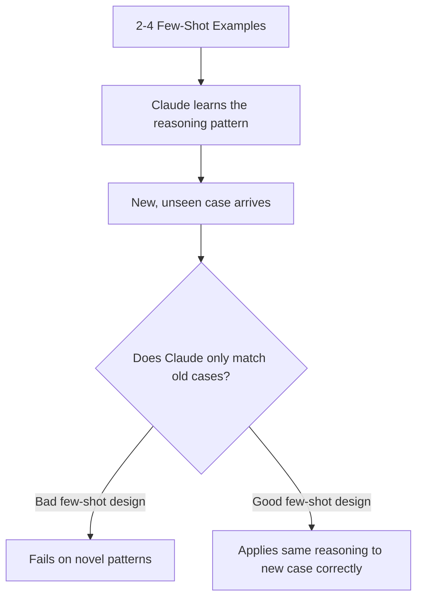
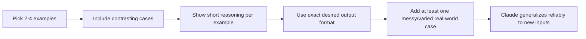

# Domain 4: Prompt Engineering & Structured Output
## Task Statement 4.2: Apply Few-Shot Prompting to Improve Output Consistency and Quality

---

## 1. Introduction

In Task Statement 4.1, you learned that **explicit criteria** beat vague instructions. But sometimes, even a very detailed written instruction is not enough to get consistent, well-formatted output from Claude.

This is where **few-shot prompting** comes in.

Few-shot prompting means: instead of only *telling* Claude the rules, you also *show* Claude a small number of examples of correct input-output pairs. Claude then learns the pattern from these examples and applies similar reasoning to new, unseen cases.

**Simple definition:**
> Few-shot prompting = giving Claude a few worked examples ("shots") of the task, so it can copy the pattern of reasoning and format, not just the words of your instructions.

---

## 2. Why Few-Shot Examples Work Better Than Instructions Alone

### 2.1 The Problem With Instructions-Only Prompts

Imagine you write a very detailed instruction:

```
Extract the issue location, issue type, severity, and suggested fix
from this code review. Format as a table.
```

This looks clear. But in practice, Claude may:
- Use different column names each time
- Sometimes skip the "suggested fix" field
- Format severity as "High" in one run and "high priority" in another

Even detailed instructions leave room for **small formatting drift**, especially across many requests or a long agent session.

### 2.2 Why Few-Shot Examples Fix This

A worked example removes ambiguity because Claude can see the **exact shape** of a correct answer, not just a description of it.

```
Instruction-only prompt → Claude imagines the format → inconsistent results
Few-shot prompt         → Claude copies the format → consistent results
```

### 2.3 Example: Instruction-Only vs Few-Shot

**Instruction-only (inconsistent):**

```
Review this function and report any issues with location, type,
severity, and suggested fix.
```

**Few-shot version (consistent):**

```
Review the function below. Use this exact format for each issue found:

Location: <file>:<line>
Issue: <short description>
Severity: Critical | High | Medium | Low
Suggested Fix: <one sentence fix>

Example 1:
Code:
    def get_user(id):
        return db.query(f"SELECT * FROM users WHERE id={id}")

Output:
Location: user_service.py:2
Issue: SQL injection via unsanitized id parameter
Severity: Critical
Suggested Fix: Use parameterized queries instead of string formatting

Example 2:
Code:
    def add_numbers(a, b):
        return a + b

Output:
No issues found.

Now review this function:
Code:
    def divide(a, b):
        return a / b
```

Because Claude has seen two worked examples (one with an issue, one without), it will reliably follow the same format and reasoning style for the new function.

---

## 3. Few-Shot Examples for Handling Ambiguous Cases

### 3.1 Why Ambiguous Cases Need Examples, Not Just Rules

Some tasks have decisions that are hard to write as a simple rule. Examples:

- **Tool selection for ambiguous requests** — should the agent use `search_docs` or `search_code` when the user says "find the config"?
- **Branch-level test coverage gaps** — is a missing `else` branch test a real gap, or is it acceptable because the `else` branch just logs and returns?

Written rules struggle to cover every case. But a few well-chosen examples can **show the reasoning process**, which Claude can then apply to new, similar — but not identical — situations.

### 3.2 Example: Ambiguous Tool Selection

```
You have two tools available:
- search_docs: searches documentation files (.md, .txt)
- search_code: searches source code files (.py, .js)

Example 1:
Request: "Find the config for database timeout"
Reasoning: "Config" often lives in source code (e.g., config.py) rather
than documentation. Choose search_code.
Action: search_code("database timeout config")

Example 2:
Request: "Find the setup guide for local development"
Reasoning: A "setup guide" is explanatory content typically found in
documentation, not source code. Choose search_docs.
Action: search_docs("local development setup guide")

Now handle this request:
Request: "Find how authentication tokens expire"
```

Notice each example includes a **short reasoning line** before the action. This is important — it does not just show *what* to do, it shows *why*, so Claude can generalize the reasoning to new ambiguous requests (like the authentication token example) instead of just matching keywords.

### 3.3 Example: Branch-Level Test Coverage Gaps

```
Example 1:
Code:
    if user.is_admin:
        grant_access()
    else:
        log_denied_access()
        return False

Test coverage: Only the "if user.is_admin" branch is tested.
Reasoning: The untested else branch denies access and logs it — this is
a security-relevant path. Missing coverage here is a genuine gap.
Verdict: Flag as coverage gap (Medium severity).

Example 2:
Code:
    if debug_mode:
        print("Debug info")
    else:
        pass

Test coverage: Only the "if debug_mode" branch is tested.
Reasoning: The untested else branch does nothing (just "pass"). There is
no behavior to verify, so this is not a meaningful gap.
Verdict: Do not flag.

Now evaluate this branch:
Code:
    if retry_count < 3:
        retry_request()
    else:
        raise ConnectionError("Max retries exceeded")

Test coverage: Only the "if retry_count < 3" branch is tested.
```

With these two contrasting examples, Claude can reason that the `else: raise ConnectionError(...)` branch is meaningful (like Example 1) and should be flagged — even though this exact code was never shown before.

---

## 4. Few-Shot Examples Help Claude Generalize, Not Just Memorize

### 4.1 The Key Idea

A common misunderstanding is that few-shot examples only work for cases *identical* to the examples. In reality, good few-shot examples teach Claude the **underlying judgment pattern**, so it can apply that judgment to **novel** cases it has never seen.



### 4.2 What Makes Few-Shot Examples Generalize Well

- Show the **reasoning**, not just the final answer.
- Use **2 to 4** examples — enough to reveal a pattern, not so many that Claude just memorizes literal cases.
- Choose examples that are **different from each other**, covering contrasting situations (e.g., one "flag it" case and one "don't flag it" case).

> ⚠️ **Anti-Pattern:** Giving 10+ near-identical examples. This makes Claude pattern-match on surface details instead of understanding the underlying reasoning, and wastes context.

---

## 5. Few-Shot Examples Reduce Hallucination in Extraction Tasks

### 5.1 The Problem: Hallucinated or Missing Extractions

When extracting structured data (like measurements, dates, or citations) from unstructured text, Claude can:
- **Hallucinate** a value that isn't really there
- **Miss** a value because the document format looks unusual
- **Return empty/null** for a field it actually could have found, if the document structure doesn't match what it expects

This is especially common when documents come in **varied formats** — for example, informal measurements ("about a cup and a half") versus precise ones ("360 ml").

### 5.2 Example: Informal Measurements

**Without few-shot examples:**

```
Extract the quantity and unit from this text: "Add roughly two big
spoonfuls of sugar."
```

Claude might guess randomly, return null, or hallucinate a made-up precise number.

**With few-shot examples:**

```
Extract quantity and unit as structured JSON. Follow these examples:

Example 1:
Text: "Add 2 cups of flour"
Output: {"quantity": 2, "unit": "cups", "ingredient": "flour"}

Example 2:
Text: "A pinch of salt"
Output: {"quantity": null, "unit": "pinch", "ingredient": "salt",
"note": "informal, non-numeric quantity"}

Example 3:
Text: "About a cup and a half of milk"
Output: {"quantity": 1.5, "unit": "cups", "ingredient": "milk",
"note": "approximate value inferred from informal language"}

Now extract from:
Text: "Add roughly two big spoonfuls of sugar."
```

These examples show Claude **how to handle informal language**: convert approximate phrases into a best-guess numeric value, and add a `note` field to be transparent about the estimate — instead of hallucinating a fake exact figure or leaving the field empty.

### 5.3 Why This Matters

Without examples of informal cases, Claude tends to either:
1. Hallucinate a falsely precise number, or
2. Return `null` even when a reasonable value could be inferred

Few-shot examples that specifically include **messy, real-world input** teach Claude the correct middle ground: extract what is reasonably inferable, and flag uncertainty rather than guessing wildly or giving up.

---

## 6. Few-Shot Examples for Varied Document Structures

### 6.1 The Problem

Documents are not all formatted the same way. For example, academic papers may cite sources:
- As **inline citations**: "...as shown by prior work (Smith, 2020)."
- As a **separate bibliography** section at the end.

Similarly, important details might be:
- In a **dedicated methodology section**, or
- **Embedded** inside paragraphs describing results.

If Claude only sees examples of one structure, it may return `null` or miss information when the structure changes.

### 6.2 Example: Citation Extraction Across Structures

```
Extract all citations mentioned in the text as a list of {author, year}.

Example 1 (inline citation style):
Text: "This approach was first proposed by Lee (2018) and later
extended by Park and Kim (2021)."
Output: [{"author": "Lee", "year": 2018}, {"author": "Park and Kim",
"year": 2021}]

Example 2 (bibliography style):
Text: "...our method builds on established techniques [1].
...
References:
[1] Chen, A. (2019). Foundations of Data Extraction."
Output: [{"author": "Chen, A.", "year": 2019}]

Now extract citations from this text:
Text: "The dataset was cleaned using standard techniques.
References
Nguyen, T. (2022). Data Cleaning Practices."
```

Because the examples cover **both inline and bibliography styles**, Claude learns to look in both places rather than assuming only one format exists — and can correctly extract from the new document, even though its layout is slightly different again.

### 6.3 Example: Methodology in a Dedicated Section vs Embedded in Results

```
Extract the sample size used in the study.

Example 1 (dedicated methodology section):
Text: "Methodology: We recruited 150 participants for this study.
...
Results: Most participants reported improved outcomes."
Output: {"sample_size": 150}

Example 2 (embedded in results, no separate methodology section):
Text: "Results: Of the 84 participants who completed the survey,
72% reported satisfaction."
Output: {"sample_size": 84}

Now extract from:
Text: "In total, 212 employees took part in the internal review,
and the findings are discussed below."
```

This teaches Claude that the sample size can appear in different places — not only under a "Methodology" heading — so it should search the whole document structure, not just one expected section.

---

## 7. Skill: Designing Good Few-Shot Examples (Practical Checklist)

When writing few-shot examples for your own CCAF-style prompts, follow this checklist:

1. **Use 2 to 4 examples** — enough to show a pattern, not so many that it becomes memorization or wastes tokens.
2. **Include contrasting cases** — at least one "yes, act/flag/extract" and one "no, skip/null/not applicable" example.
3. **Show reasoning, not just output** — a short reasoning line before the final answer helps Claude generalize the logic.
4. **Match the exact output format you want** — location, issue, severity, suggested fix (or whatever fields matter for your task) should appear identically formatted in every example.
5. **Include at least one messy/informal/varied-format example** — this is what prevents hallucination and empty extractions on real-world data.



---

## 8. Anti-Patterns to Avoid

> ⚠️ **Anti-Pattern 1: Only positive examples**
> If every example shows "flag this issue," Claude may start over-flagging things that shouldn't be flagged. Always include at least one "do not flag / null / not applicable" example.

> ⚠️ **Anti-Pattern 2: Inconsistent formatting between examples**
> If Example 1 uses `Severity: High` and Example 2 uses `Priority: high`, Claude will not know which format to follow. Keep every example in the exact same structure.

> ⚠️ **Anti-Pattern 3: Too many near-duplicate examples**
> Showing 8 examples that are all slightly different SQL injection cases wastes context and doesn't teach new reasoning — 2 to 4 well-chosen, diverse examples work better.

> ⚠️ **Anti-Pattern 4: Examples without reasoning**
> Showing only "Input → Output" without a reasoning line makes it harder for Claude to generalize to genuinely new, unseen cases — it may just try to pattern-match surface text instead.

> ⚠️ **Anti-Pattern 5: Only showing "clean" documents**
> If all extraction examples come from well-structured documents, Claude will struggle with messy, informal, or differently structured real-world documents. Always include at least one varied/messy example.

---

## 9. Quick Reference Summary Table

| Situation | Why Few-Shot Helps |
|---|---|
| Detailed instructions still give inconsistent format | Examples show the exact shape of correct output, removing guesswork |
| Ambiguous decisions (e.g., tool selection) | Examples with reasoning teach the judgment process, not just the answer |
| Need to generalize to novel/unseen cases | Diverse, reasoning-based examples teach a pattern, not memorized answers |
| Extraction with informal/messy text | Examples with informal input teach safe inference instead of hallucination |
| Documents with varied structure (inline vs bibliography, embedded vs dedicated sections) | Examples across formats teach Claude to search the whole document, not one fixed location |

---

## 10. Practice Questions

**Q1.** Why might a very detailed, instruction-only prompt still produce inconsistent output format across multiple runs?
**A1.** Because instructions describe the format in words, leaving room for Claude to interpret formatting details differently each time. A worked example shows the exact shape of the output, removing that ambiguity.

**Q2.** What is the recommended number of few-shot examples for ambiguous scenario handling, and why not more?
**A2.** 2 to 4 examples. Using more risks Claude memorizing specific cases instead of learning the general reasoning pattern, and wastes context space.

**Q3.** Why should few-shot examples include a short reasoning line before the final answer?
**A3.** Because showing the reasoning (why one action or verdict was chosen over alternatives) helps Claude generalize the same judgment process to new, unseen cases — not just copy the literal output of the examples.

**Q4.** A test-coverage tool keeps flagging untested `else` branches that just contain `pass` with no real behavior. What few-shot fix would help?
**A4.** Add a contrasting example where an untested branch with no meaningful behavior (like `pass`) is explicitly marked "do not flag," alongside an example where a meaningful untested branch (like raising an exception) is flagged. This teaches Claude to distinguish real gaps from trivial ones.

**Q5.** Why do few-shot examples help reduce hallucination in extraction tasks involving informal measurements?
**A5.** Because examples that show how to handle vague or approximate language (e.g., "about a cup and a half") teach Claude to make a reasonable, transparent inference (with a note about the estimate) instead of inventing a falsely precise number or returning null.

**Q6.** What is the risk of only including "clean," well-structured documents in your few-shot examples for an extraction task?
**A6.** Claude may fail to extract data correctly from real-world documents with varied structures (e.g., bibliography-style citations, or details embedded in results instead of a dedicated section), leading to empty or null extractions on those documents.

**Q7.** True or False: Few-shot examples are only useful for cases that exactly match the examples shown.
**A7.** False. Well-designed few-shot examples (with reasoning and contrasting cases) teach Claude the underlying judgment pattern, allowing it to generalize correctly to novel cases it has not seen before.

---

## 11. Summary

- Few-shot prompting means showing Claude a small number of worked examples, not just describing the task in words — this is the most reliable way to get consistently formatted, actionable output.
- For ambiguous decisions (like tool selection or coverage-gap judgment), few-shot examples should include a short reasoning line so Claude learns *why* a choice was made, not just *what* the choice was.
- Good few-shot examples (2-4, diverse, with reasoning) help Claude generalize its judgment to novel cases, rather than only matching pre-seen patterns.
- Including contrasting examples (issue vs no-issue, flag vs skip) reduces false positives while preserving the ability to catch genuine problems.
- For extraction tasks, examples that include informal language and varied document structures (inline citations vs bibliographies, embedded vs dedicated sections) prevent hallucinated or empty/null extractions on real-world, messy documents.