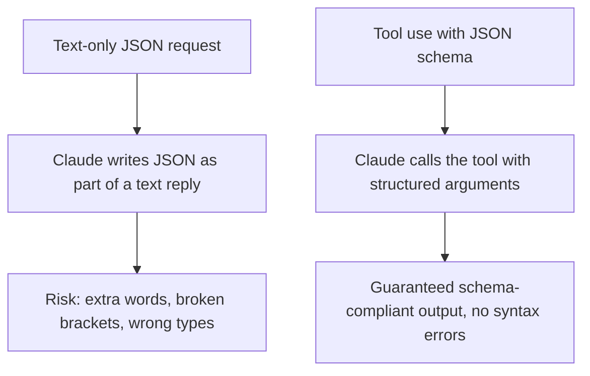
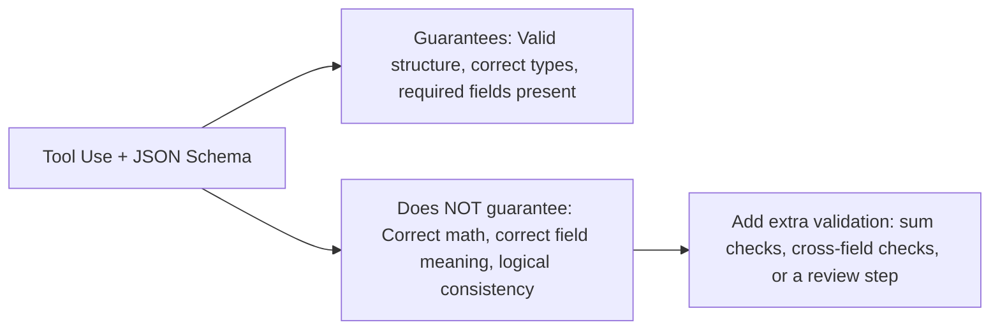

# Domain 4: Prompt Engineering & Structured Output
## Task Statement 4.3: Enforce Structured Output Using Tool Use and JSON Schemas

---

## 1. Introduction

So far you have learned how to write **explicit criteria** (4.1) and use **few-shot examples** (4.2) to improve output quality. But even with great prompting, Claude's plain text output can still have small formatting mistakes — a missing comma, an extra bracket, a slightly wrong field name.

For real agentic systems, this is a problem. If your code expects JSON and gets broken JSON, your pipeline crashes.

This is where **tool use (`tool_use`) with JSON schemas** comes in. It is the most reliable way to get **guaranteed, schema-compliant structured output** from Claude.

**Simple definition:**
> Tool use for structured output means you define a "tool" with a strict JSON schema (like a form with fixed fields), and instead of asking Claude to write JSON as text, you ask Claude to "call" that tool. Claude then fills in the tool's fields in a way that is guaranteed to match the schema.

---

## 2. Why Tool Use Is the Most Reliable Approach

### 2.1 The Problem With Asking for JSON as Plain Text

```
Extract the name, age, and city from this text and return JSON.
```

Claude might return:

```json
{"name": "Riya", "age": 29, "city": "Mumbai"}
```

...but it might also occasionally return:

```
Sure! Here is the JSON you asked for:
{"name": "Riya", "age": 29, "city": "Mumbai"}
```

Notice the extra sentence before the JSON. This breaks any code that tries to directly parse the response as JSON (`json.loads(...)` would fail).

### 2.2 How Tool Use Solves This

When you use **tool use**, you are not asking Claude to "write" JSON as part of a text answer. Instead, you define a tool (like a function signature), and Claude's response comes back as a structured `tool_use` block — separate from any text — that is validated against your schema.



### 2.3 Example: Defining an Extraction Tool

```python
extract_person_tool = {
    "name": "extract_person",
    "description": "Extract a person's name, age, and city from text.",
    "input_schema": {
        "type": "object",
        "properties": {
            "name": {"type": "string"},
            "age": {"type": "integer"},
            "city": {"type": "string"}
        },
        "required": ["name"]
    }
}
```

```python
response = client.messages.create(
    model="claude-sonnet-4-6",
    max_tokens=1000,
    tools=[extract_person_tool],
    tool_choice={"type": "tool", "name": "extract_person"},
    messages=[
        {"role": "user", "content": "Riya is 29 years old and lives in Mumbai."}
    ]
)

# The structured data appears inside a tool_use content block
for block in response.content:
    if block.type == "tool_use":
        extracted_data = block.input
        print(extracted_data)
        # {'name': 'Riya', 'age': 29, 'city': 'Mumbai'}
```

No text parsing, no risk of stray words breaking your JSON — the `input` field is already a clean, structured object matching your schema.

---

## 3. Understanding `tool_choice` Options

When you give Claude tools, you also control **how** it must use them with the `tool_choice` parameter. There are three main options to know for this exam.

### 3.1 `tool_choice: "auto"`

Claude **may** call a tool, or it may just reply with plain text. Claude decides.

```python
tool_choice = {"type": "auto"}
```

**Use case:** General assistant tasks where sometimes a tool is needed and sometimes a plain answer is fine.

**Risk for structured output tasks:** If you specifically need guaranteed structured data, `"auto"` is risky — Claude might just answer in text and skip the tool entirely.

### 3.2 `tool_choice: "any"`

Claude **must** call a tool, but it can **choose which one** if multiple tools are available.

```python
tool_choice = {"type": "any"}
```

**Use case:** You have several extraction schemas (e.g., `extract_invoice`, `extract_resume`, `extract_receipt`) and you are **not sure which document type** you're dealing with. You want to guarantee some structured tool is called, but let Claude pick the right one.

### 3.3 Forced Tool Selection

Claude **must** call one **specific, named tool** — no choice involved.

```python
tool_choice = {"type": "tool", "name": "extract_metadata"}
```

**Use case:** You know exactly which extraction must run — for example, `extract_metadata` must always run first, before any enrichment or summarization steps happen later in your pipeline.

### 3.4 Comparison Table

| `tool_choice` Value | Must Call a Tool? | Which Tool? | Best Used When |
|---|---|---|---|
| `"auto"` | No (text allowed) | Claude decides | General assistant behavior, tool use is optional |
| `"any"` | Yes | Claude picks from available tools | Multiple schemas exist, document type is unknown |
| `{"type": "tool", "name": "X"}` | Yes | Must be tool `X` | You need a specific extraction to run, e.g., before enrichment steps |

### 3.5 Example: Unknown Document Type With `"any"`

```python
tools = [extract_invoice_tool, extract_resume_tool, extract_receipt_tool]

response = client.messages.create(
    model="claude-sonnet-4-6",
    max_tokens=1000,
    tools=tools,
    tool_choice={"type": "any"},  # must call one of the 3, Claude picks
    messages=[
        {"role": "user", "content": document_text}
    ]
)
```

Because we don't know in advance if `document_text` is an invoice, resume, or receipt, we let Claude choose the right tool — but we guarantee that **some** structured extraction happens.

### 3.6 Example: Forcing a Specific Tool Before Enrichment

```python
# Step 1: Always extract metadata first, no matter what
response = client.messages.create(
    model="claude-sonnet-4-6",
    max_tokens=1000,
    tools=[extract_metadata_tool, enrich_data_tool],
    tool_choice={"type": "tool", "name": "extract_metadata"},
    messages=[{"role": "user", "content": document_text}]
)

# Step 2: Use the extracted metadata as input to an enrichment step
metadata = response.content[0].input
# ... pass metadata into the next step of the pipeline
```

This pattern is common in **multi-step agentic pipelines**: force the first, foundational extraction step, then use its output to drive later steps.

---

## 4. Schema Compliance vs Semantic Correctness

### 4.1 The Important Distinction

This is one of the most tested ideas in this task statement:

> **Strict JSON schemas via tool use eliminate *syntax* errors, but they do NOT prevent *semantic* errors.**

- **Syntax error** = broken JSON structure (missing bracket, wrong type, extra text). Tool use with schemas **fixes** this.
- **Semantic error** = the JSON is perfectly valid, but the *values* are wrong or don't make logical sense. Tool use **does not automatically fix** this.

### 4.2 Example of a Semantic Error (Even With Valid Schema)

```json
{
  "line_items": [
    {"description": "Pen", "price": 10},
    {"description": "Notebook", "price": 25}
  ],
  "total": 50
}
```

This JSON is **syntactically perfect** — it matches the schema exactly. But `10 + 25 = 35`, not `50`. This is a **semantic error**: the total does not match the sum of line items, even though the format is completely valid.

Similarly, a value could be placed in the **wrong field** — like putting a phone number in the `email` field — and the schema alone would not catch that, because the schema only checks the *type* (e.g., "string"), not the *meaning*.

### 4.3 What This Means for You



**Practical takeaway:** After using tool use for guaranteed structure, you often still need a **separate validation step** (in code, or a follow-up Claude call) to catch semantic issues like totals not summing correctly.

---

## 5. Schema Design: Required vs Optional Fields

### 5.1 The Problem With Making Everything "Required"

If you mark every field as `required` in your schema, Claude is forced to put **something** in every field — even if the source document doesn't actually contain that information. This can cause Claude to **fabricate (hallucinate) a value** just to satisfy the schema.

### 5.2 Example: Required Fields Causing Fabrication

```python
# BAD: email marked as required, even though not all documents have one
bad_schema = {
    "type": "object",
    "properties": {
        "name": {"type": "string"},
        "email": {"type": "string"}
    },
    "required": ["name", "email"]  # forces a value even if missing!
}
```

If the source text is: `"John Doe, Sales Manager"` — there is no email address anywhere. But because `email` is `required`, Claude may invent a fake email to comply with the schema.

### 5.3 Fixing It: Optional (Nullable) Fields

```python
# GOOD: email is optional and nullable
good_schema = {
    "type": "object",
    "properties": {
        "name": {"type": "string"},
        "email": {"type": ["string", "null"]}
    },
    "required": ["name"]  # only name is required; email can be missing
}
```

Now, if there is no email in the source text, Claude can correctly return `"email": null` instead of inventing one.

**Rule of thumb:**
> Mark a field as `required` only if the source documents are guaranteed to always contain that information. Otherwise, make it optional/nullable to prevent fabrication.

---

## 6. Schema Design: Enum Fields With "Other" + Detail Pattern

### 6.1 The Problem With Fixed Enum Lists

Sometimes you want a field to be one of a small set of categories, like:

```python
"category": {"type": "string", "enum": ["bug", "feature_request", "question"]}
```

But real-world data doesn't always fit neatly into your predefined list. If something doesn't match any option, Claude is forced to pick the "closest" one — even if it's wrong — because the schema does not allow anything else.

### 6.2 Solution: Add "other" + a Detail Field

```python
good_enum_schema = {
    "type": "object",
    "properties": {
        "category": {
            "type": "string",
            "enum": ["bug", "feature_request", "question", "other"]
        },
        "category_detail": {
            "type": ["string", "null"],
            "description": "If category is 'other', describe it briefly here."
        }
    },
    "required": ["category"]
}
```

This way, if the input doesn't match any known category, Claude can say `"category": "other"` and explain what it actually is in `category_detail`, instead of forcing a wrong label like `"bug"`.

### 6.3 Handling Genuinely Ambiguous Cases: The "unclear" Value

Sometimes it's not that the category is a new type — it's that the text is **too ambiguous to tell**. For this, add an `"unclear"` enum value, separate from `"other"`.

```python
severity_schema = {
    "type": "object",
    "properties": {
        "severity": {
            "type": "string",
            "enum": ["critical", "high", "medium", "low", "unclear"]
        }
    },
    "required": ["severity"]
}
```

| Enum Value | Meaning |
|---|---|
| A known category (e.g., `"bug"`) | Text clearly matches this category |
| `"other"` + detail field | Text is clear, but doesn't fit any predefined category |
| `"unclear"` | Not enough information to confidently classify at all |

This distinction matters: `"other"` means "I understand it, it's just a new category," while `"unclear"` means "I genuinely can't tell." Mixing these up causes confusing, unreliable output.

---

## 7. Handling Inconsistent Source Formatting: Normalization Rules

### 7.1 The Problem

Even with a perfect schema, source documents can describe the same thing in different, inconsistent ways:

- Dates: "12/08/2026", "August 12, 2026", "2026-08-12"
- Phone numbers: "+91 98765 43210", "9876543210", "(098) 765-43210"
- Currency: "Rs. 500", "₹500", "INR 500.00"

A JSON schema alone only enforces *type* (e.g., "this must be a string") — it does not enforce a *consistent format* within that string.

### 7.2 Solution: Add Normalization Rules in the Prompt

Alongside your schema, include plain instructions about how to normalize inconsistent formats before filling in the tool's fields.

```python
system_prompt = """
When extracting data, normalize all values before filling the tool fields:
- Dates: always output in YYYY-MM-DD format.
- Phone numbers: always output as +<country code><digits only>, no spaces or symbols.
- Currency: always output as a plain number in INR (strip symbols like Rs., ₹).
"""
```

**Example:**

Input text: `"Contact John on 9876543210, joined on August 12, 2026, paid Rs. 500."`

With normalization rules, the tool call would fill in:

```json
{
  "phone": "+919876543210",
  "joined_date": "2026-08-12",
  "amount": 500
}
```

Without these rules, three different documents might produce three differently formatted phone numbers or dates, even though the schema "passed" validation in every case (since schemas usually just check "is this a string").

---

## 8. Full Worked Example: Putting It All Together

```python
invoice_tool = {
    "name": "extract_invoice",
    "description": "Extract structured invoice details from text.",
    "input_schema": {
        "type": "object",
        "properties": {
            "vendor_name": {"type": "string"},
            "invoice_date": {
                "type": "string",
                "description": "Normalized to YYYY-MM-DD format."
            },
            "amount": {"type": ["number", "null"]},
            "payment_status": {
                "type": "string",
                "enum": ["paid", "unpaid", "partially_paid", "unclear"]
            },
            "category": {
                "type": "string",
                "enum": ["goods", "services", "subscription", "other"]
            },
            "category_detail": {
                "type": ["string", "null"],
                "description": "Required detail if category is 'other'."
            }
        },
        "required": ["vendor_name", "invoice_date", "payment_status", "category"]
    }
}

response = client.messages.create(
    model="claude-sonnet-4-6",
    max_tokens=1000,
    tools=[invoice_tool],
    tool_choice={"type": "tool", "name": "extract_invoice"},
    system="Normalize all dates to YYYY-MM-DD. If payment status is not "
           "explicitly stated, use 'unclear'. If amount is not mentioned, "
           "return null instead of guessing.",
    messages=[{"role": "user", "content": invoice_text}]
)
```

This example demonstrates every skill from this task statement:
- Tool use with a JSON schema for guaranteed structure
- Forced tool choice (`{"type": "tool", "name": "extract_invoice"}`)
- Optional/nullable `amount` field (prevents fabrication)
- Enum with `"other"` + detail pattern for `category`
- `"unclear"` enum value for ambiguous `payment_status`
- Normalization rules in the system prompt for date formatting

---

## 9. Anti-Patterns to Avoid

> ⚠️ **Anti-Pattern 1: Using `"auto"` when structured output is required**
> If your pipeline needs guaranteed structured data, never use `tool_choice: "auto"` — Claude might skip the tool and reply in plain text instead.

> ⚠️ **Anti-Pattern 2: Assuming schema validity means correctness**
> A response can be 100% schema-compliant and still be wrong (e.g., totals don't add up). Always add separate semantic validation for critical calculations.

> ⚠️ **Anti-Pattern 3: Marking every field as required**
> This forces Claude to fabricate values when information is genuinely missing from the source. Use optional/nullable fields instead.

> ⚠️ **Anti-Pattern 4: Enum lists with no escape valve**
> A closed enum list with no `"other"` option forces Claude to mislabel things that don't fit. Always include `"other"` (with a detail field) and, separately, `"unclear"` for ambiguous cases.

> ⚠️ **Anti-Pattern 5: Relying on schema alone for formatting consistency**
> A schema checks *type*, not *format*. Always pair schemas with explicit normalization instructions for dates, phone numbers, currency, etc.

---

## 10. Quick Reference Summary Table

| Concept | Key Point |
|---|---|
| Tool use + JSON schema | Most reliable way to guarantee schema-compliant output; eliminates syntax errors |
| `tool_choice: "auto"` | Claude may or may not call a tool — risky for guaranteed structure |
| `tool_choice: "any"` | Claude must call a tool, but picks which one — good for unknown document types with multiple schemas |
| `tool_choice: {"type": "tool", "name": "X"}` | Forces one specific tool — good for guaranteeing a required step runs first |
| Schema compliance vs semantics | Valid schema ≠ correct values; still need checks like "do line items sum to total?" |
| Required vs optional fields | Mark fields optional/nullable if source data may not contain them, to prevent fabrication |
| Enum + "other" + detail | Lets Claude handle categories outside your predefined list without forcing a wrong label |
| Enum + "unclear" | Lets Claude flag genuine ambiguity, separate from "other" (a real but unlisted category) |
| Normalization rules | Add plain-language formatting rules in the prompt to handle inconsistent source formats |

---

## 11. Practice Questions

**Q1.** Why is tool use with a JSON schema considered more reliable than asking Claude to "return JSON" as plain text?
**A1.** Because tool use returns a structured `tool_use` block validated against your schema, separate from free-form text. This eliminates common syntax problems like stray words, broken brackets, or malformed JSON that can occur with plain text responses.

**Q2.** You have three extraction schemas (invoice, resume, receipt) and don't know which type of document you'll receive. Which `tool_choice` setting should you use, and why?
**A2.** `tool_choice: "any"`. It forces Claude to call one of the available tools (guaranteeing structured output) while letting Claude decide which schema best matches the unknown document type.

**Q3.** True or False: A tool_use response that perfectly matches its JSON schema is guaranteed to be factually and logically correct.
**A3.** False. Schema validation only guarantees correct structure and types (no syntax errors). It does not guarantee semantic correctness — for example, line items might not sum to the stated total, even in a perfectly valid schema.

**Q4.** Why should an `email` field be optional/nullable instead of required if some source documents don't include an email address?
**A4.** If the field is required, Claude may fabricate (hallucinate) a fake email just to satisfy the schema, since it cannot leave a required field empty. Making it optional/nullable allows Claude to correctly return null when the information genuinely isn't present.

**Q5.** What is the difference between using `"other"` and `"unclear"` as enum values in a schema?
**A5.** `"other"` means the text clearly describes something, but it doesn't fit any predefined category — a detail field explains what it actually is. `"unclear"` means there isn't enough information in the source to confidently classify it at all.

**Q6.** Why is it important to add normalization rules (e.g., "always format dates as YYYY-MM-DD") in the prompt, even when using a strict JSON schema?
**A6.** Because a JSON schema typically only checks the *type* of a field (e.g., that it's a string), not its internal *format*. Without normalization rules, the same type of data (dates, phone numbers, currency) could come out in many inconsistent formats across different documents.

**Q7.** In a multi-step pipeline, you need `extract_metadata` to always run first before any enrichment step happens. Which `tool_choice` setting guarantees this, and what would it look like in code?
**A7.** Use forced tool selection: `tool_choice={"type": "tool", "name": "extract_metadata"}`. This guarantees that specific tool is called, ensuring the metadata extraction step always runs before any later enrichment step in the pipeline.

---

## 12. Summary

- Tool use with JSON schemas is the most reliable way to get guaranteed, schema-compliant structured output from Claude, eliminating JSON syntax errors that can occur with plain text responses.
- `tool_choice` has three key modes: `"auto"` (tool use optional), `"any"` (must use a tool, Claude picks which), and forced tool selection (must use one specific named tool) — pick based on whether the document type is known and whether a specific extraction must run first.
- Strict schemas guarantee structure and types, but do **not** guarantee semantic correctness — always add separate checks for things like totals matching line items or values being in logically correct fields.
- Design fields as optional/nullable when source documents may not always contain that information, to prevent Claude from fabricating values just to satisfy a required field.
- Use enum fields with an `"other"` + detail-string pattern for extensible categories, and a separate `"unclear"` value for genuinely ambiguous cases — these are two different situations and should not be merged into one label.
- Pair your strict schema with plain-language normalization rules in the prompt (for dates, phone numbers, currency, etc.) to handle inconsistent source formatting that the schema's type-checking alone cannot fix.