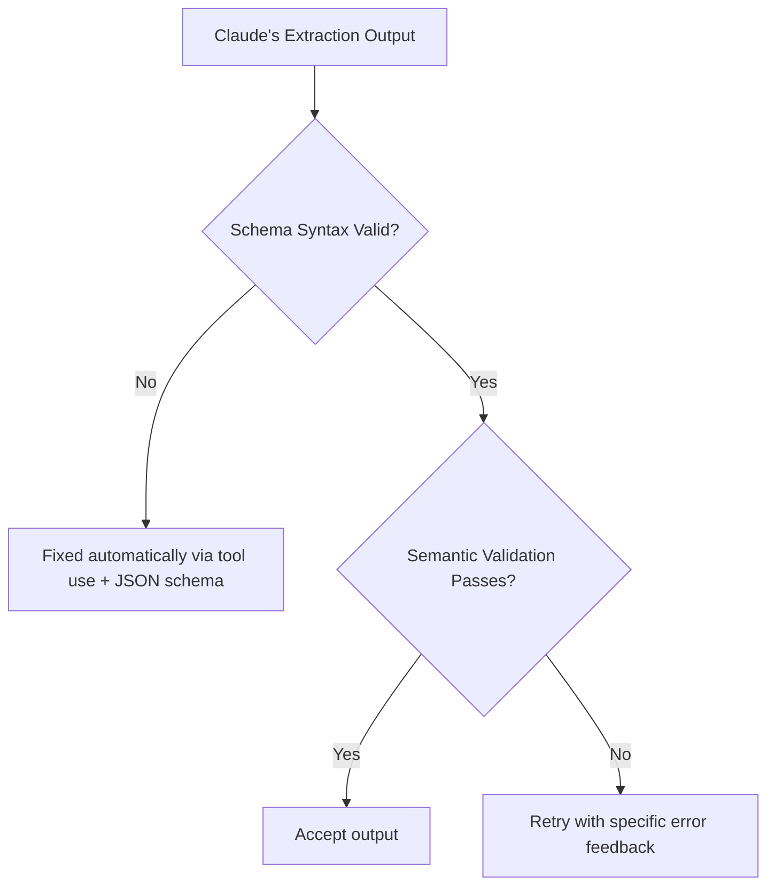
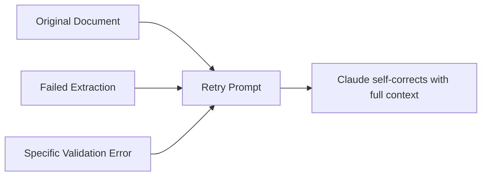
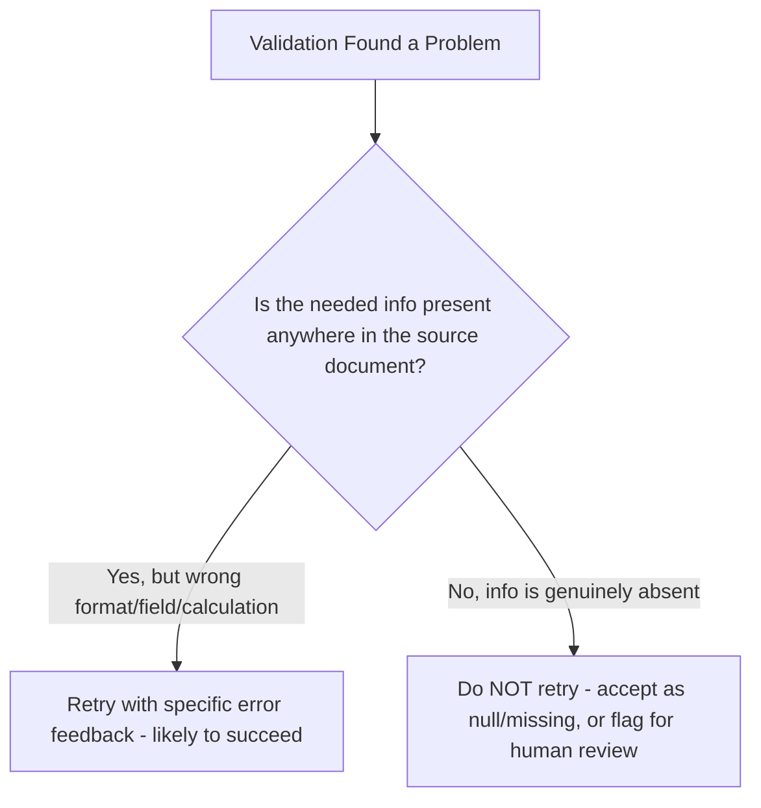
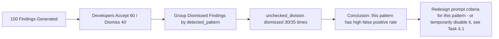
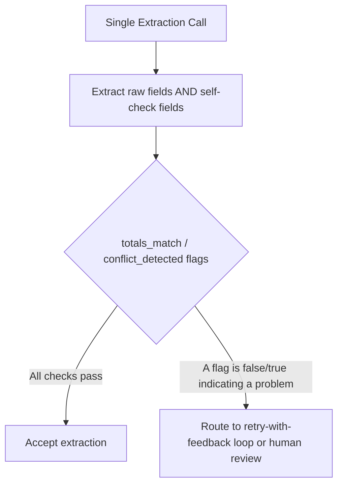

# Domain 4: Prompt Engineering & Structured Output
## Task Statement 4.4: Implement Validation, Retry, and Feedback Loops for Extraction Quality

---

## 1. Introduction

In Task Statement 4.3, you learned that tool use with JSON schemas eliminates **syntax** errors, but not **semantic** errors — a response can be perfectly structured JSON and still be wrong (like a total that doesn't add up).

This tutorial teaches you what to do **after** you detect a problem: how to build a system that **validates** output, **retries** intelligently when a retry can actually help, and uses **feedback loops** to keep improving extraction quality over time.

**Simple definition:**
> A validation-retry-feedback loop is a system where you check Claude's output for problems, and if a problem is something Claude could realistically fix by trying again with more guidance, you send it back with specific error details. If the problem is something a retry cannot fix, you don't waste time retrying — you handle it another way.

---

## 2. Two Types of Errors: Syntax vs Semantic

Before designing a retry system, you need to know **what kind of error** you're dealing with, because the fix is different for each.

| Error Type | Example | How It's Usually Fixed |
|---|---|---|
| **Schema syntax error** | Missing bracket, wrong data type, extra text around JSON | Eliminated automatically by using tool use with JSON schemas (see Task 4.3) |
| **Semantic validation error** | Line items don't sum to the total; a phone number placed in the `email` field; a date field containing a name | Needs manual validation logic + a retry-with-feedback loop |



This tutorial focuses on the right-hand side of this diagram: what happens **after** the schema is valid, but the values are still wrong.

---

## 3. Retry-With-Error-Feedback: The Core Technique

### 3.1 The Idea

When your validation code finds a semantic problem, don't just ask Claude to "try again." Instead, tell Claude **exactly what was wrong**, using specific error details. This gives Claude something concrete to correct, instead of guessing what might have gone wrong.

### 3.2 Bad Approach: Vague Retry

```
That wasn't quite right. Please try again.
```

This is exactly the kind of vague instruction you learned to avoid in Task Statement 4.1. Claude has no idea *what* was wrong, so the retry may not fix the actual issue.

### 3.3 Good Approach: Specific Error Feedback

```python
validation_error = (
    "Line items sum to 35 (10 + 25), but 'total' field says 50. "
    "Please recheck the total and correct it to match the sum of "
    "line items, or explain the discrepancy if the source document "
    "itself states an incorrect total."
)

retry_messages = [
    {"role": "user", "content": original_document_text},
    {"role": "assistant", "content": str(failed_extraction)},
    {"role": "user", "content": f"Validation error found: {validation_error}. "
                                  f"Please correct your extraction."}
]

response = client.messages.create(
    model="claude-sonnet-4-6",
    max_tokens=1000,
    tools=[invoice_tool],
    tool_choice={"type": "tool", "name": "extract_invoice"},
    messages=retry_messages
)
```

### 3.4 Why Include the Original Document AND the Failed Extraction

Notice the retry message includes **three** things:
1. The **original document** — so Claude has the source text again.
2. The **failed extraction** — so Claude can see exactly what it produced before.
3. The **specific validation error** — so Claude knows precisely what to fix.



Without all three pieces, Claude might "fix" the wrong thing, or fix the error in a way that breaks something else that was previously correct.

---

## 4. The Limits of Retry: When Retrying Will Not Help

### 4.1 The Key Distinction

Not every problem can be solved by asking Claude to try again. You must learn to tell the difference between two situations:

| Situation | Can Retry Fix It? |
|---|---|
| **Format or structural error** (e.g., date format inconsistent, wrong field used, calculation mismatch within the given document) | ✅ Yes — retry with specific feedback usually works |
| **Information is simply absent from the source document** (e.g., asking for an email address that was never mentioned anywhere in the text) | ❌ No — retrying will not create information that doesn't exist |

### 4.2 Why This Matters

If you don't make this distinction, your system will keep retrying forever on a document that simply does not contain the requested information — wasting time, money (API calls), and possibly causing Claude to **hallucinate** just to give you *something* on the next retry.

### 4.3 Example: Retry That Will Work (Format Error)

```
Original document: "Meeting scheduled for 12th August 2026"
Extraction attempt 1: {"meeting_date": "12th August 2026"}
Validation error: meeting_date must be in YYYY-MM-DD format.

Retry: This will succeed, because the date information IS present in
the document — it just needs to be reformatted.
Corrected extraction: {"meeting_date": "2026-08-12"}
```

### 4.4 Example: Retry That Will NOT Work (Missing Information)

```
Original document: "John Doe, Sales Manager, joined the team last month."
Extraction attempt 1: {"name": "John Doe", "email": null}
Validation error (if you mistakenly flag this): "email is missing,
please provide it."

Retry: This will NOT succeed, because there is no email address
anywhere in the source document. Asking Claude to retry will likely
cause it to fabricate a fake email just to comply.
```

**Correct handling:** If a field is genuinely absent from the source, this is not a validation "error" at all — it should be accepted as `null` (see Task 4.3's discussion of optional/nullable fields), not treated as a retry-triggering problem.

### 4.5 Decision Guide



**Skill checklist for deciding whether to retry:**
- Ask: "Is the correct value present somewhere in the input I gave Claude?"
- If **yes** → it's a format/structural/calculation problem → retry with specific feedback.
- If **no** → it's a missing-information problem → don't retry; mark the field as null/missing and move on (or escalate to a human, per Domain 5 concepts).

---

## 5. Feedback Loop Design: Tracking `detected_pattern`

### 5.1 The Problem: Developers Dismiss Findings, But You Don't Know Why

Imagine your tool flags 100 issues in a week. Developers accept 60 and dismiss 40. Without more detail, you don't know **why** those 40 were dismissed — were they wrong? Were they technically correct but unimportant? Is there a common code pattern causing repeated false positives?

### 5.2 The Solution: A `detected_pattern` Field

Add a field to every finding that records **which specific code construct or pattern** triggered the finding. This turns dismissed findings into useful data you can analyze later.

```python
finding_schema = {
    "type": "object",
    "properties": {
        "location": {"type": "string"},
        "issue": {"type": "string"},
        "severity": {"type": "string", "enum": ["critical", "high", "medium", "low"]},
        "detected_pattern": {
            "type": "string",
            "description": "The specific code construct or pattern that "
                            "triggered this finding, e.g. 'unparameterized_sql_query', "
                            "'unchecked_division', 'missing_null_check'."
        }
    },
    "required": ["location", "issue", "severity", "detected_pattern"]
}
```

### 5.3 Example Finding With `detected_pattern`

```json
{
  "location": "billing.py:42",
  "issue": "Possible division by zero if 'count' is 0",
  "severity": "medium",
  "detected_pattern": "unchecked_division"
}
```

### 5.4 Why This Helps



By tagging every finding with a `detected_pattern`, you can later run analysis like:

```python
from collections import Counter

dismissed_patterns = [f["detected_pattern"] for f in findings if f["dismissed"]]
pattern_counts = Counter(dismissed_patterns)
print(pattern_counts.most_common(3))
# [('unchecked_division', 30), ('missing_null_check', 8), ('unparameterized_sql_query', 2)]
```

This directly connects back to Task Statement 4.1: once you know `unchecked_division` has a high dismissal (false positive) rate, you can **temporarily disable that category** and redesign its criteria — but you can only make that decision if you were tracking `detected_pattern` in the first place.

---

## 6. Designing Self-Correction Validation Flows

### 6.1 Pattern 1: `calculated_total` vs `stated_total`

A very effective validation pattern is to have Claude extract **both**:
- The value **stated** in the document (`stated_total`)
- A value **calculated** by Claude from the underlying line items (`calculated_total`)

If these two don't match, you have an automatic, built-in discrepancy flag — no external validation code needed.

```python
invoice_schema = {
    "type": "object",
    "properties": {
        "line_items": {
            "type": "array",
            "items": {
                "type": "object",
                "properties": {
                    "description": {"type": "string"},
                    "price": {"type": "number"}
                },
                "required": ["description", "price"]
            }
        },
        "stated_total": {
            "type": "number",
            "description": "The total amount as literally written in the document."
        },
        "calculated_total": {
            "type": "number",
            "description": "The sum of all line item prices, calculated by you."
        },
        "totals_match": {
            "type": "boolean",
            "description": "True if stated_total equals calculated_total."
        }
    },
    "required": ["line_items", "stated_total", "calculated_total", "totals_match"]
}
```

**Example output:**

```json
{
  "line_items": [
    {"description": "Pen", "price": 10},
    {"description": "Notebook", "price": 25}
  ],
  "stated_total": 50,
  "calculated_total": 35,
  "totals_match": false
}
```

Now your validation code can simply check `"totals_match": false` and know immediately that something needs review — no need to re-implement the sum logic yourself, because Claude already did the comparison as part of the extraction.

### 6.2 Pattern 2: `conflict_detected` for Inconsistent Source Data

Sometimes a document contradicts itself — for example, a contract might say "Effective Date: January 1, 2026" in one place, and "This agreement begins February 1, 2026" in another. Add a `conflict_detected` boolean (plus a detail field) so this is captured explicitly, instead of Claude silently picking one value and hiding the disagreement.

```python
contract_schema = {
    "type": "object",
    "properties": {
        "effective_date": {"type": ["string", "null"]},
        "conflict_detected": {
            "type": "boolean",
            "description": "True if the source document contains "
                            "contradictory values for this field."
        },
        "conflict_detail": {
            "type": ["string", "null"],
            "description": "If conflict_detected is true, briefly "
                            "describe the contradictory values found."
        }
    },
    "required": ["effective_date", "conflict_detected"]
}
```

**Example output:**

```json
{
  "effective_date": "2026-01-01",
  "conflict_detected": true,
  "conflict_detail": "Section 1 states January 1, 2026 as the effective "
                      "date, but Section 4 states the agreement begins "
                      "February 1, 2026."
}
```

This pattern turns a hidden, silent judgment call ("Claude just picked one date") into a **visible, flaggable signal** your pipeline can route to a human reviewer.

### 6.3 Why These Patterns Are a Form of Self-Correction

Both patterns work by asking Claude to **check its own extraction against itself** (line items vs total, one part of the document vs another) *during* the same extraction call. This catches many semantic errors **before** you even need a separate retry step — cheaper and faster than a full retry loop.



---

## 7. Putting It All Together: A Full Validation-Retry-Feedback Flow

```python
def extract_with_validation(document_text, max_retries=2):
    messages = [{"role": "user", "content": document_text}]

    for attempt in range(max_retries + 1):
        response = client.messages.create(
            model="claude-sonnet-4-6",
            max_tokens=1000,
            tools=[invoice_tool],
            tool_choice={"type": "tool", "name": "extract_invoice"},
            messages=messages
        )
        extraction = response.content[0].input

        # Step 1: Semantic validation using self-check fields
        if extraction.get("totals_match") is False:
            error_detail = (
                f"stated_total ({extraction['stated_total']}) does not "
                f"match calculated_total ({extraction['calculated_total']}). "
                f"Please recheck the line items and totals."
            )

            # Step 2: Decide if retry can help
            # Here, the info (line items) IS present in the document,
            # so this is a structural/calculation issue -> retry is worth it.
            messages.append({"role": "assistant", "content": str(extraction)})
            messages.append({"role": "user", "content":
                f"Validation error found: {error_detail} Please correct "
                f"your extraction using the original document above."})
            continue  # retry with feedback

        # No validation errors found -> accept result
        return extraction

    # Exceeded retries -> flag for human review instead of retrying forever
    return {"status": "needs_human_review", "last_attempt": extraction}
```

This function demonstrates the full loop:
1. Extract using tool use (guarantees schema syntax correctness).
2. Check semantic self-validation fields (`totals_match`).
3. If there's a genuine structural/calculation problem, retry **with specific error feedback**, including the original document and the failed extraction.
4. If retries are exhausted, **stop retrying** and escalate to a human instead of looping forever — this respects the "limits of retry" principle.

---

## 8. Anti-Patterns to Avoid

> ⚠️ **Anti-Pattern 1: Vague retry prompts**
> "Try again" gives Claude nothing to work with. Always include the specific validation error, the original document, and the failed extraction.

> ⚠️ **Anti-Pattern 2: Retrying indefinitely on missing information**
> If a field is genuinely absent from the source document, retrying will not produce it — it will likely cause hallucination. Recognize this case and stop retrying.

> ⚠️ **Anti-Pattern 3: Treating "null" fields as validation errors**
> A null result for a genuinely absent field is correct behavior, not a bug. Don't trigger a retry loop for this — only retry on real structural/semantic mismatches.

> ⚠️ **Anti-Pattern 4: Findings without a `detected_pattern` field**
> Without tracking which pattern triggered a finding, you cannot analyze why developers dismiss certain findings, and you lose the ability to systematically improve your prompts over time.

> ⚠️ **Anti-Pattern 5: Silent conflict resolution**
> If a document contains contradictory information and Claude just quietly picks one value, that hidden decision could be wrong. Always surface conflicts explicitly with a `conflict_detected` flag.

---

## 9. Quick Reference Summary Table

| Concept | Key Point |
|---|---|
| Retry-with-error-feedback | Include the original document, the failed extraction, and the specific validation error in the retry prompt |
| Limits of retry | Retry works for format/structural/calculation errors; it does NOT work when the needed information is simply absent from the source |
| Syntax vs semantic errors | Syntax errors are eliminated by tool use + schemas (Task 4.3); semantic errors (wrong values, mismatched totals) need validation + retry logic |
| `detected_pattern` field | Tags each finding with the code construct that triggered it, enabling analysis of which patterns cause high false-positive/dismissal rates |
| `calculated_total` vs `stated_total` | Ask Claude to compute its own check value alongside the document's stated value, to catch mismatches automatically |
| `conflict_detected` boolean | Surfaces contradictions within a source document explicitly, instead of letting Claude silently resolve them |

---

## 10. Practice Questions

**Q1.** What three things should a retry-with-error-feedback prompt include to help Claude self-correct effectively?
**A1.** The original source document, the failed extraction attempt, and the specific validation error describing exactly what was wrong.

**Q2.** A document does not mention the customer's phone number anywhere, but your extraction schema keeps returning a validation error asking for it. What is the correct fix?
**A2.** Recognize that this is a missing-information problem, not a format/structural error — retrying will not help and may cause Claude to fabricate a fake phone number. The field should be treated as legitimately null/missing (per Task 4.3's optional field design), not as something to keep retrying.

**Q3.** Why is a `detected_pattern` field useful for improving an automated review system over time?
**A3.** It records which specific code construct or pattern triggered each finding. By analyzing which patterns are most frequently dismissed by developers, you can identify high false-positive categories and redesign or disable their criteria (connecting to Task Statement 4.1).

**Q4.** Explain the difference between a schema syntax error and a semantic validation error, with an example of each.
**A4.** A schema syntax error is a structural problem, like malformed JSON or a wrong data type — this is eliminated by using tool use with JSON schemas. A semantic validation error is when the output is structurally valid but logically wrong, such as line items summing to 35 while the stated total says 50 — this requires separate validation logic, since the schema alone cannot catch it.

**Q5.** How does asking Claude to extract both `stated_total` and `calculated_total` help catch errors without a separate retry step?
**A5.** Claude computes its own check value (`calculated_total`) from the line items during the same extraction call and compares it to the document's stated value (`stated_total`). If they don't match, this mismatch is immediately visible in the output itself, letting your validation code catch the issue without needing extra logic or an additional API call.

**Q6.** What should a `conflict_detected` field capture, and why is it better than letting the model silently choose one value?
**A6.** It should capture whether the source document contains contradictory values for a field (e.g., two different effective dates in different sections), along with a detail explaining the contradiction. This is better than silent resolution because it makes the ambiguity visible to your pipeline, allowing it to be routed for human review instead of hiding a potentially wrong guess.

**Q7.** A retry loop keeps running 5 times on the same document without success. What is the better design, based on the limits of retry?
**A7.** Set a maximum retry count, and once it's exceeded, stop retrying and escalate the item for human review instead of looping indefinitely — especially if the underlying issue may be missing information rather than a fixable structural error.

---

## 11. Summary

- Retry-with-error-feedback means including the original document, the failed extraction, and the specific validation error in a follow-up prompt, giving Claude concrete detail to self-correct — vague "try again" prompts do not work well.
- Retries are only effective for format, structural, or calculation-type errors where the correct information exists somewhere in the input. Retries cannot fix missing information that was never in the source document, and forcing retries in that case risks causing hallucination.
- Adding a `detected_pattern` field to every finding lets you later analyze which specific code constructs or patterns are causing high dismissal (false-positive) rates, directly supporting the trust and precision goals from Task Statement 4.1.
- Self-correction validation flows — like extracting `calculated_total` alongside `stated_total`, or adding a `conflict_detected` boolean — let Claude flag its own inconsistencies as part of a single extraction, catching many semantic errors before a retry is even needed.
- Schema syntax errors are solved by tool use (Task 4.3); semantic validation errors need this separate layer of validation, retry, and feedback design covered in this task statement.