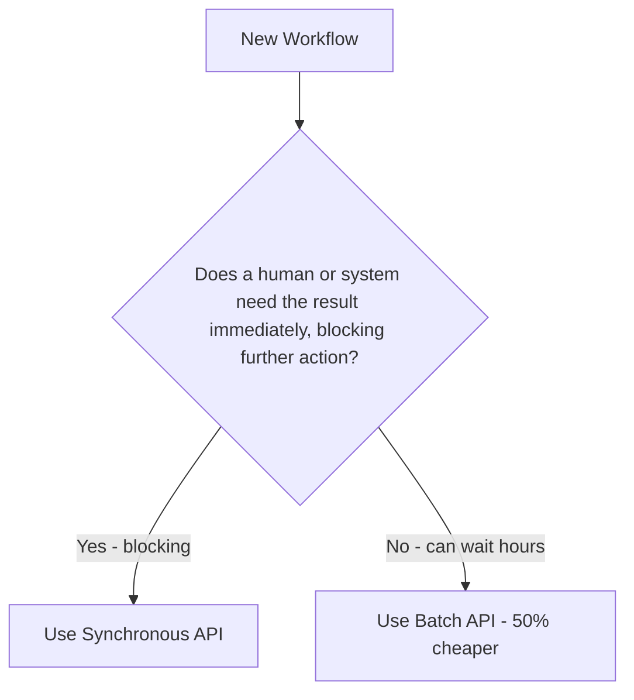
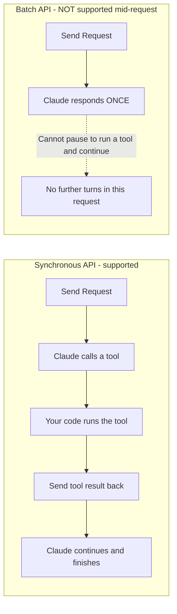
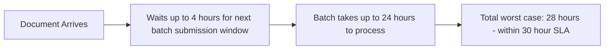
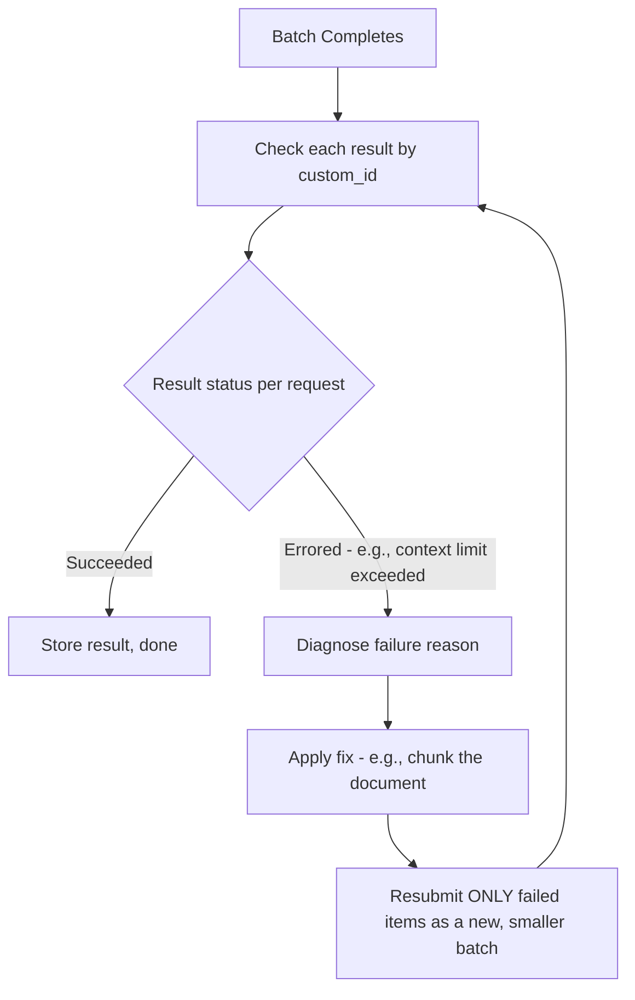
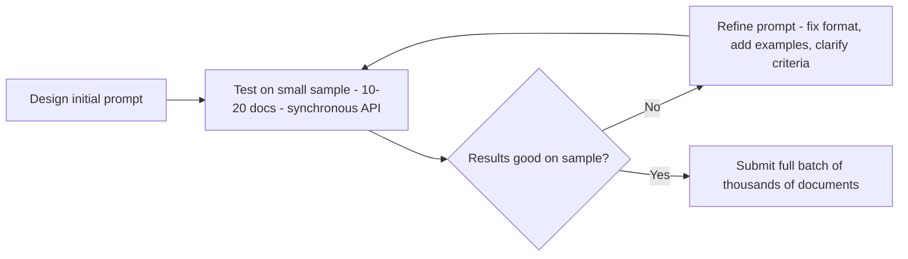

# Domain 4: Prompt Engineering & Structured Output
## Task Statement 4.5: Design Efficient Batch Processing Strategies

---

## 1. Introduction

So far in Domain 4, you have learned how to write precise prompts (4.1), use few-shot examples (4.2), enforce structured output (4.3), and validate/retry extractions (4.4). All of this assumed you were calling Claude **one request at a time**, waiting for an immediate answer.

But many real-world workloads don't need an instant answer. Think of:
- Generating an overnight summary report of yesterday's support tickets
- Running a weekly compliance audit across thousands of documents
- Generating nightly test cases for an entire codebase

For workloads like these, Anthropic offers the **Message Batches API** — a way to submit many requests at once, at a lower cost, in exchange for giving up guaranteed instant response times.

This tutorial teaches you how to decide **when** to use batch processing, how to **design around its limits**, and how to **handle failures efficiently**.

---

## 2. What Is the Message Batches API?

### 2.1 Core Facts You Must Know

| Feature | Detail |
|---|---|
| Cost savings | **50% cheaper** than the standard synchronous API, on all input and output tokens |
| Processing window | Batches may take **up to 24 hours** to complete; many finish much sooner |
| Latency guarantee | **No guaranteed latency SLA** — you cannot promise a customer "this will be done in 10 minutes" |
| Request correlation | Each request in a batch includes a **`custom_id`** field so you can match each response back to the request that produced it |

### 2.2 Simple Definition

> The Message Batches API lets you submit a large group of requests together. Anthropic processes them asynchronously (in the background) and gives you results later — usually within an hour, but potentially up to 24 hours — at half the normal cost. In return, you give up the ability to guarantee an instant response.

### 2.3 Basic Example: Submitting a Batch

```python
import anthropic

client = anthropic.Anthropic()

message_batch = client.messages.batches.create(
    requests=[
        {
            "custom_id": "ticket-001",
            "params": {
                "model": "claude-sonnet-4-6",
                "max_tokens": 500,
                "messages": [
                    {"role": "user", "content": "Summarize this support ticket: ..."}
                ]
            }
        },
        {
            "custom_id": "ticket-002",
            "params": {
                "model": "claude-sonnet-4-6",
                "max_tokens": 500,
                "messages": [
                    {"role": "user", "content": "Summarize this support ticket: ..."}
                ]
            }
        }
    ]
)

print(f"Batch ID: {message_batch.id}")
print(f"Status: {message_batch.processing_status}")
```

Each request has its own `custom_id` (`"ticket-001"`, `"ticket-002"`). This is essential — it's how you will later match each result back to the original ticket, since batch responses do not necessarily come back in the same order they were submitted.

---

## 3. When to Use Batch Processing vs the Synchronous API

### 3.1 The Core Decision Rule

The single most important skill in this task statement is matching your **API choice** to your **workflow's latency requirements**.



### 3.2 Good Fits for Batch Processing

Batch processing is appropriate for **non-blocking, latency-tolerant** workloads:

- **Overnight reports** — e.g., summarizing the day's activity, generated while no one is waiting
- **Weekly audits** — e.g., scanning a whole codebase or document set for compliance issues once a week
- **Nightly test generation** — e.g., generating new test cases for the codebase as a background job that developers review the next morning

These all share a pattern: **nobody is sitting and waiting** for the result the moment the request is submitted.

### 3.3 Bad Fits for Batch Processing

Batch processing is **inappropriate for blocking workflows** — situations where a person or an automated process is actively waiting for the result before it can continue.

- **Pre-merge checks** — e.g., a CI/CD pipeline that must review a pull request and post feedback before a developer can merge. The developer is blocked, waiting right now. A batch job that might take up to 24 hours would completely break this workflow.
- Live chat assistants
- Any interactive, user-facing feature where someone is watching a loading spinner

### 3.4 Comparison Table

| Workflow | Blocking? | Best API |
|---|---|---|
| PR pre-merge code review comment | Yes — developer waits to merge | Synchronous API |
| Nightly test-case generation | No — runs while no one is watching | Batch API |
| Weekly compliance audit across all contracts | No — result reviewed days later | Batch API |
| Live customer support chatbot reply | Yes — customer waits for the reply | Synchronous API |
| Overnight summary email of yesterday's logs | No — read the next morning | Batch API |

---

## 4. Key Limitation: No Multi-Turn Tool Calling Within a Batch Request

### 4.1 The Problem

In the synchronous API, you can do **multi-turn tool calling**: Claude calls a tool, your code executes it, you send the tool's result back to Claude, and Claude continues reasoning — all within one interactive back-and-forth loop.

**The batch API does not support this.** Each batch request gets **exactly one response**. There is no way to pause mid-request, run a tool, feed the result back, and let Claude continue — all inside a single batch item.



### 4.2 What This Means in Practice

If your workflow needs Claude to:
1. Call a tool
2. Get the result
3. Reason further based on that result
4. Maybe call another tool
5. Then give a final answer

...this **agentic loop** cannot happen inside a single batch request. If you need this kind of multi-step tool use, you must either:
- Use the **synchronous API** for that part of the workflow, or
- Break the work into **separate batch submissions** — run one batch, process the results yourself, then submit a second batch using those results as input (but this is multiple separate batch calls, not one continuous tool-use loop within a single request)

### 4.3 Example: What NOT to Expect From a Single Batch Request

```python
# This will NOT work as an agentic multi-turn tool loop inside one batch request.
# Claude can call a tool once, but there is no mechanism within a single batch
# request to send the tool's result back and get a follow-up response.

request = {
    "custom_id": "doc-001",
    "params": {
        "model": "claude-sonnet-4-6",
        "max_tokens": 500,
        "tools": [search_tool],
        "messages": [
            {"role": "user", "content": "Find the latest policy and summarize it."}
        ]
    }
}
# If Claude calls search_tool here, the batch request ends with that tool_use
# block. There is no way, within this same batch item, to send back the
# search results and let Claude continue in the same request.
```

**Key takeaway:** batch processing is best suited for **single-turn** tasks — extraction, summarization, classification, generation — not multi-step agentic tool-use workflows.

---

## 5. Skill: Calculating Batch Submission Frequency From SLA Constraints

### 5.1 The Problem

Imagine your team promises: "Every submitted document will be processed within 30 hours." You want to use the Batch API to save 50% on cost. But a single batch can take **up to 24 hours** to process. How often should you submit batches to make sure you never break your 30-hour promise?

### 5.2 The Calculation Logic

You need to leave enough of a buffer so that even in the **worst case** (a batch taking the full 24 hours), a document is still finished within your SLA.

```
Available buffer = SLA time - Maximum batch processing time
Available buffer = 30 hours - 24 hours = 6 hours
```

This means: from the moment a document arrives, you have at most **6 hours** before you must submit it in a batch, so that even in the worst case (24-hour processing), the total time stays within the 30-hour SLA.

To guarantee this for **every** document, you should submit new batches **more frequently than your buffer window** — for example, every 4 hours (safely under the 6-hour maximum buffer), so that no document waits longer than 4 hours before being included in a batch.

```
Total worst-case time = Submission frequency + Max batch processing time
Total worst-case time = 4 hours + 24 hours = 28 hours (within the 30-hour SLA)
```

### 5.3 Visualizing the Timing



### 5.4 General Formula

```
Submission Frequency <= SLA - Maximum Batch Processing Time
```

Always choose a submission frequency **safely below** this maximum, to leave a small safety margin (in the example above, 4 hours was chosen even though 6 hours was the strict maximum, to build in a buffer for unexpected delays).

### 5.5 Worked Example: Different SLA

If your SLA is **48 hours**, and batch processing takes up to 24 hours:

```
Buffer = 48 - 24 = 24 hours
```

You could submit batches every 12 or 24 hours and still comfortably meet the SLA, since even the longest wait (up to 24 hours before submission) plus the longest processing time (24 hours) totals at most 48 hours.

---

## 6. Skill: Handling Batch Failures

### 6.1 The Problem

In a batch of 10,000 documents, some requests may fail — for example, a document might exceed the context window limit, or hit some other processing error. You do **not** want to resubmit the entire batch of 10,000 just because 50 of them failed. That would waste money and time.

### 6.2 The Solution: Resubmit Only the Failed Ones, Using `custom_id`

Because every request has a unique `custom_id`, you can identify exactly which ones failed, and resubmit **only those**, with fixes applied.

```python
results = client.messages.batches.results(message_batch.id)

failed_requests = []

for result in results:
    if result.result.type == "errored":
        failed_requests.append(result.custom_id)

print(f"Failed requests: {failed_requests}")
# Example: ['doc-047', 'doc-231', 'doc-892']
```

### 6.3 Applying Appropriate Modifications Before Resubmission

Simply resubmitting a failed request unchanged will likely fail again for the same reason. You should look at **why** it failed and adjust accordingly.

**Example: Document exceeded context limits**

```python
def chunk_document(document_text, max_chars=50000):
    """Split a large document into smaller chunks that fit within
    the context window."""
    chunks = []
    for i in range(0, len(document_text), max_chars):
        chunks.append(document_text[i:i + max_chars])
    return chunks

# Rebuild only the failed requests, this time chunked
new_batch_requests = []
for custom_id in failed_requests:
    original_doc = get_original_document(custom_id)  # fetch from your storage
    chunks = chunk_document(original_doc)

    for idx, chunk in enumerate(chunks):
        new_batch_requests.append({
            "custom_id": f"{custom_id}-chunk-{idx}",
            "params": {
                "model": "claude-sonnet-4-6",
                "max_tokens": 500,
                "messages": [{"role": "user", "content": chunk}]
            }
        })

# Submit a new, smaller batch with only the fixed, failed documents
retry_batch = client.messages.batches.create(requests=new_batch_requests)
```

Notice: the new `custom_id` values (e.g., `"doc-047-chunk-0"`, `"doc-047-chunk-1"`) still let you trace each chunk back to its original document, while keeping every ID unique within the batch.

### 6.4 Failure Handling Flow



### 6.5 Why This Matters

- **Cost efficiency:** Resubmitting only failed items avoids paying again for the thousands of requests that already succeeded.
- **Speed:** A smaller retry batch processes faster than resubmitting the entire original batch.
- **Traceability:** Because `custom_id` ties every result back to its source, you always know exactly which original documents still need attention.

---

## 7. Skill: Prompt Refinement on a Sample Set Before Full Batch Runs

### 7.1 The Problem

Imagine you design a prompt and immediately submit a batch of 5,000 documents. If the prompt has a flaw — wrong output format, missing edge case handling, poor instructions — you will find out only **after** waiting up to 24 hours, and you'll need to pay again to reprocess many of them.

### 7.2 The Solution: Test on a Small Sample First

Before committing to a large batch run, test your prompt on a **small representative sample** (for example, 10-20 documents) using the **synchronous API**, where you get immediate feedback. Refine the prompt until it performs reliably on this sample, **then** scale up to the full batch.



### 7.3 Example: Sample Testing Workflow

```python
sample_documents = all_documents[:15]  # small representative sample

for doc in sample_documents:
    response = client.messages.create(
        model="claude-sonnet-4-6",
        max_tokens=500,
        messages=[{"role": "user", "content": doc}]
    )
    print(response.content[0].text)
    # Review this output manually: is the format correct? Are edge
    # cases (e.g., missing fields, unusual document structure) handled well?

# Only after the prompt performs reliably on the sample, submit the full batch:
# message_batch = client.messages.batches.create(requests=full_batch_requests)
```

### 7.4 Why This Matters

- **Maximizes first-pass success rate:** Catching formatting or logic issues on a small sample means the full batch is far more likely to succeed on the first attempt.
- **Reduces resubmission costs:** Every resubmission (due to a flawed prompt discovered too late) costs additional tokens and additional waiting time (up to another 24-hour window). Testing first avoids this expensive cycle.
- **Faster iteration:** The synchronous API gives instant feedback on the sample, so you can refine your prompt in minutes instead of waiting hours to discover a problem in a full batch run.

---

## 8. Putting It All Together: A Complete Batch Strategy

```python
# STEP 1: Refine the prompt on a small sample using the synchronous API
sample_documents = all_documents[:15]
for doc in sample_documents:
    response = client.messages.create(
        model="claude-sonnet-4-6",
        max_tokens=500,
        messages=[{"role": "user", "content": doc}]
    )
    # Manually review and refine the prompt until output is consistently good

# STEP 2: Once the prompt is validated, build the full batch with unique custom_ids
full_batch_requests = [
    {
        "custom_id": f"doc-{i:04d}",
        "params": {
            "model": "claude-sonnet-4-6",
            "max_tokens": 500,
            "messages": [{"role": "user", "content": doc}]
        }
    }
    for i, doc in enumerate(all_documents)
]

# STEP 3: Submit the batch (non-blocking workload - e.g., a weekly audit)
message_batch = client.messages.batches.create(requests=full_batch_requests)

# STEP 4: Later, retrieve results and handle failures by custom_id
results = client.messages.batches.results(message_batch.id)
failed_ids = [r.custom_id for r in results if r.result.type == "errored"]

# STEP 5: Diagnose and resubmit only the failed ones, with fixes applied
# (e.g., chunk documents that exceeded context limits, as shown in Section 6.3)
```

This full example demonstrates every skill from this task statement:
1. Matching the workload (a non-blocking batch job) to the right API
2. Sample-based prompt refinement before full-scale submission
3. Unique `custom_id` values for every request, enabling correlation
4. Failure handling that resubmits only the failed subset with appropriate fixes

---

## 9. Anti-Patterns to Avoid

> ⚠️ **Anti-Pattern 1: Using batch processing for blocking workflows**
> Never use the Batch API for something like a pre-merge CI check where a developer is actively waiting. There is no latency SLA, so this could block a developer for up to 24 hours.

> ⚠️ **Anti-Pattern 2: Expecting multi-turn tool loops inside one batch request**
> The batch API gives exactly one response per request. Design your batch tasks to be single-turn (extraction, summarization, classification), not multi-step tool-calling agents.

> ⚠️ **Anti-Pattern 3: Ignoring `custom_id` correlation**
> If you don't assign meaningful, unique `custom_id` values, you cannot reliably match results back to their original documents, especially since results may not return in submission order.

> ⚠️ **Anti-Pattern 4: Resubmitting an entire batch after partial failures**
> This wastes money reprocessing thousands of already-successful requests. Always isolate and resubmit only the failed `custom_id`s.

> ⚠️ **Anti-Pattern 5: Skipping sample testing before a full batch run**
> Submitting a large, unrefined batch risks discovering a prompt flaw only after waiting up to 24 hours, then paying again to fix and resubmit. Always validate on a small sample first using the synchronous API.

> ⚠️ **Anti-Pattern 6: Ignoring the SLA math when choosing submission frequency**
> Submitting batches too infrequently (e.g., once a day when your SLA requires faster turnaround) can cause documents to miss their deadline, since batch processing itself can take up to 24 hours on top of any wait time before submission.

---

## 10. Quick Reference Summary Table

| Concept | Key Point |
|---|---|
| Cost savings | Batch API costs 50% less than the synchronous API |
| Processing window | Up to 24 hours; no guaranteed latency SLA |
| Good fit | Non-blocking, latency-tolerant workloads: overnight reports, weekly audits, nightly test generation |
| Bad fit | Blocking workflows: pre-merge checks, live chat, anything with someone actively waiting |
| Multi-turn tool calling | NOT supported within a single batch request — each request gets exactly one response |
| `custom_id` | Unique identifier per request, used to correlate each response back to its original request |
| SLA submission frequency | Submission frequency <= SLA minus Maximum batch processing time (e.g., 30hr SLA - 24hr processing = submit at least every ~4-6 hours) |
| Failure handling | Identify failed requests by `custom_id`, diagnose the cause, apply a fix (e.g., chunking), and resubmit only those |
| Prompt refinement | Test and refine prompts on a small sample via the synchronous API before scaling to a full batch run |

---

## 11. Practice Questions

**Q1.** What are the three defining characteristics of the Message Batches API mentioned in the exam guide?
**A1.** It offers 50% cost savings compared to the synchronous API, has a processing window of up to 24 hours, and does not come with a guaranteed latency SLA.

**Q2.** Why is the Batch API inappropriate for a pre-merge CI/CD check, even though it is much cheaper than the synchronous API?
**A2.** A pre-merge check is a blocking workflow — a developer is actively waiting to merge their code. The Batch API has no guaranteed latency SLA and can take up to 24 hours, which would make the developer wait far too long, breaking the workflow.

**Q3.** Can Claude call a tool, receive the tool's result, and continue reasoning, all within a single batch request? Explain your answer.
**A3.** No. The batch API does not support multi-turn tool calling within a single request. Each batch request receives exactly one response — there is no mechanism to pause mid-request, execute a tool, feed the result back, and let Claude continue in the same request.

**Q4.** Your team must guarantee a 30-hour SLA, and the Batch API can take up to 24 hours to process. What is the maximum safe buffer time before you must submit a document into a batch, and why might you choose an even shorter submission frequency, like every 4 hours?
**A4.** The maximum safe buffer is 30 minus 24 = 6 hours. Choosing a shorter frequency, like every 4 hours, builds in an extra safety margin below the strict 6-hour maximum, protecting against unexpected delays and still comfortably meeting the 30-hour SLA (4 + 24 = 28 hours, under the limit).

**Q5.** A batch of 10,000 documents finishes with 50 requests marked as "errored" due to exceeding context limits. What is the correct way to handle this, and what should NOT be done?
**A5.** Correct approach: identify the 50 failed requests using their `custom_id`s, apply an appropriate fix (such as chunking the oversized documents into smaller pieces), and resubmit only those 50 (now chunked) requests as a new batch. What should NOT be done: resubmitting the entire original batch of 10,000 documents, which would waste money and time reprocessing the 9,950 that already succeeded.

**Q6.** Why should you test a new prompt on a small sample set using the synchronous API before submitting a large batch job?
**A6.** Because batch jobs can take up to 24 hours to complete, discovering a flawed prompt only after a full batch run wastes significant time and money on resubmission. Testing on a small sample first, with immediate synchronous feedback, allows you to refine the prompt and maximize the first-pass success rate before committing to the full-scale, more expensive batch run.

**Q7.** What is the purpose of the `custom_id` field in a batch request, and why is it especially important in the context of failure handling?
**A7.** The `custom_id` field uniquely identifies each request in a batch, allowing you to correlate each response back to its original request — since batch results are not guaranteed to come back in the same order they were submitted. This is especially important for failure handling because it lets you precisely identify which specific requests failed, so you can resubmit only those instead of the entire batch.

---

## 12. Summary

- The Message Batches API offers 50% cost savings with a processing window of up to 24 hours, but provides no guaranteed latency SLA — this trade-off defines when it should and should not be used.
- Use batch processing for non-blocking, latency-tolerant workloads like overnight reports, weekly audits, and nightly test generation. Use the synchronous API for blocking workflows like pre-merge checks, where someone is actively waiting for the result.
- The batch API does not support multi-turn tool calling within a single request — each request produces exactly one response, so batch tasks should be designed as single-turn (extraction, summarization, classification) rather than multi-step agentic tool-use loops.
- Every batch request needs a unique `custom_id`, which is essential for matching responses back to requests and for isolating exactly which requests failed.
- To meet an SLA, calculate your maximum safe submission frequency as SLA time minus the maximum batch processing time (24 hours), and submit comfortably within that window to leave a safety margin.
- When batch requests fail, diagnose the specific cause (e.g., context limit exceeded), apply an appropriate fix (e.g., chunking the document), and resubmit only the failed `custom_id`s — never the entire batch.
- Always refine your prompt on a small sample set using the synchronous API before scaling up to a full batch run, to maximize first-pass success and avoid costly, slow resubmission cycles.