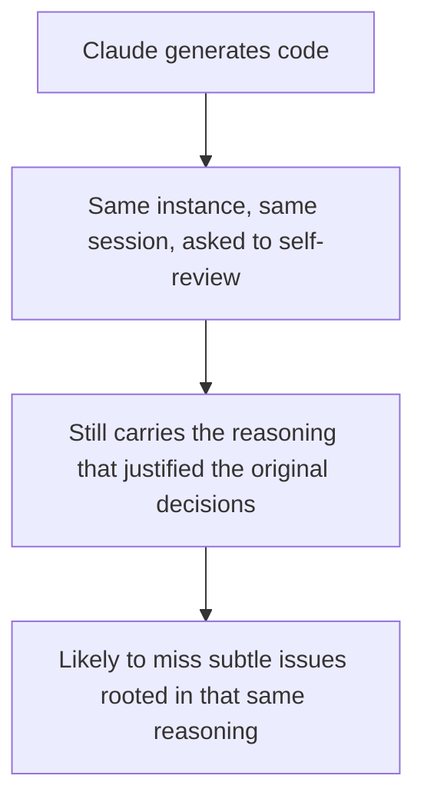
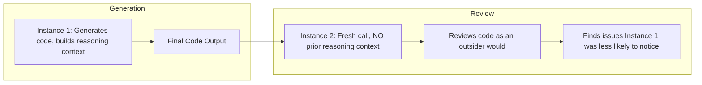
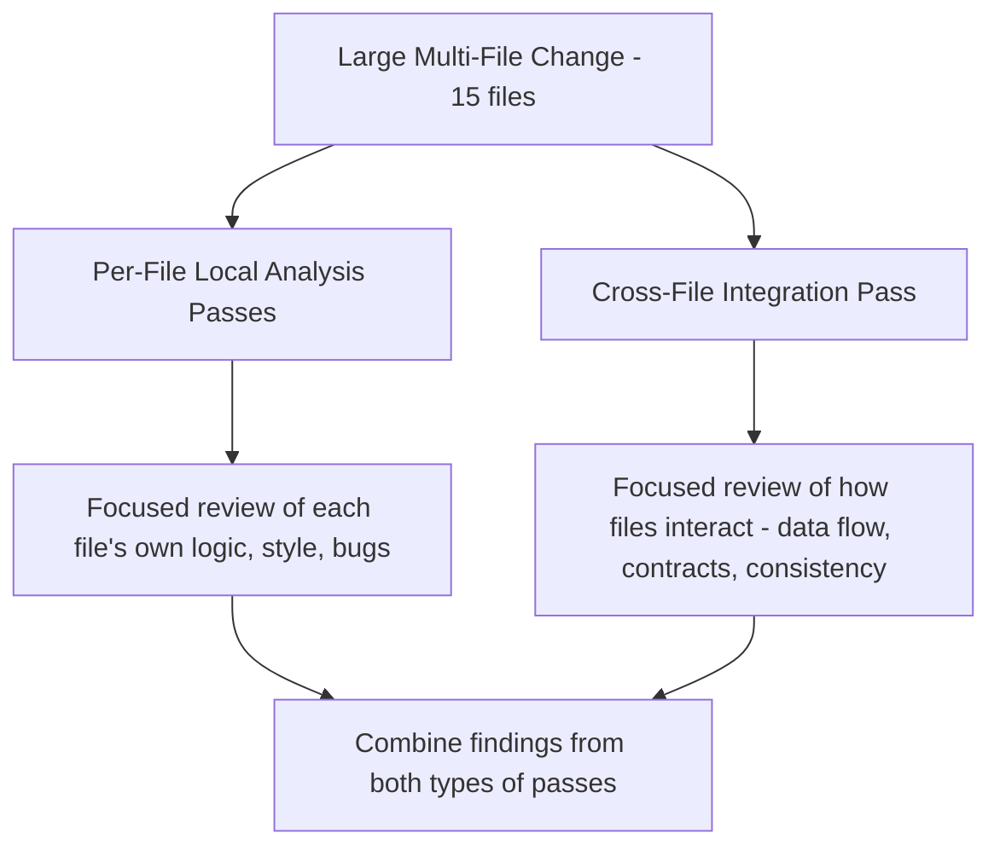
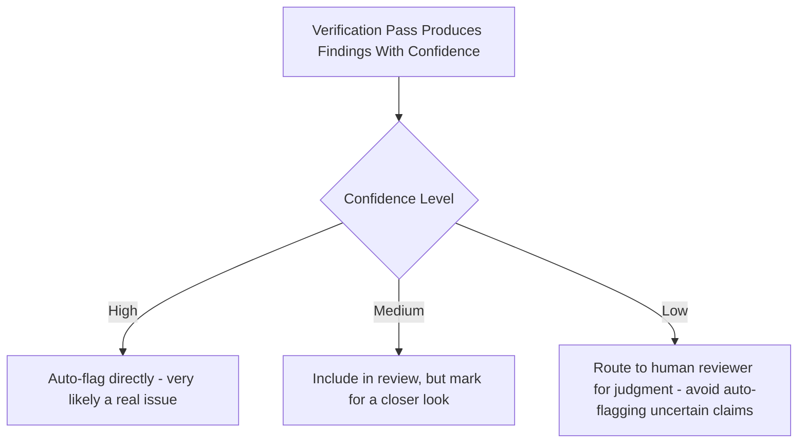
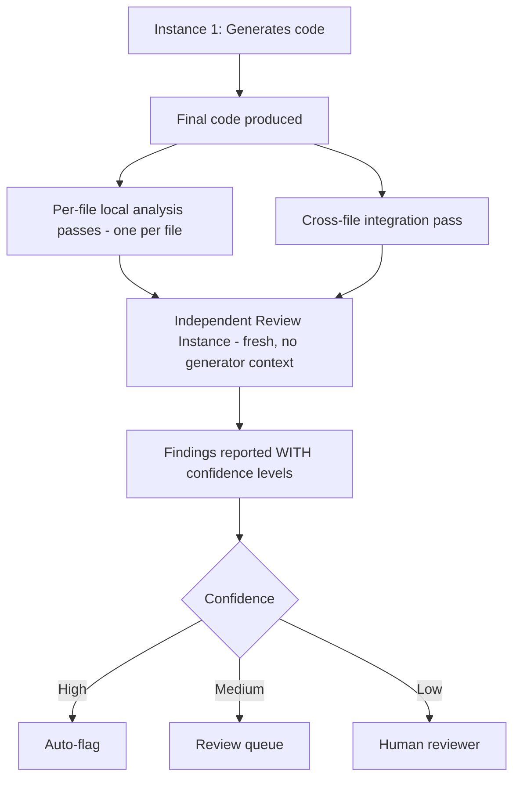

# Domain 4: Prompt Engineering & Structured Output
## Task Statement 4.6: Design Multi-Instance and Multi-Pass Review Architectures

---

## 1. Introduction

Throughout Domain 4, you've learned how to get better output from a single Claude call: explicit criteria (4.1), few-shot examples (4.2), structured output (4.3), validation and retry (4.4), and efficient batch processing (4.5).

This tutorial covers a different kind of improvement: instead of making **one** call better, you design **how many calls, and in what arrangement**, to catch issues that a single pass simply cannot catch — even a very well-prompted one.

**Simple definition:**
> A multi-instance or multi-pass review architecture uses more than one Claude call — sometimes a fresh, independent instance, sometimes multiple focused passes over different parts of the content — to catch problems that a single self-review would likely miss.

---

## 2. Why Self-Review Has Limits

### 2.1 The Core Problem

Imagine Claude just generated a piece of code. If you then ask that **same** Claude instance, in the **same session**, "please review your code for mistakes," something important works against you:

> Claude still remembers **why** it made each decision — because it just made those decisions moments ago, in the same reasoning context.

This matters because a model that just generated something has already convinced itself its choices were reasonable. It generated the code *because* it believed the logic was correct. Asking it to review its own work in the same session means it is reviewing through the lens of the reasoning it just used to justify those same choices.

### 2.2 A Simple Analogy

Imagine you write an essay, then immediately re-read it to check for mistakes. You will catch typos, but you are far less likely to notice that an *argument* doesn't fully make sense — because your mind still remembers the reasoning that felt convincing while writing it. A friend who has never seen the essay is much more likely to say, "Wait, this part doesn't actually follow."

Claude has the same limitation: **the model that generated something retains reasoning context that makes it less likely to question its own decisions in the same session.**

### 2.3 Why "Just Tell It to Be More Careful" Doesn't Fully Fix This

You might think: "What if I just add stronger self-review instructions, like 'carefully double-check your work' or use extended thinking to reason longer?"

These help somewhat, but they do **not** solve the core issue, because the model is still working from the **same reasoning context** it used to generate the content in the first place. It's still the same "mindset" checking its own work, just spending more time doing so.



**Key fact for the exam:** Independent review instances (fresh instances, without the generator's prior reasoning context) are **more effective** at catching subtle issues than self-review instructions or extended thinking within the same session.

---

## 3. Skill: Using an Independent Review Instance

### 3.1 The Idea

Instead of asking the same Claude instance (with its existing conversation history) to review its own output, start a **brand-new, independent** Claude call. This new instance has **no memory** of why the original decisions were made — it only sees the finished code (or document) as a fresh reviewer would.



### 3.2 Example: Self-Review vs Independent Review

**Weaker approach: Self-review in the same session**

```python
# Same conversation/session that generated the code
messages = [
    {"role": "user", "content": "Write a function to calculate compound interest."},
    {"role": "assistant", "content": generated_code},
    {"role": "user", "content": "Now carefully review your code for any bugs."}
]
# The assistant reviewing here still remembers WHY it wrote the code this way.
```

**Stronger approach: Independent review instance**

```python
# STEP 1: Generation call (Instance 1)
gen_response = client.messages.create(
    model="claude-sonnet-4-6",
    max_tokens=1000,
    messages=[
        {"role": "user", "content": "Write a function to calculate compound interest."}
    ]
)
generated_code = gen_response.content[0].text

# STEP 2: A completely separate, fresh call (Instance 2) - NEW conversation,
# no shared history, no memory of why decisions were made.
review_response = client.messages.create(
    model="claude-sonnet-4-6",
    max_tokens=1000,
    messages=[
        {"role": "user", "content":
            f"Review the following code for bugs, edge cases, and correctness "
            f"issues. You have no other context about this code.\n\n{generated_code}"}
    ]
)
review_feedback = review_response.content[0].text
```

Because Instance 2 starts a **fresh conversation**, it has no attachment to the original reasoning. It reviews the code the way a completely new colleague would — more likely to notice, for example, that compound interest with a negative interest rate isn't handled, because it isn't anchored to the assumptions Instance 1 made while writing it.

### 3.3 Why This Works Better Than Extended Thinking Alone

| Approach | What It Changes | Limitation |
|---|---|---|
| Same-session self-review instruction | Asks the same instance to "look again" | Still carries the same reasoning context; unlikely to challenge its own prior assumptions |
| Extended thinking in the same session | Gives the same instance more time/steps to reason | Still the same reasoning context, just explored more deeply — doesn't introduce a genuinely fresh perspective |
| **Independent review instance** | A **new** instance with **no shared reasoning context** reviews the output | Genuinely fresh perspective, more likely to catch subtle issues the generator was blind to |

---

## 4. Multi-Pass Review: Splitting Large Reviews Into Focused Passes

### 4.1 The Problem With One Giant Review Pass

Imagine you ask Claude to review a pull request touching 15 files in a single pass. Two problems tend to occur:

1. **Attention dilution** — with so much content to look at simultaneously, the model's attention is spread thin across many files, making it more likely to skim over subtle local issues in any one file.
2. **Contradictory findings** — the model may reach inconsistent conclusions in different parts of its own review, because it's trying to track local file details and cross-file relationships all at once, in one pass.

### 4.2 The Solution: Split Into Two Types of Passes



**Per-file local analysis passes:**
Review each file **on its own**, focused only on issues that live inside that file — logic errors, unused variables, missing null checks, etc.

**Cross-file integration passes:**
Review specifically how files **interact with each other** — for example, does a function's return type in `file_a.py` match what `file_b.py` expects? Does a change to a shared data structure in one file break an assumption made in another?

### 4.3 Example: Structuring Multi-Pass Review

```python
files_changed = ["billing.py", "invoice.py", "payment_gateway.py"]

# PASS TYPE 1: Per-file local analysis (one focused call per file)
local_findings = {}
for filename in files_changed:
    file_content = get_file_content(filename)
    response = client.messages.create(
        model="claude-sonnet-4-6",
        max_tokens=800,
        messages=[
            {"role": "user", "content":
                f"Review ONLY this file for local issues (bugs, logic errors, "
                f"missing edge cases). Do not worry about how it interacts "
                f"with other files.\n\nFile: {filename}\n\n{file_content}"}
        ]
    )
    local_findings[filename] = response.content[0].text

# PASS TYPE 2: Cross-file integration analysis (separate, focused call)
all_files_summary = "\n\n".join(
    f"### {f}\n{get_file_content(f)}" for f in files_changed
)
integration_response = client.messages.create(
    model="claude-sonnet-4-6",
    max_tokens=800,
    messages=[
        {"role": "user", "content":
            f"Review how these files interact with each other. Focus ONLY "
            f"on cross-file issues: mismatched function signatures, data "
            f"passed between files, and shared assumptions that might be "
            f"broken by these changes.\n\n{all_files_summary}"}
    ]
)
integration_findings = integration_response.content[0].text
```

### 4.4 Why Splitting Passes Helps

- **Reduces attention dilution:** Each per-file pass only has to focus on one file's worth of content, so subtle local issues are less likely to be skimmed over.
- **Reduces contradictory findings:** Because local and cross-file concerns are handled by **separate, focused passes**, the model isn't trying to juggle both kinds of reasoning simultaneously in one giant analysis — each pass has a clear, narrow job.
- **Improves traceability:** You get clearly separated local findings (per file) and integration findings (across files), making the results easier for a human reviewer to act on.

---

## 5. Skill: Confidence Self-Reporting for Calibrated Review Routing

### 5.1 The Idea

Not every finding deserves the same level of trust. Some findings are almost certainly correct; others are best guesses. If Claude reports a **confidence level alongside every finding**, you can route findings differently based on how confident the model is — for example, sending low-confidence findings to a human reviewer, while high-confidence findings might be auto-flagged directly.

### 5.2 Example: Adding Confidence to Findings

```python
verification_prompt = """
Review this code and report any issues found. For each issue, include:
- location
- issue description
- confidence: "high", "medium", or "low"
  (high = you are very sure this is a real issue based on the code shown;
   medium = likely an issue, but some assumptions were made;
   low = possible issue, but genuinely uncertain without more context)

Code:
{code}
"""
```

**Example finding output:**

```json
{
  "location": "payment_gateway.py:88",
  "issue": "No timeout is set on the external API call, which could cause the request to hang indefinitely.",
  "confidence": "high"
}
```

```json
{
  "location": "invoice.py:34",
  "issue": "This function might not handle discounts correctly, but I'm not fully sure how discounts are applied elsewhere in the codebase.",
  "confidence": "low"
}
```

### 5.3 Calibrated Routing Based on Confidence



### 5.4 Why This Matters

This connects back to Task Statement 4.1's lesson about false positives damaging trust: if low-confidence findings are treated the same as high-confidence ones, developers may start distrusting the entire review system. By having Claude **self-report confidence**, you can calibrate how findings are routed — reducing the chance that shaky, low-confidence guesses get the same weight as clear, well-supported findings.

```python
findings = [
    {"location": "payment_gateway.py:88", "issue": "No timeout on API call", "confidence": "high"},
    {"location": "invoice.py:34", "issue": "Possible discount handling issue", "confidence": "low"},
]

for finding in findings:
    if finding["confidence"] == "high":
        auto_flag(finding)
    elif finding["confidence"] == "medium":
        add_to_review_queue(finding)
    else:  # low confidence
        route_to_human_reviewer(finding)
```

---

## 6. Putting It All Together: A Full Multi-Instance, Multi-Pass Architecture



**Design summary:**
1. **Generation** happens in one instance, with its own reasoning context.
2. **Review** happens in a **separate, independent instance** with no memory of the generator's reasoning — this catches issues the generator was less likely to question.
3. For large, multi-file changes, review is **split into per-file local passes plus a separate cross-file integration pass**, to avoid attention dilution and contradictory findings.
4. Every finding includes a **self-reported confidence level**, enabling calibrated routing — high-confidence issues can be auto-flagged, while low-confidence ones go to a human.

---

## 7. Anti-Patterns to Avoid

> ⚠️ **Anti-Pattern 1: Relying only on same-session self-review**
> Asking the same instance that generated the content to "double-check its work" in the same session is weaker than using a fresh, independent instance, because the reasoning context that justified the original decisions is still present.

> ⚠️ **Anti-Pattern 2: Assuming extended thinking replaces independent review**
> Giving the same instance more time to think (extended thinking) does not introduce a new perspective — it's still working from the same reasoning context that generated the content.

> ⚠️ **Anti-Pattern 3: Reviewing many files in a single giant pass**
> This causes attention dilution (subtle local issues get missed) and can produce contradictory findings, because the model is juggling local and cross-file reasoning at the same time.

> ⚠️ **Anti-Pattern 4: Treating all findings as equally trustworthy**
> Without confidence self-reporting, low-confidence guesses get the same weight as well-supported findings, which can damage developer trust when the low-confidence ones turn out wrong (see Task Statement 4.1).

> ⚠️ **Anti-Pattern 5: Skipping the cross-file integration pass**
> Reviewing files only individually can miss real bugs that only appear when you look at how files interact — e.g., a function signature mismatch across two files. Always pair local passes with a separate integration pass for multi-file changes.

---

## 8. Quick Reference Summary Table

| Concept | Key Point |
|---|---|
| Self-review limitation | Same-instance, same-session review retains the reasoning that justified the original decisions, making it less likely to question them |
| Independent review instance | A fresh instance with no prior reasoning context catches subtle issues more effectively than self-review instructions or extended thinking |
| Multi-pass review | Split large, multi-file reviews into per-file local passes plus a separate cross-file integration pass |
| Why split passes | Avoids attention dilution (missed local issues) and contradictory findings (mixing local and cross-file reasoning in one pass) |
| Confidence self-reporting | Each finding includes a confidence level (high/medium/low), enabling calibrated routing of findings to auto-flag, review queue, or human reviewer |

---

## 9. Practice Questions

**Q1.** Why is a same-session self-review by the same Claude instance less effective at catching subtle issues than an independent review instance?
**A1.** Because the same instance still retains the reasoning context it used to generate the content, making it less likely to question its own original decisions. An independent instance, with no prior reasoning context, reviews the output more like a genuinely fresh reviewer would.

**Q2.** Does using extended thinking within the same session fully solve the self-review limitation? Why or why not?
**A2.** No. Extended thinking gives the same instance more time or steps to reason, but it is still working from the same underlying reasoning context that produced the original content. It does not introduce a genuinely independent perspective the way a fresh, separate instance does.

**Q3.** A pull request changes 12 files. What two types of review passes should this be split into, and why?
**A3.** Per-file local analysis passes (focused only on issues within each individual file) and a separate cross-file integration pass (focused on how the files interact, such as data flow and shared assumptions). Splitting them avoids attention dilution across many files at once and prevents contradictory findings from mixing local and cross-file reasoning in a single pass.

**Q4.** What is "attention dilution" in the context of large multi-file code reviews, and how does multi-pass review address it?
**A4.** Attention dilution is when a model's focus is spread too thin across a large amount of content reviewed all at once, making it more likely to miss subtle, local issues. Multi-pass review addresses this by giving each file (or each concern, like cross-file interactions) its own focused pass, rather than reviewing everything simultaneously.

**Q5.** Why should each finding in a review include a self-reported confidence level?
**A5.** Because not all findings are equally reliable — some are well-supported, others are best guesses. Including a confidence level (high/medium/low) allows the system to route findings appropriately: high-confidence findings can be auto-flagged, while low-confidence ones can be sent to a human reviewer, avoiding the trust damage that comes from treating shaky guesses the same as solid findings.

**Q6.** Design a two-instance architecture for reviewing AI-generated code, explaining what each instance does and why they are separate.
**A6.** Instance 1 generates the code, building its own reasoning context for the decisions made. Instance 2 is a completely separate, fresh call (new conversation, no shared history) that reviews the generated code with no knowledge of why those decisions were made. They are kept separate because Instance 1's reasoning context would make it less likely to question its own choices, while Instance 2, without that context, can catch subtle issues more effectively.

**Q7.** True or False: Reviewing all files in a single large pass is generally more effective than splitting the review into per-file and cross-file passes.
**A7.** False. Reviewing all files in a single large pass risks attention dilution and contradictory findings. Splitting the review into focused per-file local passes plus a separate cross-file integration pass is the more effective approach for large, multi-file reviews.

---

## 10. Summary

- A model that just generated content retains the reasoning context that justified its decisions, making same-session self-review less effective at catching subtle issues — this is a fundamental limitation, not something extended thinking alone can fix.
- Independent review instances — fresh Claude calls with no prior reasoning context from the generator — are more effective at catching subtle issues than self-review instructions or extended thinking within the same session.
- Large, multi-file reviews should be split into per-file local analysis passes (focused on issues within each file) plus separate cross-file integration passes (focused on how files interact), to avoid attention dilution and contradictory findings.
- Adding a self-reported confidence level to each finding enables calibrated review routing — high-confidence findings can be auto-flagged, while low-confidence findings can be routed to a human reviewer, protecting developer trust in the overall system.
- A robust review architecture typically combines all three ideas: independent review instances, split local/integration passes for large changes, and confidence-based routing of findings.