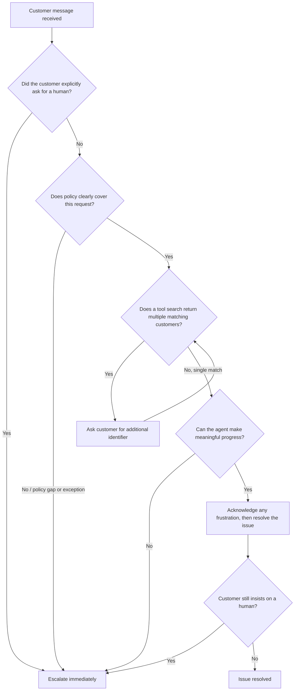

# Task Statement 5.2: Design Effective Escalation and Ambiguity Resolution Patterns

## Why This Topic Matters

When you build an AI agent to handle customer support, the agent will not be able to solve every problem. Some problems need a human. The hard part is teaching the agent **when** to hand off to a human and **when** to keep helping.

If the agent escalates too often, customers get annoyed because they wanted a fast answer. If the agent escalates too little, customers get stuck with wrong answers or unresolved issues. This tutorial teaches you how to design good escalation rules.

---

## Part 1: What Should Trigger an Escalation?

There are three main triggers that should make an agent escalate to a human:

### Trigger 1: The customer directly asks for a human

If a customer says "I want to talk to a person" or "connect me to an agent," the AI should escalate right away. It should **not** try to solve the problem first and then escalate. The customer already told you what they want.

### Trigger 2: A policy exception or a policy gap

This is not the same as "a complex case." A case can look simple but still need escalation if:

- The policy does not cover this exact situation (a **policy gap**), or
- The customer is asking for something outside normal policy (a **policy exception**)

**Example:** Your policy says "We match prices found on our own website." But the customer asks "Can you match a lower price I found on a competitor's website?" The policy is **silent** on competitor pricing. This is a policy gap, so the agent should escalate — even though the question itself is easy to understand.

### Trigger 3: The agent cannot make meaningful progress

If the agent has tried reasonable steps (looked up the order, checked the account, tried the normal fix) and is still stuck, it should escalate instead of guessing or repeating itself.

---

## Part 2: Immediate Escalation vs. Offering to Help First

This is a key distinction for the exam.

| Situation | What the agent should do |
|---|---|
| Customer explicitly says "give me a human" / "I don't want a bot" | Escalate **immediately**. No investigation, no "let me try first." |
| Customer is upset or frustrated, but has NOT asked for a human, and the issue is simple | Acknowledge the frustration, then **offer to resolve it**. Only escalate if the customer says again that they want a human. |

### Why this matters

Imagine a customer says: "This is so frustrating, my package is late!"

The customer is frustrated, but they have not asked for a human. If tracking the package is something the agent can do, the right move is:

1. Acknowledge the feeling ("I understand this is frustrating.")
2. Try to help ("Let me check your tracking status right now.")
3. Only escalate if the customer insists: "No, I want a human" → now escalate immediately.

**Simple rule:** Explicit request = escalate now. Frustration alone = acknowledge + try to help.

---

## Part 3: Why Sentiment and Confidence Scores Are Bad Escalation Signals

You might think: "Let's escalate whenever the customer sounds angry" or "Let's escalate whenever the AI's confidence score is low." Both of these sound reasonable, but they are **unreliable**. Here is why:

### Problem with sentiment-based escalation

- A customer can sound calm but have a genuinely serious problem (like a billing error affecting their whole account).
- A customer can sound angry about something small and easy to fix (like asking where a button is).

Sentiment (tone of voice or wording) does not tell you how **complex** or **policy-sensitive** the actual issue is. Angry does not always mean hard. Calm does not always mean easy.

### Problem with self-reported confidence scores

If you ask the AI model to rate "how confident am I that I solved this correctly?" that score is **generated by the model itself**, and models can be confidently wrong. A high confidence score does not guarantee a correct answer, and a low confidence score does not always mean the case is truly complex.

**Key takeaway:** Escalation decisions must be based on **real factors** — explicit customer requests, policy gaps, and inability to make progress — not on tone or self-rated confidence.

---

## Part 4: Handling Multiple Customer Matches

Sometimes a tool search returns more than one matching customer record. For example, searching by name "John Smith" might return 3 different accounts.

### The wrong way

Do **not** let the agent guess which one is correct using a heuristic, such as:
- Picking the most recently active account
- Picking the first result in the list
- Guessing based on order history similarity

This is risky. Picking the wrong customer record could expose someone else's private data — a serious privacy and security problem.

### The right way

The agent should **ask the customer for additional identifying details**, such as:
- Email address
- Order number
- Phone number
- Billing zip code

Only after the agent gets enough identifying information to be **certain** which record is correct should it proceed.

```
Tool result: 3 customers found matching "John Smith"

Agent should NOT say:
"I found your account and made the refund."

Agent SHOULD say:
"I found a few accounts with that name. Could you confirm your
email address or order number so I can find the right one?"
```

---

## Part 5: Writing Escalation Criteria in the System Prompt

The best way to make sure your agent follows these rules consistently is to write **explicit escalation criteria** directly into the system prompt, along with **few-shot examples** (small example conversations that show the correct behavior).

### Why few-shot examples help

Telling the model "escalate when appropriate" is too vague. Showing the model 2–3 real examples of "escalate" and "don't escalate" situations teaches it the pattern much more reliably.

### Example system prompt snippet

```text
ESCALATION RULES:

1. If the customer explicitly asks for a human agent, escalate
   immediately. Do not attempt to solve the issue first.

2. If our policy does not clearly cover the customer's request,
   escalate to a human for a policy decision.

3. If a tool search returns more than one matching customer,
   ask the customer for an additional identifier (email, order
   number, or phone number). Do not guess.

4. Do not escalate just because the customer sounds upset. If the
   issue is within your ability to resolve, acknowledge their
   frustration and offer to help. Escalate only if they still ask
   for a human afterward.

EXAMPLES:

Example 1 (escalate immediately):
Customer: "I don't want to talk to a bot, connect me to a person."
Agent: "Of course, connecting you with a human agent now."

Example 2 (offer help first):
Customer: "Ugh, my order still hasn't arrived, this is so annoying."
Agent: "I'm sorry about the delay — let me check your tracking
status right now." 
[If customer still insists on a human after this, escalate.]

Example 3 (policy gap, escalate):
Customer: "Can you match a price from a competitor's website?"
Agent: "Our policy covers price matching on our own site, but I'm
not able to confirm competitor price matching. Let me connect you
with a specialist who can review this."

Example 4 (multiple matches, ask for clarification):
Tool result: 3 accounts found for "John Smith"
Agent: "I found a few accounts under that name. Could you share
your email or order number so I can pull up the right one?"
```

---

## Part 6: Putting It All Together — Decision Flow

Below is a simple flow the agent should follow when deciding whether to escalate.



---

## Quick Recap (Exam Cheat Sheet)

- **Escalate immediately** when the customer explicitly asks for a human — no investigation first.
- **Escalate** when there is a **policy gap or exception**, not just because a case seems complex.
- **Escalate** when the agent truly cannot make progress after a reasonable attempt.
- **Do not escalate** just because a customer sounds upset — acknowledge the feeling and try to help, unless they insist on a human.
- **Never use sentiment or self-reported confidence scores** as the deciding factor for escalation — they are unreliable.
- **Never guess** which customer record is correct when multiple matches appear — always ask for an additional identifier.
- Put **explicit escalation rules with few-shot examples** in the system prompt so the agent behaves consistently.
