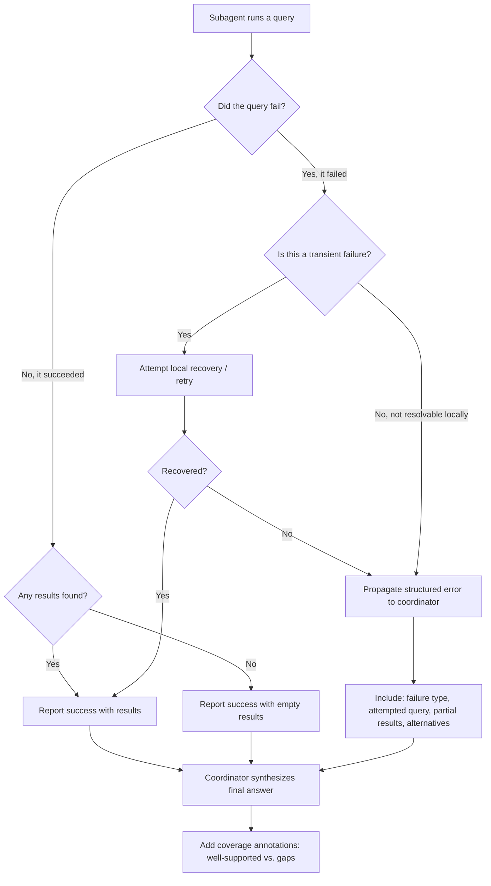

# Task Statement 5.3: Implement Error Propagation Strategies Across Multi-Agent Systems

## Why This Topic Matters

In a multi-agent system, you usually have a **coordinator** (the main agent) that assigns tasks to **subagents** (smaller agents that do specific jobs, like searching a database or calling a tool). When something goes wrong inside a subagent, how that error is reported back to the coordinator makes a huge difference.

If errors are reported badly, the coordinator cannot make good decisions. If errors are reported well, the coordinator can recover, retry, work around the problem, or clearly tell the user what happened.

This tutorial teaches you how to design good error reporting between agents.

---

## Part 1: Two Very Different Situations That Look Similar

There are two situations that can look the same on the surface but mean very different things:

### Situation A: Access Failure

The subagent **could not even complete the search**. For example:
- A timeout
- A network error
- An API being down
- A permission error

In this case, we do not know the real answer. The task simply failed to run properly. The coordinator needs to decide: should we retry? Should we try a different method? Should we tell the user we could not check?

### Situation B: Valid Empty Result

The subagent **successfully ran the search**, and there just happened to be no matching data. For example:
- Searching orders for a customer who genuinely has no past orders
- Searching a knowledge base for a topic that truly has no articles

This is **not a failure**. It is a successful query that returned zero results. The coordinator should treat this as a real answer, not as a problem to fix.

### Why the distinction matters

If you mix these two together, bad things happen:

- If an access failure is reported like a normal empty result, the coordinator (and eventually the user) will think "there is no data" when really the system just could not check. This is misleading.
- If a valid empty result is treated like a failure, the coordinator might retry endlessly or escalate for no reason, wasting time.

**Simple rule:** Always report *whether the query ran successfully* separately from *what the query found*.

---

## Part 2: Why Generic Error Messages Are a Problem

Imagine a subagent fails and just reports back:

```
"search unavailable"
```

This tells the coordinator almost nothing useful. The coordinator cannot answer any of these questions:

- What kind of failure was it? (timeout? bad input? permission denied?)
- What was actually being searched for?
- Did we get any partial results before it failed?
- Is there another way to get this information?

Without this context, the coordinator can only guess. It might retry the exact same failing call, give up completely, or pass a confusing message to the user.

**Key takeaway:** A generic status hides the details the coordinator needs to make a smart decision. Good error reporting must include real context, not just a short label.

---

## Part 3: What Good Structured Error Context Looks Like

Instead of a generic message, a subagent should return **structured error context** with these parts:

1. **Failure type** – what kind of failure happened (timeout, permission error, invalid input, service unavailable, etc.)
2. **Attempted query** – exactly what the subagent was trying to do (so the coordinator does not have to guess)
3. **Partial results** – any data that was gathered before the failure happened, even if incomplete
4. **Alternative approaches** – suggestions for what could be tried instead (a different tool, a retry, a narrower search, etc.)

### Example: Bad vs. Good Error Reporting

**Bad (generic status):**
```json
{
  "status": "error",
  "message": "search unavailable"
}
```

**Good (structured error context):**
```json
{
  "status": "error",
  "failure_type": "timeout",
  "attempted_query": "search customer orders for account #48213, last 90 days",
  "partial_results": [
    {"order_id": "A1001", "date": "2026-07-10"}
  ],
  "alternative_approaches": [
    "Retry with a shorter date range",
    "Try the legacy orders API instead of the real-time API"
  ]
}
```

With this structured version, the coordinator can decide intelligently: maybe it retries with a shorter date range, maybe it uses the partial result plus a note that more data might exist, or maybe it tells the user honestly what happened.

### Example: Reporting a valid empty result correctly

```json
{
  "status": "success",
  "result_type": "empty",
  "attempted_query": "search customer orders for account #48213, last 90 days",
  "results": []
}
```

Notice `"status": "success"` — the query worked fine. It just found nothing. This should never be confused with the error example above.

---

## Part 4: Two Anti-Patterns to Avoid

### Anti-Pattern 1: Silently Suppressing Errors

This means a subagent hides a failure by returning an empty result as if it were a normal, successful search.

```
Real situation: The search timed out.
Bad report: { "status": "success", "results": [] }
```

This is dangerous because the coordinator (and the user) will believe there is genuinely no data, when actually the system just failed to check. This can lead to wrong decisions, like telling a customer "you have no past orders" when really the system just could not look.

### Anti-Pattern 2: Terminating the Entire Workflow on a Single Failure

This means one small subagent failure causes the whole multi-agent process to stop completely, even if other parts of the task succeeded or could still succeed.

**Example of the problem:** A coordinator asks three subagents to gather data — pricing, inventory, and shipping. If the shipping subagent times out, but pricing and inventory both succeeded, it would be wasteful to throw away all three results and stop everything. It is better to let the coordinator know that shipping failed, while still using the pricing and inventory data that came back fine.

**Correct approach:** A single subagent failure should be reported clearly to the coordinator, so the coordinator can decide what to do next (retry, skip, note the gap) — not silently hidden, and not treated as a reason to abandon the whole task.

---

## Part 5: Local Recovery vs. Propagating the Error

Subagents should not automatically send every small hiccup up to the coordinator. Good subagent design includes **local recovery**:

- If a failure is **transient** (temporary, like a brief network blip), the subagent should try to **recover locally** — for example, retry the call once or twice on its own.
- Only if the subagent **cannot resolve the problem itself** should it propagate the error up to the coordinator.
- When it does propagate the error, it must still include what was attempted and any partial results, exactly as described in Part 3.

```
Subagent logic (simplified):

1. Try the search.
2. If it fails due to a transient issue (like a timeout):
   a. Retry locally, up to a small limit (e.g., 2 retries).
3. If it still fails after local retries:
   a. Stop trying.
   b. Report back to the coordinator with structured error context
      (failure type, attempted query, partial results, alternatives).
4. If it succeeds (even with zero results):
   a. Report back as a success, with the actual results (even if empty).
```

This way, the coordinator is not bothered with every tiny problem, but it is always informed about real problems it needs to make a decision on.

---

## Part 6: Coverage Annotations in Synthesis Output

When a coordinator combines results from multiple subagents into one final answer (this is called **synthesis**), it should not just quietly present the answer as if everything was fully checked. It should show **coverage annotations** — notes about which parts of the answer are well-supported and which parts have gaps.

### Why this matters

If three out of four sources responded successfully, but one source failed or timed out, the final answer should say so. Otherwise, the user might think the answer is complete when it is actually missing information.

### Example of a synthesis output with coverage annotations

```text
Summary of findings:

✅ Well-supported: Pricing information (confirmed from pricing database)
✅ Well-supported: Inventory levels (confirmed from inventory system)
⚠️ Gap: Shipping estimate could not be retrieved (shipping service timed
   out). This information is currently unavailable; recommend checking
   again shortly or contacting the shipping team directly.
```

This is much more honest and useful than simply leaving out the shipping section without explanation, or guessing a shipping estimate.

---

## Part 7: Putting It All Together — Error Flow Diagram



---

## Quick Recap (Exam Cheat Sheet)

- **Access failures** (timeouts, service down) are different from **valid empty results** (query worked, no data found) — always report these separately and clearly.
- **Generic error statuses** (like "search unavailable") hide details the coordinator needs — always include more context.
- Good error reports include: **failure type, attempted query, partial results, and alternative approaches.**
- **Do not silently suppress errors** by reporting a failure as if it were a normal empty result.
- **Do not terminate the entire workflow** just because one subagent failed — let the coordinator decide what to do with partial success.
- Subagents should attempt **local recovery** for transient failures first, and only propagate errors they truly cannot fix, including what they already tried and any partial results.
- Final synthesized answers should use **coverage annotations** to show which findings are well-supported and which have gaps due to failures or missing sources.
