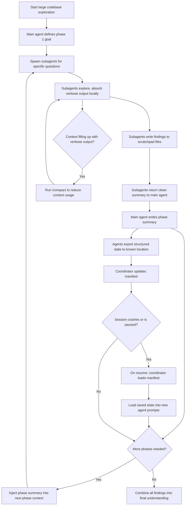

# Task Statement 5.4: Manage Context Effectively in Large Codebase Exploration

## Why This Topic Matters

When an AI agent explores a large codebase — reading many files, tracing how code connects, searching for patterns — it can generate a huge amount of text. This is called **context**, and every model has a limited amount of space for it.

If you do not manage context carefully during long exploration sessions, the agent's answers slowly get worse. This tutorial explains why that happens and teaches you practical techniques to prevent it.

---

## Part 1: What Is Context Degradation?

**Context degradation** happens when a session goes on for a long time and the model has taken in a lot of information. As the context fills up, the model can start to lose track of specific details it found earlier.

### Signs of context degradation

- The model gives **inconsistent answers** — for example, describing a class one way early in the session, and a different way later on, even though nothing changed.
- The model starts talking about **"typical patterns"** instead of the actual, specific code it discovered. In other words, it starts guessing based on general knowledge of how code "usually" looks, instead of using the real classes and files it already explored.

### Why this happens

Long sessions fill up the context window with lots of exploration output (file contents, search results, discussion). As more information gets added, older, specific details can become harder for the model to reliably recall and prioritize. The model may fall back on generic patterns instead of the exact facts it gathered earlier.

**Key takeaway:** The longer and more crowded a session gets, the more likely the agent is to forget specific discovered facts and replace them with generic guesses. You need strategies to prevent this.

---

## Part 2: Scratchpad Files — Persisting Key Findings

A **scratchpad file** is a simple file where an agent writes down important findings as it explores, such as:

- Class names and what they do
- File paths where important logic lives
- Key relationships between parts of the code (e.g., "RefundService calls PaymentGateway.reverseCharge()")

### Why scratchpad files help

Instead of relying only on what is inside the model's active context (which can degrade over a long session), the agent can **write findings to a file**, and then **read from that file** later when it needs to remember something. This gives the agent a reliable, permanent record that does not degrade, even if the conversation gets very long.

### Example scratchpad entry

```markdown
## Scratchpad: Refund Flow Investigation

- RefundService (src/services/refund_service.py)
  - Calls PaymentGateway.reverseCharge()
  - Validates refund eligibility via OrderPolicy.can_refund()

- PaymentGateway (src/services/payment_gateway.py)
  - reverseCharge() calls external API `POST /v1/charges/{id}/refund`
  - Retries up to 3 times on network failure

- OrderPolicy (src/policies/order_policy.py)
  - can_refund() checks: order status == "delivered" AND within 30 days
```

When the agent needs to answer a later question about the refund flow, it should **reference this scratchpad file** instead of trying to remember from earlier in the conversation. This directly counteracts context degradation, because the agent is reading exact facts instead of relying on a fuzzy memory of a long conversation.

---

## Part 3: Subagent Delegation for Isolating Verbose Output

Exploring a codebase often means running lots of searches and reading many files, which produces a large amount of raw output (verbose exploration output). If all of this goes directly into the **main agent's** context, it fills up fast and causes context degradation.

### The solution: delegate to subagents

Instead of having the main agent do all the raw exploration itself, you can **spawn subagents** to handle specific, narrow investigation questions. The subagent does the messy, verbose work, and only reports back a clean, summarized answer to the main agent.

This means:
- The **subagent's context** absorbs all the verbose output (reading many files, searching, trial and error).
- The **main agent's context** stays clean, holding only the important summarized findings, so it can keep coordinating the overall task effectively.

### Example subagent tasks

```
Subagent 1 task: "Find all test files related to the refund flow."
Subagent 2 task: "Trace all dependencies of the refund flow, from
                   API endpoint to database write."
```

Each subagent does its own deep-dive, and only returns a compact answer like:

```
Subagent 1 result:
Found 4 test files:
- tests/test_refund_service.py
- tests/test_payment_gateway.py
- tests/test_order_policy.py
- tests/integration/test_refund_flow.py

Subagent 2 result:
Refund flow dependency chain:
API (/refund) -> RefundService -> OrderPolicy.can_refund()
-> PaymentGateway.reverseCharge() -> External Payment API
-> DB write (refunds table)
```

The main agent keeps high-level coordination (deciding what to investigate next, combining findings, talking to the user) while subagents absorb the noisy details.

---

## Part 4: Summarize Before Moving to the Next Phase

When exploration happens in multiple phases (for example: Phase 1 = understand the refund flow, Phase 2 = understand the notification flow), it is important to **summarize the key findings from the current phase** before starting the next one.

### Why this matters

If you just keep piling on more and more raw exploration without summarizing, context keeps growing and degrading. Instead:

1. Finish a phase of exploration (possibly using subagents, as shown in Part 3).
2. Write a clean summary of what was learned.
3. **Inject that summary into the initial context** of the next phase (or next subagent), instead of carrying forward all the raw, verbose details.

### Example

```
Phase 1 Summary (injected into Phase 2 context):

"The refund flow works as follows: API endpoint /refund calls
RefundService, which checks OrderPolicy.can_refund() and then
calls PaymentGateway.reverseCharge(). Related test files are in
tests/test_refund_service.py and others."

Phase 2 task: "Now investigate how the notification flow is
triggered after a successful refund, using the above summary
as background."
```

This keeps each new phase starting from a clean, focused foundation instead of a huge pile of raw exploration text.

---

## Part 5: Structured State Persistence for Crash Recovery

Long exploration sessions can crash or get interrupted. If there is no saved state, all the progress is lost, and everything must start over. To prevent this, use **structured state persistence**.

### How it works

1. **Each agent exports its state** to a known, predictable location (like a file path), whenever it finishes an important step. This exported state includes things like what was investigated and what was found.
2. The **coordinator keeps a manifest** — a file that lists all the state exports from all the agents (a kind of index or table of contents).
3. If the session crashes or is resumed later, the **coordinator loads the manifest** first, sees what has already been done, and can **inject the saved findings back into the new agent prompts** — instead of starting from zero.

### Example manifest file

```json
{
  "session_id": "explore-refund-2026-08-09",
  "agents": [
    {
      "agent": "subagent_test_finder",
      "state_file": "state/test_finder_state.json",
      "status": "complete"
    },
    {
      "agent": "subagent_dependency_tracer",
      "state_file": "state/dependency_tracer_state.json",
      "status": "complete"
    },
    {
      "agent": "subagent_notification_flow",
      "state_file": "state/notification_flow_state.json",
      "status": "in_progress"
    }
  ]
}
```

On resume, the coordinator reads this manifest, sees that two subagents already finished, loads their saved state files, and only needs to resume (or restart) the one that was still `"in_progress"`. This avoids re-doing completed work.

---

## Part 6: Using /compact to Reduce Context Usage

During long exploration sessions, the context window can fill up with a lot of verbose discovery output (file contents, tool results, searches). One practical tool for this is the **`/compact`** command.

`/compact` is used to **reduce context usage** by compressing or trimming the conversation history, while keeping the important information. This helps extend how long an exploration session can continue productively, without hitting context limits or suffering as much from context degradation.

**When to use it:** When context is filling up with a lot of raw exploration output during an extended session, running `/compact` helps keep the session usable for longer.

---

## Part 7: Putting It All Together — Context Management Flow



---

## Quick Recap (Exam Cheat Sheet)

- **Context degradation** shows up as inconsistent answers and reliance on "typical patterns" instead of specific facts discovered earlier in a long session.
- **Scratchpad files** let agents persist key findings outside the conversation, so they can reference exact facts instead of relying on fuzzy memory.
- **Subagent delegation** isolates verbose exploration output (like reading many files) away from the main agent, letting the main agent stay focused on high-level coordination.
- **Summarize each exploration phase** before starting the next one, and inject that summary into the next phase's starting context instead of carrying all raw details forward.
- **Structured state persistence (manifests)** let agents export their state to known locations, so a coordinator can recover from a crash by loading the manifest and injecting saved state into new prompts.
- **`/compact`** reduces context usage during long exploration sessions when verbose discovery output starts filling up the context window.
