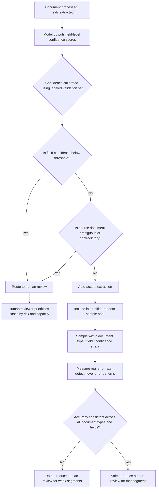

# Task Statement 5.5: Design Human Review Workflows and Confidence Calibration

## Why This Topic Matters

Many AI systems extract information from documents — for example, pulling fields like "invoice total" or "patient date of birth" out of scanned files. These systems often report an overall accuracy number, like "97% accurate." But a single overall number can hide serious problems. This tutorial teaches you how to design a review process that catches those hidden problems and routes the right cases to human reviewers.

---

## Part 1: The Danger of Aggregate Accuracy Metrics

Imagine a document extraction system reports **97% overall accuracy**. That sounds great. But this single number is an **average across everything** — all document types and all fields combined.

### The hidden risk

A 97% overall accuracy can hide the fact that:
- One specific document type (for example, handwritten forms) might only be **70% accurate**, while a common, easy document type (like typed invoices) might be **99.5% accurate**, and the average still looks good.
- One specific field (for example, a rarely-seen "discount code" field) might be extracted wrong most of the time, while common fields (like "total amount") are extracted correctly almost always.

**Key takeaway:** A high aggregate number can mask poor performance on specific document types or specific fields. You cannot trust a single overall accuracy score to tell you the system is safe to automate everywhere.

---

## Part 2: Validate Accuracy by Document Type and Field Segment

Before you reduce human review (that is, before you trust the system to run automatically without a person checking it), you must **validate accuracy broken down by document type and by field**, not just as one overall number.

### What this looks like in practice

| Document Type | Field | Accuracy |
|---|---|---|
| Typed Invoice | Total Amount | 99.6% |
| Typed Invoice | Vendor Name | 98.9% |
| Handwritten Form | Total Amount | 71.2% |
| Handwritten Form | Vendor Name | 65.4% |
| Scanned Receipt | Date | 93.1% |

Looking at this table, you can clearly see that **handwritten forms** are a weak spot, even though the overall average accuracy might still look acceptable. This kind of breakdown lets you decide: maybe handwritten forms should always go to a human, while typed invoices can be automated with confidence.

**Key takeaway:** Only after checking that accuracy is consistently strong across **all** document types and fields should you consider reducing human review for a given segment.

---

## Part 3: Stratified Random Sampling for Measuring Error Rates

Once a system is automated, you still need to keep checking that it stays accurate over time, especially for **high-confidence extractions** — the ones the model feels sure about, which are the ones a human is least likely to review.

### What is stratified random sampling?

Instead of randomly picking any extractions to review, **stratified random sampling** means splitting the data into meaningful groups (called "strata") — such as document type, field, or confidence level — and then randomly sampling **within each group**.

### Why this matters

If you just randomly sample from everything, common and easy cases will dominate the sample, and you might never catch problems in a smaller but important category (like handwritten forms or a rare field).

By sampling separately **within each stratum** (each document type, each field, each confidence band), you make sure:
- Every category gets checked, even the less common ones.
- You can measure the **actual error rate** of high-confidence extractions specifically — the ones that are normally skipped by human review because the model seemed sure of itself.
- You can detect **novel error patterns** — new kinds of mistakes that did not show up before, which might signal a new problem (for example, a new document template that confuses the model).

### Example sampling plan

```text
Stratified Sampling Plan:

- Document Type: Typed Invoice, Confidence: High  -> sample 2% of extractions
- Document Type: Typed Invoice, Confidence: Low    -> sample 20% of extractions
- Document Type: Handwritten Form, Confidence: High -> sample 10% of extractions
- Document Type: Handwritten Form, Confidence: Low  -> sample 50% of extractions
```

Notice that even "High confidence" extractions still get sampled and checked — this is intentional, because confidence alone should never be fully trusted without ongoing verification.

---

## Part 4: Field-Level Confidence Scores and Calibration

Instead of the model giving one confidence score for an entire document, it is much more useful for the model to give a **confidence score for each individual field** it extracts.

### Example

```json
{
  "document_id": "inv-2931",
  "fields": {
    "vendor_name": { "value": "Acme Supplies", "confidence": 0.98 },
    "total_amount": { "value": "$4,532.10", "confidence": 0.95 },
    "discount_code": { "value": "SPR25", "confidence": 0.42 }
  }
}
```

Here, even though the document overall looks mostly fine, the `discount_code` field has low confidence and should likely be sent for human review, while the other two fields are probably safe to trust.

### Calibrating confidence with labeled validation sets

A raw confidence score from a model is just a number — it needs to be **calibrated** to be meaningful. Calibration means checking: "When the model says 90% confidence, is it actually correct about 90% of the time?"

This is done using a **labeled validation set** — a set of documents where the correct answers are already known (labeled by humans). By comparing the model's confidence scores against the actual correct/incorrect results in this labeled set, you can figure out the right **confidence threshold** to use for routing decisions (for example, "anything below 85% confidence should go to a human").

**Key takeaway:** Confidence scores must be calibrated using real labeled data before you trust them to decide what needs human review.

---

## Part 5: Routing Extractions to Human Review

Once you have field-level, calibrated confidence scores, you can build a routing system that sends the right cases to human reviewers.

### What should be routed to human review?

- Fields with **low model confidence** (below the calibrated threshold)
- Cases where the **source document is ambiguous or contradictory** (for example, a form where two different totals appear and disagree with each other)

### Prioritizing limited reviewer capacity

Human reviewers have limited time. Not every low-confidence case can be reviewed instantly. So the routing system should **prioritize** which cases reviewers see first — for example, prioritizing:
- Higher-value or higher-risk documents first
- Fields that are most likely to be wrong, based on stratified sampling results
- Cases with contradictory source information, since these are especially risky to leave unchecked

```text
Routing Example:

Field: discount_code, Confidence: 0.42  -> ROUTE to human review (low confidence)
Field: total_amount, Confidence: 0.95   -> Auto-accept (above threshold)
Document: contains two conflicting totals -> ROUTE to human review (ambiguous source)
```

---

## Part 6: Putting It All Together — Review Workflow Diagram



---

## Quick Recap (Exam Cheat Sheet)

- A high **overall accuracy number** can hide poor performance on specific document types or fields — always check the breakdown.
- Validate accuracy **by document type and by field** before reducing human review for any segment.
- Use **stratified random sampling** (sampling within groups like document type, field, confidence level) to measure real error rates, especially for high-confidence extractions, and to catch novel error patterns.
- Use **field-level confidence scores**, not just one score per document.
- **Calibrate** confidence scores using labeled validation sets, so thresholds are based on real accuracy, not raw model output.
- Route to human review when confidence is **low** or the source document is **ambiguous/contradictory**, and prioritize review queues based on risk and limited reviewer capacity.
