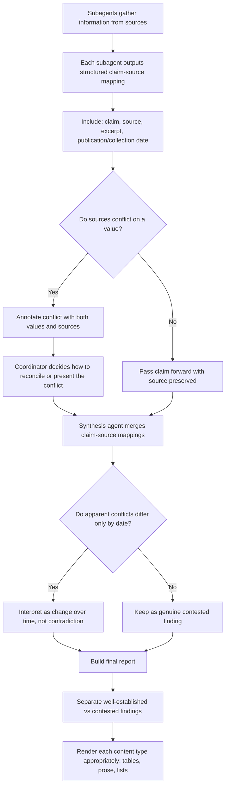

# Task Statement 5.6: Preserve Information Provenance and Handle Uncertainty in Multi-Source Synthesis

## Why This Topic Matters

When an AI system gathers information from many different sources (multiple articles, reports, or documents) and combines it into one final answer, this is called **multi-source synthesis**. During this process, it is very easy to lose track of **where each piece of information came from**, or to accidentally hide disagreements between sources. This tutorial explains how to preserve source information and handle uncertainty properly.

---

## Part 1: How Source Attribution Gets Lost

**Source attribution** means knowing exactly which source a specific fact or claim came from.

### The problem

When findings from multiple sources are **summarized** or **compressed** into a shorter version, it is common for the connection between a claim and its original source to get dropped. The summary might say:

```
"Revenue grew significantly last year."
```

But it no longer says **which report** this came from, or **which company** it was even about, if multiple companies were being researched. Once this connection is lost, it usually cannot be recovered later — you cannot verify the claim, check it for reliability, or trace it back if there's a disagreement.

**Key takeaway:** Summarization steps are a common place where source attribution silently disappears, unless you specifically design the process to preserve it.

---

## Part 2: Structured Claim-Source Mappings

To prevent this loss, subagents that gather information should not just report a plain summary. They should output a **structured claim-source mapping** — a clear link between each claim and exactly where it came from.

### What should be included in a claim-source mapping

- The **claim** itself (the fact or statement)
- The **source** (a URL, document name, or report title)
- A **relevant excerpt** (the specific part of the source that supports the claim)

### Example structured output

```json
{
  "claims": [
    {
      "claim": "Company X's revenue grew 12% in 2025.",
      "source": "Company X Annual Report 2025",
      "excerpt": "Total revenue increased 12% year-over-year, driven by..."
    },
    {
      "claim": "Company X's revenue grew 18% in 2025.",
      "source": "MarketWatch News Article, Jan 2026",
      "excerpt": "Analysts estimate Company X saw an 18% revenue jump..."
    }
  ]
}
```

### Why this matters for downstream agents

When a **synthesis agent** later combines findings from multiple subagents into one report, it must **preserve and merge** these claim-source mappings, not just merge the plain text summaries. This way, every claim in the final report can still be traced back to where it came from.

---

## Part 3: Handling Conflicting Statistics from Credible Sources

Sometimes, as in the example above, two credible sources report **different numbers** for the same thing (like revenue growth: 12% vs. 18%).

### The wrong way

Do **not** just pick one value arbitrarily (for example, always picking the "first" source, or picking whichever number seems more common) and present it as the single correct answer. This hides real uncertainty and could mislead the reader.

### The right way

**Annotate the conflict**, showing both values along with their sources, so the reader can see the disagreement and understand where each number came from.

```text
Note: Sources disagree on Company X's 2025 revenue growth.
- Company X Annual Report 2025 states 12% growth.
- MarketWatch News (Jan 2026) reports an estimated 18% growth.
This may be due to different measurement periods or methodologies.
```

### Who decides how to resolve it?

Document analysis agents should complete their work **with the conflicting values included and explicitly annotated** — they should not try to force a resolution themselves. It is the **coordinator's job** to decide how to reconcile or present the conflict, before the information is passed along to the final synthesis step.

**Key takeaway:** Never silently choose one number over another when sources disagree. Show the conflict clearly, and let the coordinator decide how to handle it.

---

## Part 4: Temporal Data — Dates Matter

Sometimes two sources appear to disagree, but they are actually both correct — they are just describing **different points in time**.

### The problem without dates

If Source A says "Company X has 500 employees" and Source B says "Company X has 620 employees," these might look like a contradiction. But if Source A's data is from **2022** and Source B's data is from **2026**, this is not a contradiction at all — the company simply grew over time.

### The solution

Every subagent should be required to include the **publication date or data collection date** in its structured output. This allows the coordinator (and the final reader) to correctly interpret time-related differences as **normal change over time**, instead of mistakenly treating them as a contradiction.

### Example

```json
{
  "claim": "Company X has approximately 500 employees.",
  "source": "Company X Press Release",
  "publication_date": "2022-03-15"
}
```

```json
{
  "claim": "Company X has approximately 620 employees.",
  "source": "Company X Careers Page",
  "collection_date": "2026-08-01"
}
```

With dates included, it becomes clear this is employee growth over four years, not conflicting data.

**Key takeaway:** Always require publication or collection dates in structured outputs, so that temporal differences are not misread as contradictions.

---

## Part 5: Structuring Reports — Well-Established vs. Contested Findings

When writing the final synthesized report, it helps readers a lot if the report **clearly separates**:

- **Well-established findings** — facts that multiple credible sources agree on
- **Contested findings** — facts where sources disagree, or where only one lower-confidence source supports the claim

### Why this matters

Mixing everything together, with no distinction between solid facts and disputed ones, makes it hard for the reader to know how much to trust each part of the report. This structure should also **preserve original source characterizations and methodological context** — for example, noting if a number came from an official audited report versus an informal estimate.

### Example report structure

```markdown
## Well-Established Findings
- Company X reported $50M in revenue in fiscal year 2025.
  (Source: Company X Annual Report 2025, audited financial statement)

## Contested Findings
- Company X's revenue growth rate is disputed:
  - Annual Report 2025 states 12% growth (based on audited figures).
  - MarketWatch (Jan 2026) estimates 18% growth (based on analyst
    projections, not confirmed by the company).
```

---

## Part 6: Rendering Different Content Types Appropriately

Not all information should be presented the same way in a final synthesis report. Forcing everything into one uniform format (like plain paragraphs for everything) can actually make information harder to understand.

### Match the format to the content type

| Content Type | Best Format |
|---|---|
| Financial data (numbers, comparisons) | Tables |
| News and events | Prose (normal written paragraphs) |
| Technical findings (steps, specifications) | Structured lists |

### Example

```markdown
### Financial Summary (Table)

| Metric | 2025 Value | Source |
|---|---|---|
| Revenue | $50M | Annual Report 2025 |
| Growth Rate | 12% (disputed, see note) | Annual Report / MarketWatch |

### Recent News (Prose)

In early 2026, Company X announced an expansion into two new
international markets, following stronger-than-expected demand
in its existing regions.

### Technical Findings (Structured List)

- API authentication uses OAuth 2.0
- Rate limit: 100 requests per minute
- Data retention policy: 90 days
```

**Key takeaway:** Choose the presentation format that best fits the type of content — tables for financial/numeric data, prose for narrative news, and structured lists for technical details — instead of flattening everything into one uniform style.

---

## Part 7: Putting It All Together — Provenance and Synthesis Flow



---

## Quick Recap (Exam Cheat Sheet)

- **Source attribution** is often lost when findings are compressed during summarization — design your process to prevent this.
- Require subagents to output **structured claim-source mappings** (claim, source, excerpt), and make sure synthesis agents **preserve and merge** these mappings, not just plain text.
- When credible sources report **conflicting statistics**, annotate the conflict with both values and their sources — never arbitrarily pick one.
- Document analysis should output conflicting values **explicitly annotated**, leaving reconciliation decisions to the **coordinator**.
- Always require **publication or collection dates** in structured outputs, so time-based differences are not mistaken for contradictions.
- Structure final reports with clear sections for **well-established** versus **contested** findings, preserving original source context.
- **Render content appropriately** to its type: tables for financial data, prose for news, structured lists for technical findings — avoid forcing everything into one uniform format.
